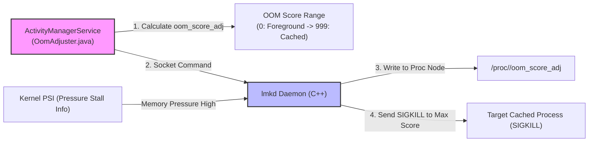

## 프로세스 우선순위는 메모리 회수 정책 입력이지 앱 상태의 진실이 아니다

상위 문서: [system_server 계약](system-server-contracts.md)
배경 지식: [OOM Killer / 메모리 압박 / PSI](02_references/operating-systems/oom-killer-and-memory-pressure.md)

프로세스 우선순위(`oom_score_adj`)는 앱 개발자가 직접 제어하거나 프로세스 내부에서 주관적으로 지정하는 상태가 아니며, `AMS`가 컴포넌트 실행 상태(Foreground Activity, Visible, Service, Broadcast 등) 및 시스템 메모리 압박 상태를 종합 판단하여 커널 **[Low Memory Killer Daemon(LMKD)](02_references/operating-systems/oom-killer-and-memory-pressure.md)**(리눅스 표준 OOM Killer가 "메모리 할당이 완전히 실패한 뒤"에야 개입하는 것과 달리, 메모리 압박 초기 신호(PSI)를 보고 선제적으로 프로세스를 죽이는 Android userspace 데몬)의 수거 우선순위 입력값으로 지속 계산·전송하는 수치 정책이다.

### 내부 동작 메커니즘 (Internal Mechanism)

1. **OOM Adjustment Scored Spectrum (`oom_score_adj`)**:
   - `-1000` (`SYSTEM_ADJ`): `system_server` 및 핵심 루트 데몬 (절대 희생되지 않음).
   - `0` (`FOREGROUND_APP_ADJ`): 현재 화면 전면에 활성화된 앱 Activity.
   - `100` (`VISIBLE_APP_ADJ`): 화면 일부에 보이지만 포커스는 없는 앱(Dialog, Split-Screen).
   - `200` (`PERCEPTIBLE_APP_ADJ`): 음악 재생, 포그라운드 서비스(Foreground Service).
   - `500` (`SERVICE_ADJ`): 백그라운드 구동 중인 서비스.
   - `900~999` (`CACHED_APP_MAX_ADJ`): 캐시된 백그라운드 프로세스 (OOM 발생 시 최우선 희생).
2. **`applyOomAdjLSP()` Execution**:
   - 액티비티 전환, 서비스 생성/파괴, 바인딩 연결 시 AMS는 `OomAdjuster.java`를 실행하여 프로세스 트리의 `oom_score_adj` 값을 동적 재계산한다.
3. **Kernel LMKD (Low Memory Killer Daemon) Interface**:
   - AMS는 계산된 `oom_score_adj` 값을 Unix Domain Socket을 통해 `lmkd` 데몬으로 전달하고, `lmkd`는 커널 **[PSI](02_references/operating-systems/oom-killer-and-memory-pressure.md)**(Pressure Stall Information — 프로세스들이 CPU/메모리/IO 자원을 기다리며 멈춰있는 시간 비율을 측정해, 메모리가 실제로 고갈되기 전에 압박 상태를 조기 감지하는 커널 지표) 이벤트 발생 시 해당 조정치 순서대로 프로세스에 `SIGKILL`을 발송한다.



### 코드 및 구체 예시 (Concrete Snippets)

AMS `OomAdjuster` 조정치 전달 코드 스니펫 (`frameworks/base/services/core/java/com/android/server/am/OomAdjuster.java`):

```java
// OomAdjuster.java
private boolean applyOomAdjLSP(ProcessRecord app, boolean doingAll, long now, long nowRealtime) {
    if (app.getSetAdj() != app.getCurRawAdj()) {
        // Write calculated oom_score_adj to lmkd or proc filesystem
        ProcessList.setOomScoreAdjs(new int[] { app.getPid() }, new int[] { app.getCurRawAdj() });
        app.setSetAdj(app.getCurRawAdj());
    }
    return true;
}
```

### 관측 가능 증거 (Observable Evidence)

`adb shell`을 활용하여 특정 프로세스의 현재 `oom_score_adj` 수치와 LMKD 로그를 점검할 수 있다:

```bash
# 특정 프로세스의 oom_score_adj 조회
adb shell cat /proc/$(adb shell pidof com.example.app)/oom_score_adj
# 출력 예시:
# 0 (Foreground 상태인 경우)
# 905 (Background Cached 상태로 전환된 경우)

# AMS oom_score_adj 덤프 확인
adb shell dumpsys activity oom

# LMKD 프로세스 킬 로그 관측 (logcat)
adb logcat -s lmkd
```

### 관련 문서

- [AMS는 앱 프로세스와 컴포넌트 lifecycle을 조율한다](ams-coordinates-app-process-and-component-lifecycle.md)
- [ANR은 단일 timeout 숫자가 아니라 responsiveness 계약 위반이다](anr-is-responsiveness-contract-violation-not-single-timeout.md)

공식 문서: [Processes and App Lifecycle](https://developer.android.com/guide/components/activities/process-lifecycle)
