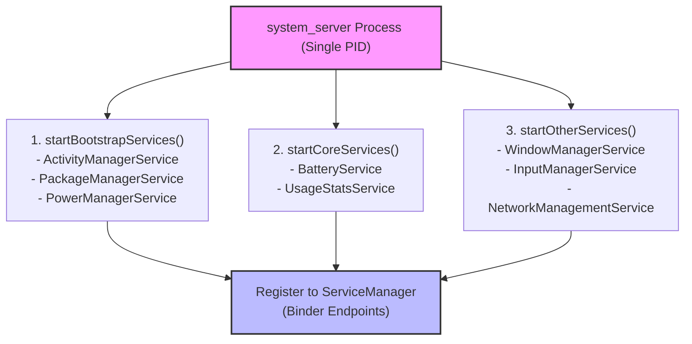

## system_server 는 framework service 를 한 프로세스 안에서 시작한다

상위 문서: [system_server 계약](system-server-contracts.md)

`system_server`는 Android 프레임워크의 거의 모든 핵심 시스템 서비스(AMS, PMS, WMS, DisplayManager, BatteryService 등 100여 개 이상)를 단일 Java 프로세스 공간 내부에서 스레드 형태로 구동하여, 서비스 간 고속 메모리 참조와 체계적인 3단계 수명주기 초기화 메커니즘을 제공하는 통합 프로세스다.

### 내부 동작 메커니즘 (Internal Mechanism)

1. **Single Process, Multi-Threaded Architecture**:
   - Zygote에 의해 fork된 `system_server`는 Java VM 환경에서 실행되며, 개별 서비스들이 독립 프로세스가 아닌 단일 프로세스 메모리 공간 안에서 스레드와 싱글톤 인스턴스로 동사한다.
   - 단점: 서비스 중 단 하나라도 Uncaught Exception으로 크래시되면 `system_server` 프로세스 전체가 종료되어 자식 앱 및 UI가 일제히 크래시/재부팅된다.
2. **3단계 서브시스템 초기화 순서 (`SystemServer.java`)**:
   - **`startBootstrapServices()`**: 디바이스 부팅 및 자원 관리에 필수적인 최우선 서비스 구동 (`ActivityManagerService`, `PowerManagerService`, `PackageManagerService`, `DisplayManagerService`).
   - **`startCoreServices()`**: 특수 목적 서비스 구동 (`BatteryService`, `UsageStatsService`, `WebViewUpdateService`).
   - **`startOtherServices()`**: UI 및 보조 서비스 구동 (`WindowManagerService`, `InputManagerService`, `NetworkManagementService`, `SystemUI`).
3. **`SystemServiceManager` Lifecycle Management**:
   - `SystemService` 클래스를 상속받은 서비스 객체들을 등록하고 `onStart()`, `onBootPhase()` 콜백을 단계별로 발송한다.



### 코드 및 구체 예시 (Concrete Snippets)

`SystemServer.java`의 단계별 서비스 구동 엔트리포인트 예시 (`frameworks/base/services/java/com/android/server/SystemServer.java`):

```java
// SystemServer.java
public static void main(String[] args) {
    new SystemServer().run();
}

private void run() {
    // 1. Initialize SystemServiceManager
    mSystemServiceManager = new SystemServiceManager(mSystemContext);
    
    // 2. Start services in strict sequence
    startBootstrapServices(t);
    startCoreServices(t);
    startOtherServices(t);
    
    // 3. Loop forever (Main System Looper)
    Looper.loop();
}
```

### 관측 가능 증거 (Observable Evidence)

`adb shell`을 통해 `system_server` 프로세스의 PID, 스레드 수, 메모리 점유율을 점검할 수 있다:

```bash
# system_server 프로세스 정보 및 스레드 개수 조회
adb shell ps -T -p $(adb shell pidof system_server) | wc -l
# 출력 예시: 150 (단일 프로세스 내부에서 150여 개의 스레드가 구동 중임)

# system_server 부팅 초기화 단계 로그 점검
adb logcat -s SystemServer
# 출력 예시:
# SystemServer: Entered the Android robot world!
# SystemServer: Start Bootstrap Services
# SystemServer: Start Core Services
# SystemServer: Start Other Services
```

### 관련 문서

- [system-service-is-binder-endpoint-and-platform-policy-enforcer](system-service-is-binder-endpoint-and-platform-policy-enforcer.md)
- [dumpsys는 system service의 현재 상태를 보는 inspection interface다](dumpsys-is-system-service-state-inspection-interface.md)

공식 문서: [SystemServer Source Overview](https://cs.android.com/android/platform/superproject/+/main:frameworks/base/services/java/com/android/server/SystemServer.java)
