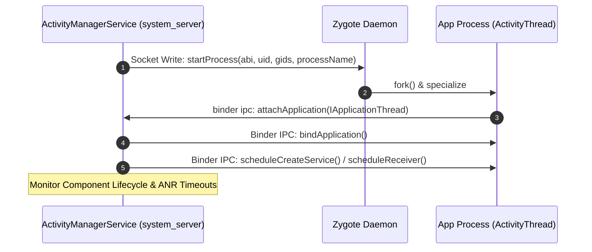

## [AMS](../../../04_system_services/activity-manager-service.md) 는 앱 프로세스 와 컴포넌트 lifecycle 을 조율한다

상위 문서: [system_server 계약](system-server.md)

`ActivityManagerService`([AMS](../../../04_system_services/activity-manager-service.md))는 `system_server` 내부에서 앱 프로세스의 바인딩, 4대 컴포넌트(Service, BroadcastReceiver, ContentProvider, Activity 지원)의 수명주기 및 의존성, 프로세스 OOM Adj 우선순위 동적 재계산을 조율하는 중앙 프레임워크 컨트롤러다.

### 내부 동작 메커니즘 (Internal Mechanism)

1. **Process Fork Request via Zygote Socket**:
   - 컴포넌트 구동(예: `startService` 또는 Broadcast 바인딩) 요청 시, 해당 앱의 프로세스가 존재하지 않으면 [AMS](../../../04_system_services/activity-manager-service.md)(`ProcessList.java`)는 Zygote Unix Socket으로 Process Fork 요청 메세지를 전송한다.
2. **`ActivityThread` Attach & Application Initialized**:
   - fork된 앱 프로세스는 `ActivityThread.main()`을 실행한 후 [AMS](../../../04_system_services/activity-manager-service.md)에 Binder IPC인 `attachApplication(IApplicationThread thread)`을 호출한다.
   - [AMS](../../../04_system_services/activity-manager-service.md)는 `ApplicationThread` 인터페이스 핸들을 수신하여 해당 프로세스와 Binder 통신 채널을 확립한다.
3. **Component LifeCycle Dispatch**:
   - [AMS](../../../04_system_services/activity-manager-service.md)는 Binder 콜백(`scheduleCreateService`, `scheduleReceiver` 등)을 통해 앱 프로세스 Main Looper로 컴포넌트 생성을 지시하고, 타임아웃 메커니즘(ANR Timer)을 관리한다.
4. **OOM Adjustment (`applyOomAdjLSP`)**:
   - 컴포넌트 구동 상태 및 포그라운드 여부에 따라 `oom_score_adj`를 재계산하여 커널 LMKD에 전달한다.



### 코드 및 구체 예시 (Concrete Snippets)

[AMS](../../../04_system_services/activity-manager-service.md)의 프로세스 요청 및 attach 콜백 메서드 정의 (`frameworks/base/services/core/java/com/android/server/am/ActivityManagerService.java`):

```java
// ActivityManagerService.java (Attach Application Lifecycle)
public final void attachApplication(IApplicationThread thread, long startSeq) {
    synchronized (this) {
        int callingPid = Binder.getCallingPid();
        long callingId = Binder.clearCallingIdentity();
        try {
            attachApplicationLocked(thread, callingPid, callingId, startSeq);
        } finally {
            Binder.restoreCallingIdentity(callingId);
        }
    }
}
```

### 관측 가능 증거 (Observable Evidence)

`adb shell dumpsys activity`를 사용하여 등록된 프로세스 및 컴포넌트 수명주기 상태를 점검할 수 있다:

```bash
# 특정 패키지의 AMS 프로세스 및 수명주기 상태 조회
adb shell dumpsys activity processes | grep -A 10 "ProcessRecord"

# 실행 중인 서비스 및 수명주기 바인딩 확인
adb shell dumpsys activity services com.example.app

# AMS 로그캣 이벤트 필터링
adb logcat -s ActivityManager
```

### 관련 문서

- [ATMS는 activity, task, back stack 전이를 담당한다](atms-activity-task-management.md)
- [ANR은 단일 timeout 숫자가 아니라 responsiveness 계약 위반이다](anr-responsiveness.md)

공식 문서: [ActivityManagerService API](https://developer.android.com/reference/android/app/ActivityManager)
