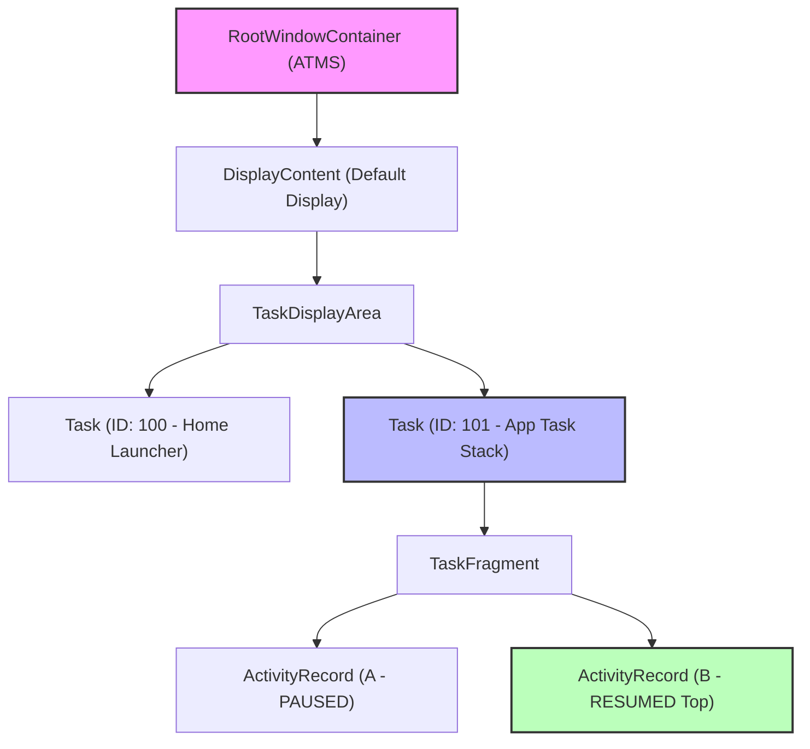

## ATMS 는 activity, task, back stack 전이를 담당한다

상위 문서: [system_server 계약](system-server.md)

`ActivityTaskManagerService`(ATMS)는 Android 10(API 29)에서 `AMS`로부터 분리되어 Activity의 생명주기 상태 전환, Task 계층 구조 관리, Back Stack 순회, Multi-Window/Split-Screen 레이아웃 및 WindowManager(WMS) 통합 구조를 전담하는 프레임워크 서브시스템이다.

### 내부 동작 메커니즘 (Internal Mechanism)

1. **Task Hierarchy (`RootWindowContainer`)**:
   - `DisplayContent` -> `TaskDisplayArea` -> `Task` (Root Task / Leaf Task) -> `TaskFragment` -> `ActivityRecord` 계층 트리 구조로 화면에 표시되는 모든 액티비티를 구조화한다.
2. **State Transition Engine (`ActivityRecord`)**:
   - `INITIALIZING` -> `STARTED` -> `RESUMED` -> `PAUSED` -> `STOPPED` -> `DESTROYED` 상태 머신을 유지한다.
   - `ClientTransaction` 객체와 `LaunchActivityItem`, `ResumeActivityItem`, `PauseActivityItem` 등을 조합하여 `IApplicationThread`를 통해 앱 프로세스의 ActivityThread/ClientLifecycleManager로 트랜잭션을 일괄 발송한다.
3. **Back Stack Management & Intent Flags**:
   - `FLAG_ACTIVITY_NEW_TASK`, `FLAG_ACTIVITY_CLEAR_TOP`, `FLAG_ACTIVITY_SINGLE_TOP` 및 `launchMode` (`singleInstance`, `singleTask`, `singleInstancePerTask`) 조건을 해석하여 기존 Task로 복귀시킬지 신규 Task를 생성할지 결정한다.
4. **WindowProcessController 연동**:
   - 액티비티 실행 대상 프로세스가 상주하는지 확인 후, 미존재 시 `AMS.startProcessLocked()`를 호출하여 Zygote에 프로세스 생성 요청을 전달한다.



### 코드 및 구체 예시 (Concrete Snippets)

ATMS 액티비티 전환 트랜잭션 발송 구현 예시 (`frameworks/base/services/core/java/com/android/server/wm/ActivityTaskSupervisor.java`):

```java
// ActivityTaskSupervisor.java (Activity Launch & Transaction Scheduling)
boolean realStartActivityLocked(ActivityRecord r, WindowProcessController proc,
        boolean andResume, boolean checkConfig) throws RemoteException {
    
    // 1. App Process Check & Binder Thread Association
    r.setProcess(proc);
    
    // 2. Build ClientTransaction container
    ClientTransaction clientTransaction = ClientTransaction.obtain(
            proc.getThread(), r.token);
            
    // 3. Add Launch Activity Callback Item
    clientTransaction.addCallback(LaunchActivityItem.obtain(new Intent(r.intent),
            System.identityHashCode(r), r.info, r.overrideConfig,
            r.compat, r.getFilteredReferrer(r.launchedFromPackage),
            proc.getReportedProcState(), r.shareableActivityToken,
            r.getMergedOverrideConfiguration(), r.getOptions()));

    // 4. Set Target Lifecycle State (Resume or Pause)
    if (andResume) {
        clientTransaction.setLifecycleStateRequest(
                ResumeActivityItem.obtain(r.navigationBarColor, isForward));
    } else {
        clientTransaction.setLifecycleStateRequest(
                PauseActivityItem.obtain());
    }

    // 5. Schedule Transaction Execution via ClientLifecycleManager
    mService.getLifecycleManager().scheduleTransaction(clientTransaction);
    return true;
}
```

### 관측 가능 증거 (Observable Evidence)

`adb shell dumpsys activity activities` 커맨드를 통해 현재 백스택 및 Task 계층 상태를 상세 출력할 수 있다:

```bash
# 최상위 Activity 및 Task Stack 구조 조회
adb shell dumpsys activity activities | grep -E "(Stack #|Running activities|ResumedActivity)"

# 특정 패키지의 Task 계층 및 ActivityRecord 상태 조회
adb shell dumpsys activity containers

# Activity 생명주기 이벤트 로그캣 확인
adb logcat -s ActivityTaskManager
```

### 관련 문서

- [AMS는 앱 프로세스와 컴포넌트 lifecycle을 조율한다](ams-coordinates-app-process-and-component-lifecycle.md)
- [system service는 Binder endpoint이자 플랫폼 정책 집행자다](system-service-is-binder-endpoint-and-platform-policy-enforcer.md)

공식 문서: [Tasks and Back Stack](https://developer.android.com/guide/components/activities/tasks-and-back-stack)
