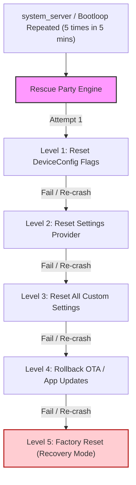

## Rescue Party 는 반복되는 system failure 를 단계적으로 복구한다

상위 문서: [system_server 계약](system-server.md)

`Rescue Party`는 Android 디바이스가 무한 부팅 루프(Bootloop)에 빠지거나 `system_server` 프로세스가 연속적으로 크래시될 때, 디바이스를 벽돌(Bricked Device) 상태로부터 구출하기 위해 단계별 복구 액션(System Reset Levels)을 자동으로 발동시키는 셀프 힐링(Self-healing) 서브시스템이다.

### 내부 동작 메커니즘 (Internal Mechanism)

1. **Failure Counting Trigger**:
   - **Bootloop Trigger**: 디바이스 부팅 시작 후 5분 이내에 `sys.boot_completed = 1` 마일스톤에 도달하지 못하고 5회 이상 재부팅되는 경우.
   - **System Crash Trigger**: 5분 이내에 `system_server`가 5회 이상 크래시되는 경우.
   - **Persistent App Crash Trigger**: 30초 이내에 시스템 필수 패키지가 5회 이상 크래시되는 경우.
2. **Mitigation Levels (단계별 복구 수준)**:
   - **Level 1 (`LEVEL_RESET_SETTINGS_UNRESET`)**: 문제가 발생한 패키지의 플래그 및 DeviceConfig 오버라이드 리셋.
   - **Level 2 (`LEVEL_RESET_SETTINGS_UNTAGGED`)**: 기본 Settings Provider 구성 리셋.
   - **Level 3 (`LEVEL_RESET_SETTINGS_TAGGED`)**: 모든 커스텀 세팅값 및 플래그 초기화.
   - **Level 4 (`LEVEL_RESET_SETTINGS_UNRESET` + App Reset)**: 최근 업데이트된 서드파티 앱 및 OTA 업데이트 롤백.
   - **Level 5 (`LEVEL_FACTORY_RESET`)**: 최종 단계로 Recovery Mode 진입 후 Factory Reset (전체 데이터 초기화) 지시.



### 코드 및 구체 예시 (Concrete Snippets)

Rescue Party 수준 판단 및 복구 코드 예시 (`frameworks/base/services/core/java/com/android/server/RescueParty.java`):

```java
// RescueParty.java
public static void noteBootPolicyReset(Context context, int level, String failedPackage) {
    Slog.w(TAG, "RescueParty triggered level " + level + " for package: " + failedPackage);
    switch (level) {
        case LEVEL_RESET_SETTINGS_UNRESET:
            resetDeviceConfig(context);
            break;
        case LEVEL_RESET_SETTINGS_UNTAGGED:
            resetSettingsUntagged(context);
            break;
        case LEVEL_FACTORY_RESET:
            // Prompt for Factory Reset via Recovery System
            RecoverySystem.rebootPromptAndWipeUserData(context, "RescueParty");
            break;
    }
}
```

### 관측 가능 증거 (Observable Evidence)

`adb shell`을 활용해 Rescue Party의 현재 복구 레벨 및 상태를점검할 수 있다:

```bash
# Rescue Party 디버그/테스트 모드 속성 확인
adb shell getprop persist.sys.enable_rescue
# 출력: true

# Rescue Party 발동 로그 관측 (logcat)
adb logcat -s RescueParty
# 출력 예시:
# RescueParty: RescueParty triggered level 1 for package: com.android.systemui

# Rescue Party 강제 트리거 테스트 CLI
adb shell setprop debug.rescue 1
```

### 관련 문서

- [boot-completion-is-observable-milestones-not-one-property](../boot-flow/boot-completion-is-observable-milestones-not-one-property.md)
- [system_server는 framework service를 한 프로세스 안에서 시작한다](system-server-startup.md)

공식 문서: [Rescue Party](https://source.android.com/docs/core/tests/debug/rescue-party)
