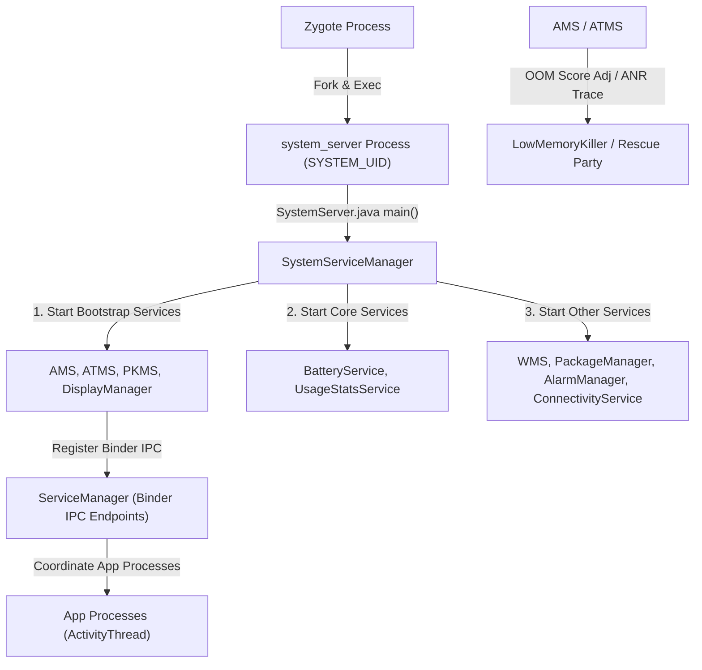

## system_server 와 ActivityManager 계약

`system_server`는 Android 시스템 프레임워크 핵심 서비스들([AMS](../../../04_system_services/activity-manager-service.md), ATMS, PKMS, WMS 등 100여 개 이상)을 단일 프로세스 안에서 구동하고, [binder ipc](../../binder-ipc.md) 엔드포인트를 제공하여 앱 프로세스의 컴포넌트 생명주기, Task 백스택, 시스템 자원 할당, ANR 타임아웃 감지, 그리고 OOM Reclaim 우선순위 정책을 통합 제어하는 중추이다.

---

## system_server 계약 영역 구성 (Contract Map)

| 정본 계약 노트 | 핵심 보장 메커니즘 | 검증 및 관측 가능 지점 |
| :--- | :--- | :--- |
| **[system_server는 framework service를 한 프로세스 안에서 시작한다](system-server-startup.md)** | `SystemServer.main()`, 3단계 서비스 서순(`Bootstrap` -> `Core` -> `Other`), `ServerThread` 멀티스레딩 | `ps -ef \| grep system_server`, `dumpsys system_server` |
| **[system service는 Binder endpoint이자 플랫폼 정책 집행자다](system-service-is-binder-endpoint-and-platform-policy-enforcer.md)** | `SystemService` 수명주기, ServiceManager IPC 등록, `checkCallingPermission()` 권한 강제 | `dumpsys -l`, `service list` |
| **[AMS는 앱 프로세스와 컴포넌트 lifecycle을 조율한다](ams-coordinates-app-process-and-component-lifecycle.md)** | ProcessRecord 관리, Component(Service/BroadcastReceiver/ContentProvider) 바인딩 및 생명주기 | `dumpsys activity processes`, `logcat -s ActivityManager` |
| **[ATMS는 activity, task, back stack 전이를 담당한다](atms-owns-activity-task-and-back-stack-transitions.md)** | RootWindowContainer -> Task -> ActivityRecord 트리 구조, ClientTransaction 스케줄링 | `dumpsys activity activities`, `logcat -s ActivityTaskManager` |
| **[프로세스 우선순위는 메모리 회수 정책 입력이지 앱 상태의 진실이 아니다](process-priority-is-memory-reclaim-policy-input-not-app-state-truth.md)** | `oom_score_adj` (-1000 ~ 1000) 동적 계산, ProcessState 전환, LMKD 회수 가이드라인 | `dumpsys activity processes`, `cat /proc/<pid>/oom_score_adj` |
| **[ANR은 단일 timeout 숫자가 아니라 responsiveness 계약 위반이다](anr-responsiveness.md)** | Event/Broadcast/Service 타임아웃 메커니즘, SIGQUIT(Signal 3) 발송, Stack Trace 덤프 | `/data/anr/traces.txt`, `logcat \| grep ANR` |
| **[Rescue Party는 반복되는 system failure를 단계적으로 복구한다](rescue-party-recovers-repeated-system-failures-in-stages.md)** | 5분 내 5회 연속 크래시 감지, 4단계 복구(Reset Settings -> Reset Namespace -> Factory Reset) | `getprop sys.rescue_level`, `logcat -s RescueParty` |
| **[dumpsys는 system service의 현재 상태를 보는 inspection interface다](dumpsys-is-system-service-state-inspection-interface.md)** | `IBinder.dump()` 규약, 각 서브시스템 내부 메모리 및 데이터 구조 직렬화 출력 | `dumpsys <service_name>` |

---

## 경계 및 구별 규칙 (Boundary Rules)

- **App Framework와 정책의 분리**: `Activity`, `Service`, `BroadcastReceiver` 등 앱 측 API 구문은 App Framework 정본 문서가 다루며, 이 묶음은 `system_server` 내부에서 이들 프로세스 및 생명주기를 강제 집행하는 정책에 집중한다.
- **Binder IPC 세부 분리**: Binder IPC 커널 드라이버, `Parcel`, `transact()` 멀티스레드 웅덩이는 IPC 정본으로 위임하고, 이 묶음은 시스템 서비스가 등록된 Binder Endpoint라는 계약 사실만 연동한다.
- **메모리 회수 구현체 분리**: Linux Kernel의 `PSI` (Pressure Stall Information) 및 `LMKD` 데몬 커널 모듈 세부는 Kernel/HAL 정본으로 이관하고, [AMS](../../../04_system_services/activity-manager-service.md)가 계산하여 건네는 `oom_score_adj` 입력 인터페이스에 집중한다.

상위 지도: [Android 부팅과 런타임 지도](../android-boot-and-runtime.md)  
관련 지도: [IPC and process contracts](../../ipc-and-process/ipc-process/ipc-process.md)
