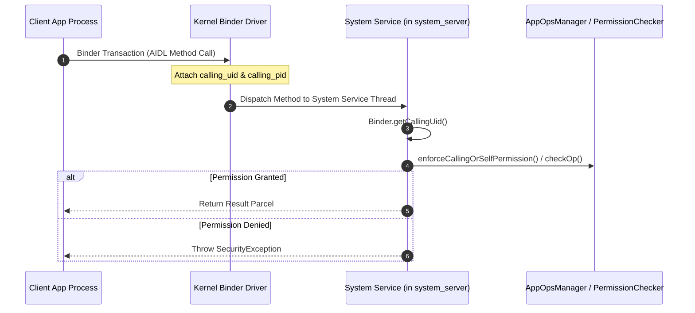

## system service 는 Binder endpoint 이자 플랫폼 정책 집행자다

상위 문서: [system_server 계약](system-server.md)

`system service`는 `ServiceManager`에 IPC 이름으로 등록된 Binder 노출 엔드포인트(Endpoint)로, 앱 프로세스가 프레임워크 서브시스템(카메라, 위치, 알림, 윈도우 등)을 이용하려 할 때 호출 프로세스의 UID/GID, Android Permission, AppOps 상태를 검증하여 보안 및 플랫폼 정책을 강력히 집행(Policy Enforcer)하는 관문이다.

### 내부 동작 메커니즘 (Internal Mechanism)

1. **Service Registration**:
   - `system_server` 내의 서비스 인스턴스는 부팅 시 `ServiceManager.addService("service_name", binderInterface)`를 호출하여 IPC 커뮤니케이션 핸들을 노출한다.
2. **Binder Calling Identity Isolation (`Binder.getCallingUid()`)**:
   - 앱이 AIDL 인터페이스를 통해 Binder 메서드를 호출하면, 커널 Binder 드라이버가 호출자의 검증된 PID/UID 정보를 IPC 패킷에 캡처한다.
   - 서비스 내부에서는 `Binder.getCallingUid()`, `Binder.getCallingPid()`를 호출해 원격 클라이언트의 진실된 신원을 파악한다.
3. **Permission & AppOps Enforcement**:
   - `mContext.enforceCallingOrSelfPermission(PERMISSION_NAME, "message")`를 호출하여 클라이언트가 패키지 권한을 보유했는지 체크한다.
   - `AppOpsManager.checkOpNoThrow()`를 호출하여 동적 권한(위치, 카메라 사용 권한 거부 여부)을 최종 검증한다.



### 코드 및 구체 예시 (Concrete Snippets)

System Service 내부 권한 검증 코드 스니펫 예시:

```java
// System Service Method Security Enforcement Pattern
public void performRestrictedOperation(String packageName) {
    // 1. Verify Calling Identity
    int callingUid = Binder.getCallingUid();
    
    // 2. Enforce Android Manifest Permission
    mContext.enforceCallingOrSelfPermission(
        android.Manifest.permission.MANAGE_USERS, 
        "Only system can manage users"
    );

    // 3. Check AppOps for runtime privacy restrictions
    if (mAppOpsManager.noteOp(AppOpsManager.OP_FINE_LOCATION, callingUid, packageName) 
            != AppOpsManager.MODE_ALLOWED) {
        throw new SecurityException("Location access denied by AppOps policy");
    }

    // 4. Perform core logic
}
```

### 관측 가능 증거 (Observable Evidence)

`adb shell`을 이용해 등록된 모든 Binder System Service 목록과 AppOps 제약 상태를 점검할 수 있다:

```bash
# ServiceManager에 등록된 모든 Binder Service 이름 확인
adb shell service list

# 특정 시스템 서비스 상태 덤프 및 권한 확인
adb shell dumpsys package com.example.app

# AppOps 보안 정책 집행 상태 조회
adb shell dumpsys appops com.example.app
```

### 관련 문서

- [system_server는 framework service를 한 프로세스 안에서 시작한다](system-server-startup.md)
- [dumpsys는 system service의 현재 상태를 보는 inspection interface다](dumpsys-is-system-service-state-inspection-interface.md)

공식 문서: [Android Binder Architecture](https://source.android.com/docs/core/architecture/hidl/binder-ipc)
