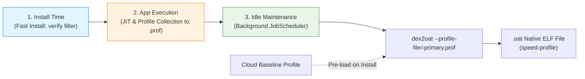

## Profile guided compilation 은 설치, 실행, idle compile 비용을 나눈다

상위 문서: [Zygote 런타임 계약](zygote-runtime-contracts.md)

Profile-Guided Compilation(PGO)은 설치 단계에서 앱 전체 코드를 100% AOT 컴파일함으로써 발생하는 앱 설치 시간 지연 및 디스크 공간 낭비를 막고, **설치 시점(Install Time)**, **실행 시점(Runtime JIT)**, 그리고 **배경 컴파일(Idle System Maintenance)** 시점으로 컴파일 비용을 분산시키는 하이브리드 최적화 아키텍처다.

### 내부 동작 메커니즘 (Internal Mechanism)

1. **설치 단계 (Install Phase - `verify` / `quicken`)**:
   - APK 설치 시 `PackageManagerService`는 바이트코드 검증만 수행하여 설치 시간을 수 초 이내로 대폭 단축한다.
2. **실행 단계 (Runtime Profiling Phase)**:
   - 앱 구동 중 ART는 JIT 컴파일러를 통해 사용자가 실제 자주 사용하는 코드 트레이스(Hot Code Path)를 수집하여 `/data/misc/profiles/cur/0/<package>/primary.prof` 파일에 프로파일 데이터로 기록한다.
3. **유휴 배경 컴파일 (Idle Maintenance Phase - `speed-profile`)**:
   - `JobScheduler`가 기기가 충전 중이고 화면이 켜지지 않은 유휴 시간에 `BackgroundDexOptService`를 호출한다.
   - `dex2oat`는 등록된 `.prof` 파일의 핫 메서드만 선별적으로 AOT 컴파일하여 최소한의 디스크 공간으로 최상의 성능을 유도한다.
4. **Cloud Profile (Baseline Profiles)**:
   - Google Play 스토어는 다른 사용자들로부터 수집된 프로파일 데이터를 APK 다운로드 시 사전 포함(Baseline Profile)시켜 첫 실행부터 `speed-profile` 급의 속도를 제공한다.



### 코드 및 구체 예시 (Concrete Snippets)

`BackgroundDexOptService` 백그라운드 컴파일 트리거 CLI 예시:

```bash
# 수동으로 유휴 상태 배경 컴파일(Background Dexopt Job) 트리거
adb shell cmd package bg-dexopt-job

# 앱 프로파일 정보 강제 플러시 덤프
adb shell kill -3 (adb shell pidof com.example.app)
```

### 관측 가능 증거 (Observable Evidence)

`adb shell`을 활용해 해당 패키지의 JIT Profile 크기 및 컴파일 결과를 확인할 수 있다:

```bash
# 런타임 수집 프로파일 파일 존재 확인
adb shell ls -la /data/misc/profiles/cur/0/com.example.app/primary.prof

# 덤프를 통한 bg-dexopt 실행 결과 관측
adb shell dumpsys package dexopt
```

### 관련 문서

- [Art Dex Execution Modes](art-dex-execution-modes.md)
- [runtime-debugging-separates-profile-compile-filter-and-jit-state](runtime-debugging-separates-profile-compile-filter-and-jit-state.md)

공식 문서: [Profile-Guided Compilation](https://source.android.com/docs/core/runtime/jit)
