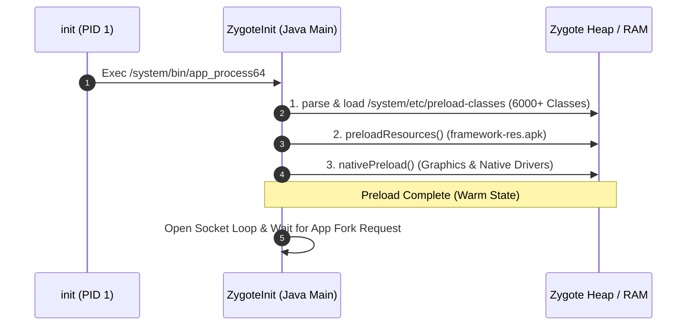

## Zygote 는 framework 공통 상태를 preload 한 뒤 앱 프로세스를 fork 한다

상위 문서: [Zygote 런타임 계약](zygote-runtime-contracts.md)

Zygote 부팅 초기화의 핵심 계약은 앱 구동 전 수 천 개의 안드로이드 공통 프레임워크 Java 클래스, 그래픽/UI 시스템 리소스(`framework-res.apk`), 그리고 Native C/C++ 공유 라이브러리(`libandroid_runtime.so`, `libhwui.so` 등)를 사전 메모리에 로드(Preload)해 두고, 이후 모든 앱 생성 시 이 상태를 통째로 `fork()` 복제하여 앱 스타트업 속도를 극대화하는 메커니즘이다.

### 내부 동작 메커니즘 (Internal Mechanism)

1. **`preload-classes` Parsing**:
   - Zygote 부팅 시 `ZygoteInit.java`는 `/system/etc/preload-classes` 목록 파일을 읽어 정적 클래스 6,000여 개 이상을 JVM ClassLoader 메모리로 사전 로딩한다.
2. **`preloadResources()` Execution**:
   - 공통 테마, 드로어블, 서체, 레이아웃 XML 메타데이터를 담고 있는 `framework-res.apk`를 로드하여 정적 자원 테이블을 초기화한다.
3. **OpenGL / Vulkan / HAL Driver Preload**:
   - `ZygoteInit.nativePreload()`를 호출하여 그래픽 드라이버 및 ART 런타임 C++ 공유 라이브러리를 메모리에 매핑한다.
4. **App Fork Acceleration**:
   - 모든 사전 로딩이 완료되면 Zygote는 Unix Socket에서 앱 생성 요청을 대기한다. 앱 구동 요청 시 이미 공통 환경이 100% 로딩된 메모리 상태에서 `fork()`만 수행하므로 앱 생성 시간이 수십 밀리초 이내로 단축된다.



### 코드 및 구체 예시 (Concrete Snippets)

`ZygoteInit.java` 내부의 Preload 초기화 메서드 스니펫 (`frameworks/base/core/java/com/android/internal/os/ZygoteInit.java`):

```java
// ZygoteInit.java (Preload Framework State)
public static void main(String argv[]) {
    // 1. Register Zygote Socket
    zygoteServer.registerServerSocketAtUserSpace();

    // 2. Preload shared classes and resources
    preload(bootTimingsTraceLog);

    // 3. Start SystemServer (First Child Fork)
    if (startSystemServer) {
        forkSystemServer(abiList, socketName, zygoteServer);
    }

    // 4. Run main Zygote loop
    zygoteServer.runSelectLoop(abiList);
}
```

### 관측 가능 증거 (Observable Evidence)

`adb shell`을 통해 Zygote가 사전 로드한 클래스 파일 및 로깅 이력을 관측할 수 있다:

```bash
# Zygote가 부팅 시 로딩하는 preload-classes 목록 파일 점검
adb shell head -n 20 /system/etc/preload-classes

# Zygote 부팅 초기화 및 Preload 소요 시간 로그 확인 (logcat)
adb logcat -s Zygote | grep -i "preload"
# 출력 예시:
# Zygote: Preloaded 6450 classes in 1250ms.
# Zygote: Preloaded 320 resources in 210ms.
```

### 관련 문서

- [zygote-fork-saves-memory-while-copy-on-write-pages-stay-clean](zygote-fork-saves-memory-while-copy-on-write-pages-stay-clean.md)
- [zygote-socket-is-system-server-process-factory-interface](zygote-socket-is-system-server-process-factory-interface.md)

공식 문서: [Zygote Optimization Overview](https://source.android.com/docs/core/runtime)
