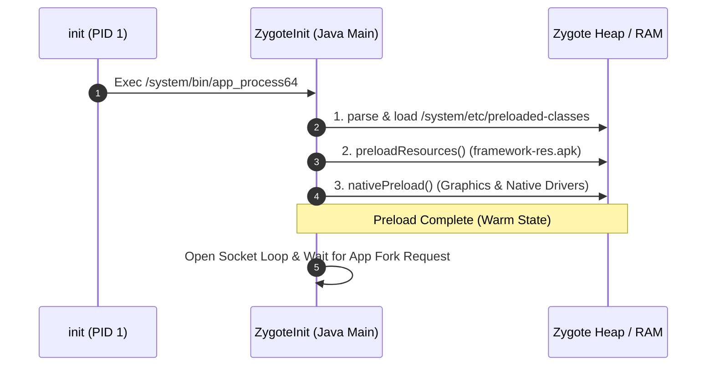

## Zygote 는 framework 공통 상태를 preload 한 뒤 앱 프로세스를 fork 한다

상위 문서: [Zygote 런타임 계약](zygote-runtime-contracts.md)

Zygote는 앱 프로세스보다 먼저 시작해 공통 class와 resource 일부를 preload하고, 같은 ABI의 system·app process가 공유할 수 있는 parent가 된다. 이후 process는 필요할 때 fork되거나, 기기 설정에 따라 미리 fork된 USAP(unspecialized app process) pool에서 specialization된다. preload 범위와 수치는 제품 구성에 따라 달라지며 앱별 class·resource·native initialization까지 준비해 주는 것은 아니다.

### 내부 동작 메커니즘 (Internal Mechanism)

1. **`preloaded-classes` parsing**:
   - Zygote 부팅 시 `ZygoteInit`은 기본적으로 `/system/etc/preloaded-classes` 목록을 사용한다. 목록은 일반 phone workload에 맞춰 조정되며 wearable 등 제품에서는 다를 수 있다. 고정된 class 수를 platform 계약으로 보지 않는다.
2. **`preloadResources()` Execution**:
   - 공통 테마, 드로어블, 서체, 레이아웃 XML 메타데이터를 담고 있는 `framework-res.apk`를 로드하여 정적 자원 테이블을 초기화한다.
3. **Native/runtime preload hook**:
   - platform 구현은 native preload hook과 shared-library preload를 수행할 수 있다. 특정 GPU driver나 모든 HAL이 항상 이 단계에서 초기화된다고 일반화하지 않는다.
4. **App Fork Acceleration**:
   - preload가 끝나면 Zygote는 Unix domain socket을 통해 process 생성 요청을 받는다. fork 후에는 UID/GID, SELinux domain, cgroup, runtime flags, app class path 등을 specialization하고 앱별 초기화를 계속한다. preload와 copy-on-write는 중복 작업과 private memory를 줄일 수 있지만 고정된 startup 시간이나 완성된 앱 환경을 보장하지 않는다.



### 코드 및 구체 예시 (Concrete Snippets)

다음은 release마다 달라지는 세부 method 이름을 생략한 개념적 순서다. 실제 코드는 대상 branch의 `frameworks/base/core/java/com/android/internal/os/ZygoteInit.java`와 `ZygoteServer.java`에서 확인한다.

```java
registerZygoteCommandSocket()
preloadConfiguredClassesResourcesAndLibraries()
if (startSystemServer) forkAndSpecializeSystemServer()
if (usapPoolEnabled) maintainUnspecializedAppProcessPool()
runCommandLoopAndForkOrSpecializeApps()
```

### 관측 가능 증거 (Observable Evidence)

`adb shell`을 통해 Zygote가 사전 로드한 클래스 파일 및 로깅 이력을 관측할 수 있다:

```bash
# Zygote가 부팅 시 로딩하는 기본 preloaded-classes 목록 점검
adb shell head -n 20 /system/etc/preloaded-classes

# Zygote 부팅 초기화 및 Preload 소요 시간 로그 확인 (logcat)
adb logcat -s Zygote | grep -i "preload"
# 출력 예시:
# Zygote: Preloaded ... classes in ...ms.
# 구체적인 tag와 출력 형식은 release·제품별로 다를 수 있다.
```

### 관련 문서

- [zygote-fork-saves-memory-while-copy-on-write-pages-stay-clean](zygote-fork-saves-memory-while-copy-on-write-pages-stay-clean.md)
- [zygote-socket-is-system-server-process-factory-interface](zygote-socket-is-system-server-process-factory-interface.md)

공식 문서: [About the Zygote processes](https://source.android.com/docs/core/runtime/zygote), [Configure ART preloaded classes](https://source.android.com/docs/core/runtime/configure)
