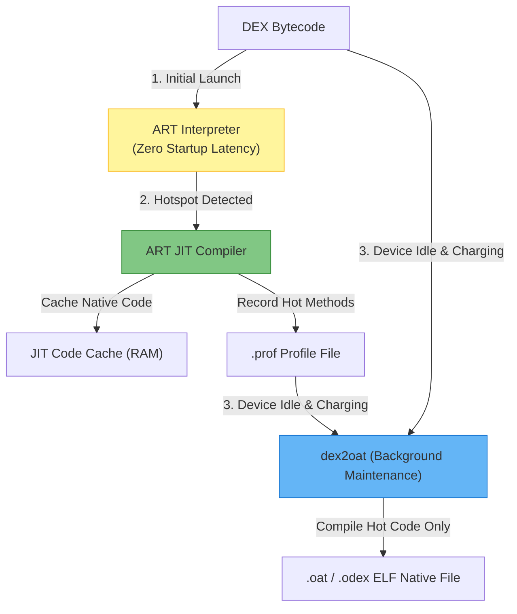

## ART 는 DEX 를 interpretation, JIT, AOT 조합으로 실행한다

상위 문서: [Zygote 런타임 계약](zygote-runtime.md)

Android Runtime(ART)은 앱 실행 효율을 극대화하기 위해 초기의 빠른 실행을 위한 **Interpreter**, 핫스팟(Hotspot) 메서드를 런타임에 네이티브 기계어로 직접 컴파일하는 **JIT (Just-In-Time) Compiler**, 그리고 기기 충전 중 idle 시간에 핫 메서드를 완전한 ELF 기계어로 정적 변환하는 **AOT (Ahead-Of-Time) Compiler (`dex2oat`)**를 하이브리드 조합으로 구동하는 런타임 엔진이다.

### 내부 동작 메커니즘 (Internal Mechanism)

1. **Interpreter Stage**:
   - 앱이 최초 실행되면 ART는 DEX 바이트코드를 지연(Latency) 없이 Interpreter 패턴으로 즉시 읽어 구동한다.
2. **JIT Compilation & Profiling Stage**:
   - 실행 중 핫 메서드(Invocation Counter 기준 한도 초과)가 감지되면 JIT 컴파일러 스레드가 백그라운드에서 해당 DEX 함수를 ARM64 네이티브 머신 코드로 번역하고 JIT Code Cache 메모리에 저장한다.
   - 동시에 실행 핫스팟 정보를 `/data/misc/profiles/cur/0/<package>/primary.prof` 바이너리 프로파일 파일로 기록한다.
3. **Idle Maintenance AOT Stage (`dex2oat`)**:
   - 기기가 충전 중이고 유휴(Idle) 상태에 진입하면 `BackgroundDexOptService`가 실행되어 `dex2oat` 바이너리를 호출한다.
   - `dex2oat`는 지정된 Compile Filter(`speed-profile`, `speed`, `space`, `verify` 등) 및 `.prof` 프로파일을 기반으로 AOT 컴파일을 수행하고 아티팩트 아카이브를 생성한다:
     - **`.vdex`**: 검증(Verification) 단계를 통과한 uncompressed DEX 코드 및 메타데이터 (재부팅 시 검증 속도 극대화).
     - **`.odex` / `.oat`**: AOT로 사전 번역된 네이티브 기계어 ELF 실행 파일.
     - **`.art`**: 빠른 클래스 및 힙 이니셜라이징을 위한 앱 이미지(App Image) Pre-instantiated 힙 스냅샷.



### 코드 및 구체 예시 (Concrete Snippets)

`dex2oat` CLI를 활용한 수동 수선 컴파일 옵션 지정 예시:

```bash
# 특정 앱을 JIT 프로파일 기반으로 speed-profile 컴파일 실행
adb shell cmd package compile -m speed-profile -f com.example.app

# 특정 앱을 완전한 AOT 기계어(speed filter)로 수동 컴파일
adb shell cmd package compile -m speed -f com.example.app
```

### 관측 가능 증거 (Observable Evidence)

`adb shell`을 통해 해당 앱의 컴파일 필터 상태 및 `.vdex` / `.odex` 생성 유무를 조회할 수 있다:

```bash
# 앱의 현재 Compile Filter 상태 (verify, speed-profile, speed 등) 점검
adb shell dumpsys package com.example.app | grep -E "(compiler-filter|dexCodeInstructionSet)"
# 출력 예시:
# [com.example.app]
#   compilation_filter=speed-profile

# 아티팩트 파일 저장 경로 조회
adb shell ls -la /data/app/*/com.example.app*/oat/arm64/
```

### 관련 문서

- [ART 프로파일 기반 컴파일 PGO (Profile-Guided Compilation)](art-profile-guided-compilation.md)
- [ART 런타임 디버깅과 컴파일 필터 (Runtime Debugging)](art-runtime-debugging.md)

공식 문서: [ART and Dalvik](https://source.android.com/docs/core/runtime)
