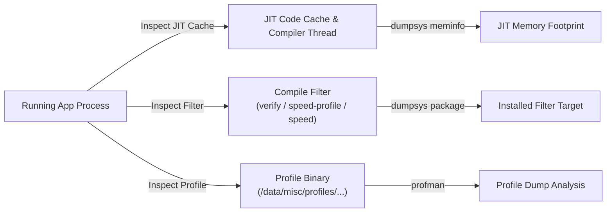

## ART 런타임 디버깅과 컴파일 필터 (Compile Filter)

상위 문서: [Zygote 와 ART 런타임 계약](zygote-runtime.md)

ART 런타임 환경에서 발생하는 앱 스타트업 지연, 프레임 드롭(Jank), GC 수면 이슈를 정확히 진단하기 위해서는 단일 디버그 로그에 의존하지 않고, (1) JIT Code Cache 메모리 상태, (2) 현재 적용된 Compile Filter 상태 (`verify`, `speed`, `speed-profile`), 그리고 (3) Baseline Profile 및 Local `.prof` 덤프 상태를 명확히 분리하여 종합 분석해야 한다.

---

### 1. 내부 동작 메커니즘 (Internal Mechanism)

1. **Compile Filter Spectrum (컴파일 필터 스펙트럼)**:
   - `assume-verified` / `extract`: 바이트코드 검증 생략 혹은 APK에서 DEX만 추출.
   - `verify`: DEX 바이트코드 검증만 수행 (런타임 시 Interpreter / JIT 구동).
   - `quicken`: DEX 바이트코드 명령어 일부만 단순 디코딩 최적화 (구버전 호환용).
   - `space` / `space-profile`: 디스크 점유율을 줄이는 방향으로 크기 제한 AOT 컴파일.
   - `speed-profile`: Profile `.prof`에 수집된 핫 메서드만 선택적 AOT 컴파일 (권장 기본값).
   - `speed`: 앱의 모든 메서드를 완전한 AOT 네이티브 기계어(`.odex`)로 사전 컴파일.
   - `everything`: 모든 메서드 및 디버그 심볼 정보까지 포함하여 최대 컴파일.
2. **JIT State Inspection (JIT 상태 검사)**:
   - JIT 컴파일러의 런타임 동작 여부는 System Property `dalvik.vm.usejit` 및 JIT Code Cache 덤프를 통해 파악한다.
3. **Profile State Inspection (프로파일 상태 검사)**:
   - 앱 런타임 실행 중 수집된 가변 프로파일 데이터는 `/data/misc/profiles/cur/0/<package>/primary.prof`에 저장된다.
   - 백그라운드 컴파일 시 합쳐진 기준 참조 프로파일(Reference Profile)은 `/data/misc/profiles/ref/<package>/primary.prof`로 동기화 관리된다.



---

### 2. 코드 및 구체 예시 (Concrete Snippets)

`profman` CLI 툴을 사용한 Profile 파일 바이너리 내용 분석 예시:

```bash
# 프로파일 분석 CLI를 사용하여 프로파일 텍스트 덤프 출력
adb shell profman --dump-only --profile-file=/data/misc/profiles/cur/0/com.example.app/primary.prof
```

---

### 3. 관측 가능 증거 (Observable Evidence)

`adb shell`을 통해 ART 런타임 컴파일 상태를 다각도로 검증할 수 있다:

```bash
# 1. 대상 앱의 현재 Compile Filter 상태 확인
adb shell dumpsys package com.example.app | grep -i "compiler-filter"

# 2. 강제로 특정 컴파일 필터(speed-profile)로 AOT 컴파일 실행
adb shell cmd package compile -m speed-profile -f com.example.app

# 3. 컴파일 상태 초기화 (verify 모드로 롤백)
adb shell cmd package compile -r -f com.example.app
```

---

### 4. 관련 문서 (Related Links)

- [ART 프로파일 기반 컴파일(PGO)](art-profile-guided-compilation.md)
- [ART DEX 실행 모드](art-dex-execution-modes.md)
- [Zygote 와 ART 런타임 계약](zygote-runtime.md)
- [Android Compilation Pipeline](../../android-compilation-pipeline.md)
