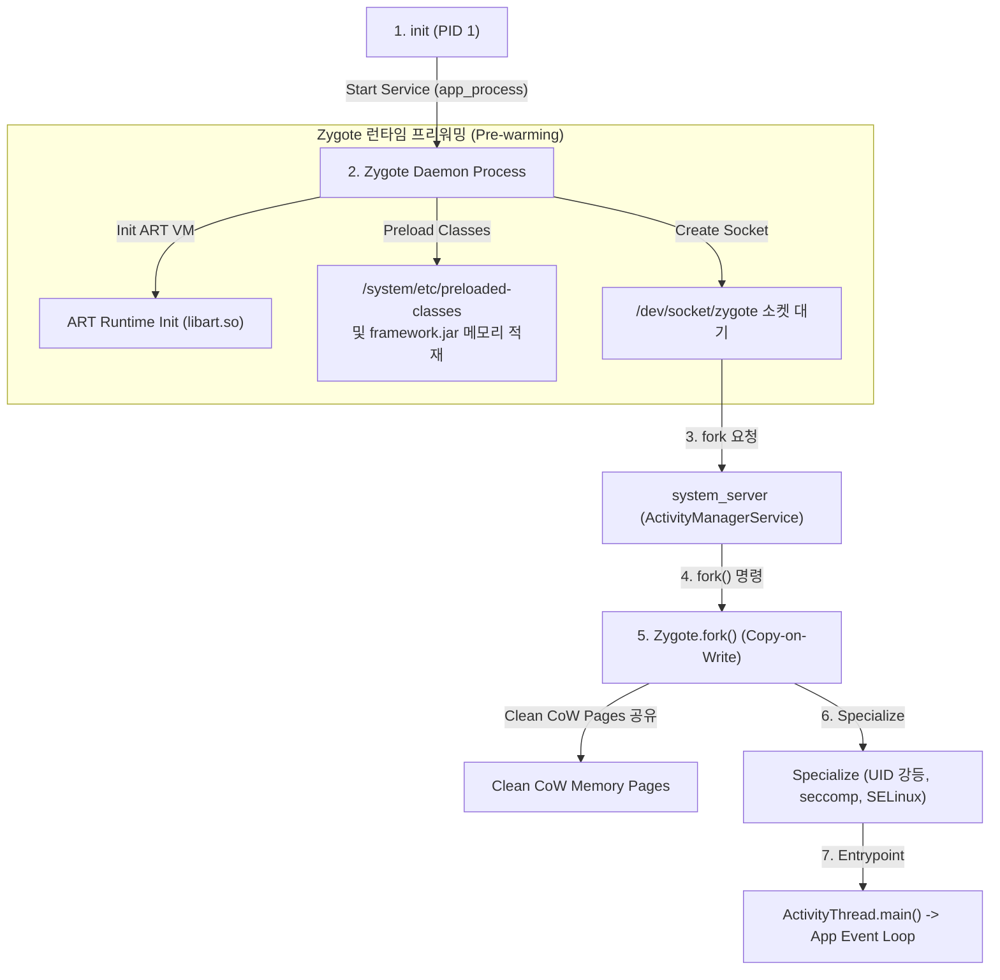

## Zygote 와 ART 런타임 심층 계약 (Zygote & ART Runtime)

### 1. 개요 및 런타임 격리 원칙 (Overview & Isolation Principles)

Android OS 에서 **Zygote (자이고트)** 는 **"모든 안드로이드 앱 프로세스의 모체(Parent) 역할을 하는 마스터 프로세스"** 이다.

> [!IMPORTANT]
> **"Android 에서 가상 머신(ART/Dalvik)은 OS 에 1 개만 떠 있는 것이 아니라, 모든 앱 프로세스마다 독립적으로 1 개씩 존재한다."**
> 만약 앱을 실행할 때마다 매번 밑바닥부터 무거운 가상 머신(ART)을 초기화하고 기본 프레임워크 클래스들을 메모리에 새로 올린다면, 앱 하나를 켜는 데 수 초 이상의 딜레이가 발생한다. Zygote 는 이러한 문제를 해결하기 위해 도입된 **초고속 프로세스 생성 및 런타임 프리워밍(Pre-warming) 메커니즘**이다.

Zygote 와 ART(Android Runtime) 서브시스템은 공통 Java/Kotlin 프레임워크 클래스와 자원을 사전 로딩(Preload)하고, Unix Domain Socket (`/dev/socket/zygote`)을 통해 `system_server`의 프로세스 생성 요청을 받아 Copy-On-Write(CoW) 메모리 공유 앱 프로세스로 `fork()`한 뒤, ART JIT/AOT 컴파일 엔진과 `ActivityThread.main()` 으로 런타임 특화(Specialization)를 완성하는 프로세스/런타임 계층 계약이다.

---

### 2. Zygote 와 ART 런타임 계약 영역 구성 (Contract Map)

| 정본 계약 노트 | 핵심 보장 메커니즘 | 검증 및 관측 가능 지점 |
| :--- | :--- | :--- |
| **[Zygote 프레임워크 상태 프리로드 (Zygote Preload)](zygote-preload-state.md)** | `/system/etc/preloaded-classes` 및 `framework.jar` 자원 preloading, `ZygoteInit.main()` | `logcat \| grep Zygote`, `preloaded-classes` |
| **[Zygote CoW 메모리 공유 (Copy-on-Write)](zygote-copy-on-write.md)** | `fork()` 페이지 테이블 복사, Clean Shared Page(OAT/VDEX) 무변경 유지 및 PSS/USS 절감 | `dumpsys meminfo`, `/proc/<pid>/smaps_rollup` |
| **[Zygote 소켓 인터페이스 (Socket Interface)](zygote-socket-interface.md)** | `/dev/socket/zygote` Unix Socket, `Process.start()`, `ZygoteServer` 커맨드 루프 | `ls -la /dev/socket/zygote`, `logcat -s Zygote` |
| **[앱 프로세스 특화와 ActivityThread 연결 (Specialization)](app-process-specialization.md)** | `ZygoteConnection.handleChildProc()`, Target UID/GID/SELinux Context 전환, `ActivityThread.attach()` | `ps -AZ`, `logcat \| grep ActivityThread` |
| **[ART DEX 실행 모드와 티어링 (Execution Modes)](art-dex-execution-modes.md)** | Interpreter -> JIT Compiler (Hot Methods) -> Profile-guided AOT (`dex2oat`) 3 단계 티어링 | `dumpsys package <pkg>`, `art_dispatch` |
| **[ART 프로파일 기반 컴파일 PGO (Profile-Guided Compilation)](art-profile-guided-compilation.md)** | JIT 프로파일링(`.prof`), Baseline Profile, `BackgroundDexOptService` 유휴 컴파일 | `cmd package compile`, `/data/misc/profiles/` |
| **[ART 런타임 디버깅과 컴파일 필터 (Runtime Debugging)](art-runtime-debugging.md)** | Compile filter(`verify`, `speed-profile`, `speed`), `profman` CLI, JIT 메모리 맵 관측 | `cmd package compile -m speed-profile`, `profman` |

---

## 경계 및 구별 규칙 (Boundary Rules)

- **프로세스 생성과 컴포넌트 생명주기의 분리**: 프로세스 생성 및 Specialization 은 Zygote/`ActivityThread` 부트스트랩 영역에서 처리하고, Activity/Service 자체의 생명주기 제어는 [system_server 계약](../system-server/system-server.md) 정본으로 이관한다.
- **빌드 타임과 런타임 최적화 분리**: ART 실행 모델 및 Profile-Guided compilation 은 OS 런타임 최적화 범위로 다루며, APK 빌드 시점의 ProGuard / R8 바이트코드 난독화 및 최적화와 혼동하지 않는다.
- **메모리 절감 관점 분리**: Copy-On-Write 메모리 공유 이점은 Zygote Preload 및 Clean Shared Page 관점으로만 설명하며, LMKD / OOM-Killer 프로세스 회수 정책은 system_server 및 Kernel 정본으로 위임한다.

상위 지도: [Android 부팅과 런타임 지도](../android-boot-and-runtime.md)

관련 지도: [system_server와 ActivityManager 계약](../system-server/system-server.md), [Kernel contracts](../../kernel-and-hal/kernel/kernel.md)
