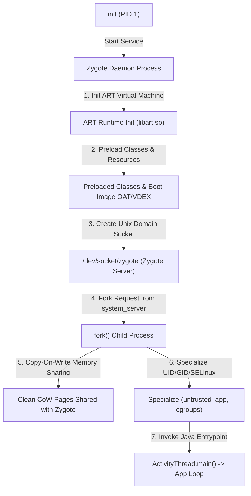

## Zygote 와 ART 런타임 계약

Zygote와 ART(Android Runtime) 서브시스템은 공통 Java/Kotlin 프레임워크 클래스와 자원을 사전 로딩(Preload)하고, Unix Domain Socket을 통한 프로세스 생성을 받아 Copy-On-Write(CoW) 메모리 공유 앱 프로세스로 Fork한 뒤, ART JIT/AOT 컴파일 엔진과 `ActivityThread.main()`으로 런타임 특화(Specialization)를 완성하는 프로세스/런타임 계층 계약이다.

---

## Zygote 와 ART 런타임 계약 영역 구성 (Contract Map)

| 정본 계약 노트 | 핵심 보장 메커니즘 | 검증 및 관측 가능 지점 |
| :--- | :--- | :--- |
| **[Zygote는 framework 공통 상태를 preload한 뒤 앱 프로세스를 fork한다](zygote-preload-state.md)** | `/system/etc/preloaded-classes` 및 `framework.jar` 자원 preloading, `ZygoteInit.main()` | `logcat \| grep Zygote`, `preloaded-classes` |
| **[Zygote fork의 메모리 이점은 copy-on-write가 유지될 때 생긴다](zygote-copy-on-write.md)** | `fork()` 페이지 테이블 복사, Clean Shared Page(OAT/VDEX) 무변경 유지 및 PSS/USS 절감 | `dumpsys meminfo`, `/proc/<pid>/smaps_rollup` |
| **[Zygote socket은 system_server가 앱 프로세스를 요청하는 factory interface다](zygote-socket-interface.md)** | `/dev/socket/zygote` Unix Socket, `Process.start()`, `ZygoteServer` 커맨드 루프 | `ls -la /dev/socket/zygote`, `logcat -s Zygote` |
| **[앱 프로세스는 specialization 뒤 ActivityThread로 framework에 attach한다](app-process-specializes-before-activitythread-attaches-to-framework.md)** | `ZygoteConnection.handleChildProc()`, Target UID/GID/SELinux Context 전환, `ActivityThread.attach()` | `ps -AZ`, `logcat \| grep ActivityThread` |
| **[ART는 DEX를 interpretation, JIT, AOT 조합으로 실행한다](art-dex-execution-modes.md)** | Interpreter -> JIT Compiler (Hot Methods) -> Profile-guided AOT (`dex2oat`) 3단계 티어링 | `dumpsys package <pkg>`, `art_dispatch` |
| **[Profile guided compilation은 설치, 실행, idle compile 비용을 나눈다](profile-guided-compilation-splits-install-runtime-and-idle-costs.md)** | JIT 프로파일링(`.prof`), Baseline Profile, `BackgroundDexOptService` 유휴 컴파일 | `cmd package compile`, `/data/misc/profiles/` |
| **[런타임 디버깅은 profile, compile filter, JIT 상태를 분리해서 본다](runtime-debugging-separates-profile-compile-filter-and-jit-state.md)** | Compile filter(`verify`, `speed-profile`, `speed`), `profman` CLI, JIT 메모리 맵 관측 | `cmd package compile -m speed-profile`, `profman` |

---

## 경계 및 구별 규칙 (Boundary Rules)

- **프로세스 생성과 컴포넌트 생명주기의 분리**: 프로세스 생성 및 Specialization은 Zygote/`ActivityThread` 부트스트랩 영역에서 처리하고, Activity/Service 자체의 생명주기 제어는 [system_server 계약](../system-server/system-server.md) 정본으로 이관한다.
- **빌드 타임과 런타임 최적화 분리**: ART 실행 모델 및 Profile-Guided compilation은 OS 런타임 최적화 범위로 다루며, APK 빌드 시점의 ProGuard / R8 바이트코드 난독화 및 최적화와 혼동하지 않는다.
- **메모리 절감 관점 분리**: Copy-On-Write 메모리 공유 이점은 Zygote Preload 및 Clean Shared Page 관점으로만 설명하며, LMKD / OOM-Killer 프로세스 회수 정책은 system_server 및 Kernel 정본으로 위임한다.

상위 지도: [Android 부팅과 런타임 지도](../android-boot-and-runtime.md)  
관련 지도: [system_server와 ActivityManager 계약](../system-server/system-server.md), [Kernel contracts](../../kernel-and-hal/kernel/kernel.md)
