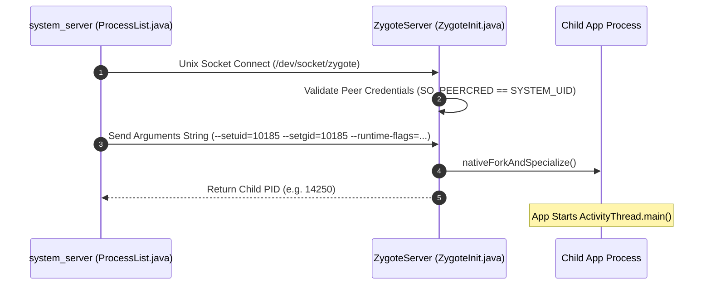

## Zygote socket 은 system_server 가 앱 프로세스를 요청하는 factory interface 다

상위 문서: [Zygote 런타임 계약](zygote-runtime.md)
배경 지식: [유닉스 도메인 소켓 IPC](../../../../../operating-systems/ipc-mechanisms.md)

`Zygote socket`은 `system_server`와 `Zygote` 데몬 간에 구축된 전용 Local **[Unix Domain Socket](../../../../../operating-systems/ipc-mechanisms.md)**(같은 머신 안의 프로세스끼리 파일시스템 경로를 주소로 통신하는 IPC 메커니즘) 통신 관문으로, Security Context 검증을 거쳐 `system_server` 프로세스만이 신규 앱 프로세스 팩토리(Process Factory)로서 Zygote에게 `fork` 및 프로세스 구체화(Specialize)를 요청할 수 있도록 한 제어 통로다.

### 내부 동작 메커니즘 (Internal Mechanism)

1. **Socket Pre-creation & Listening**:
   - `init` 프로세스가 부팅 시 `/dev/socket/zygote` (64-bit 기본) 및 64/32-bit 혼용 기기 환경용 `/dev/socket/zygote_secondary` (32-bit) 노드를 생성하고 소켓 파일 디스크립터(FD)를 Zygote 데몬에 전달한다.
   - Zygote 프로세스의 `ZygoteServer.runSelectLoop()` 메인 루프가 `epoll` 방식으로 소켓 연결 및 USAP (Unspecialized App Process) pool 제어 소켓을 감지 대기한다.
2. **IPC Credentials & Authorization**:
   - `system_server`가 신규 프로세스 작성을 요청할 때 유닉스 소켓으로 접속하면, Zygote는 커널 `SO_PEERCRED` 옵션을 호출해 연결 클라이언트의 UID, GID, PID를 검증한다.
   - 오직 `system_server` (UID `1000` / `SYSTEM_UID`) 클라이언트의 요청만 프로세스 Fork로 승인하며, 일반 서드파티 앱의 직접 소켓 접근은 차단된다.
3. **Command Protocol & Response**:
   - `system_server`는 줄바꿈 문자(`\n`)로 구분된 텍스트 프로토콜 기반으로 패키지 정보, Target SDK, UID/GID, SELinux `seinfo`, 런타임 컴파일 플래그가 직렬화된 인수 목록을 전송한다.
   - Zygote가 자식 프로세스를 `fork()`하면, 부모 Zygote는 자식의 새로 생성된 PID를 `system_server`로 소켓 응답(DataOutputStream writeInt)하고 자식 프로세스 측 소켓 연결은 즉시 닫는다(Close).



### 코드 및 구체 예시 (Concrete Snippets)

Zygote Socket 접속 및 명령어 스트림 전달 코드 스nippet (`frameworks/base/core/java/com/android/internal/os/ZygoteProcess.java`):

```java
// ZygoteProcess.java (system_server Process Factory Request)
private ProcessStartResult zygoteSendArgsAndGetResult(ZygoteState zygoteState, 
                                                      ArrayList<String> args) {
    // 1. Open socket writer/reader stream
    final BufferedWriter writer = zygoteState.mZygoteOutput;
    final DataInputStream inputStream = zygoteState.mZygoteInputStream;

    // 2. Write arguments protocol string
    writer.write(Integer.toString(args.size()));
    writer.newLine();
    for (String arg : args) {
        writer.write(arg);
        writer.newLine();
    }
    writer.flush();

    // 3. Read child PID returned from Zygote
    ProcessStartResult result = new ProcessStartResult();
    result.pid = inputStream.readInt();
    result.usingWrapper = inputStream.readBoolean();
    return result;
}
```

### 관측 가능 증거 (Observable Evidence)

`adb shell`을 이용해 Zygote Unix Socket 파일 노드의 권한과 소켓 덤프 상태를 확인할 수 있다:

```bash
# Zygote 유닉스 도메인 소켓 파일 권한 조회
adb shell ls -la /dev/socket/zygote*
# 출력 예시:
# srw-rw---- 1 root system 0 Zygote
# srw-rw---- 1 root system 0 zygote_secondary

# Zygote 프로세스 및 소켓 리스너 로그 관측 (logcat)
adb logcat -s Zygote
```

### 관련 문서

- [앱 프로세스 특화와 ActivityThread 연결 (Specialization)](app-process-specialization.md)
- [Zygote 프레임워크 상태 프리로드 (Zygote Preload)](zygote-preload-state.md)

공식 문서: [Zygote Process Architecture](https://source.android.com/docs/core/runtime)
