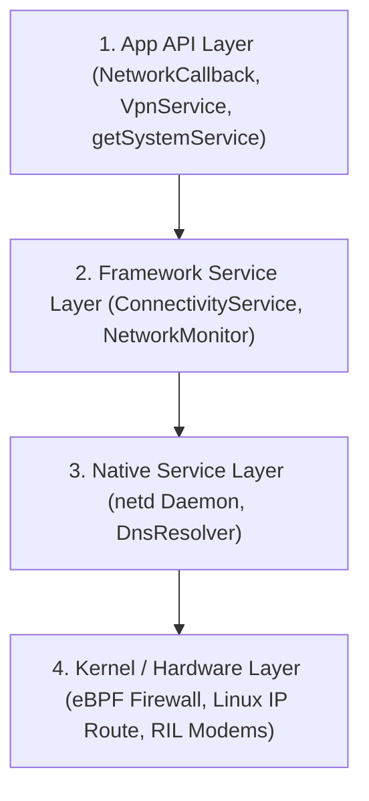

# Android Connectivity Runtime (안드로이드 네트워크 런타임 통제 아키텍처)

## 1. 개요 (Overview)

**Android Connectivity Runtime (안드로이드 연결성 런타임)** 은 단순히 앱이 소켓을 열거나 HTTP 요청을 보내는 차원을 넘어, **네트워크 평가 점수(Network Score), [Android eBPF 패킷 방화벽](ebpf-networking.md), [NetId 기반 멀티 라우팅](netid-routing-table.md), [Android Private DNS](android-private-dns.md), 및 [VPN Always-on / Lockdown](../../05_security_privacy/vpn-always-on-vs-lockdown.md)** 을 시스템 수준에서 통합 제어하는 안드로이드 가용성 및 보안 통제 체계이다.

---

### 초보자를 위한 쉽게 이해하는 비유

* **Connectivity Runtime (스마트 시티의 종합 교통 관제 센터)**:
  - 도시(스마트폰)에 일반 도로(Wi-Fi), 고속도로(셀룰러), 전용 보안 터널(VPN)이 공존할 때, 차량(앱 패킷)의 통행 통행권([NetId](netid-routing-table.md))을 발급하고, 위반 차량을 검문소([Android eBPF](ebpf-networking.md))에서 멈추며, 보안 주소록([Android Private DNS](android-private-dns.md))을 검증하고, 비상시 차선 통제([VPN Lockdown](../../05_security_privacy/vpn-always-on-vs-lockdown.md))를 총괄 수행하는 관제 센터.

---

## 2. 계층별 제어 파이프라인 및 원자/확장 레퍼런스 노드

1. **App API Layer**:
   - `ConnectivityManager`, `NetworkCallback`, `NetworkRequest`, `VpnService` 등 앱 코드가 직접 부르는 인터페이스.
   - 상세 레퍼런스: [Context.getSystemService()](../../04_system_services/get-system-service.md)
2. **Framework Service Layer**:
   - `ConnectivityService`, `NetworkMonitor`, `NetworkPolicyManagerService` 처럼 `system_server` 내부에서 디폴트 네트워크를 선택하고 유효성(Validation)을 검사하는 계층.
   - 상세 레퍼런스: [system_server 통합 관제 프로세스](../../04_system_services/system-server.md)
3. **Native Service Layer**:
   - `netd` 데몬, `DnsResolver`, Mainline `NetworkStack` 모듈처럼 C++ 프로세스로 IP 라우팅, eBPF 방화벽 룰, DNS 캐싱을 처리하는 영역.
   - 상세 레퍼런스:
     - [NetId & Multi-Routing Table](netid-routing-table.md) - `netd` 라우팅 파이프라인
     - [Android Private DNS](android-private-dns.md) - 안드로이드 Private DNS 확장 노드
     - [CS DNS-over-TLS (DoT)](../../../../computer-science/networking/dns-over-tls-dot.md) - CS 기반 DoT 프로토콜
4. **Kernel / Hardware Layer**:
   - [Android eBPF 방화벽 및 penalty_box](ebpf-networking.md), Linux 커널 multiple routing tables, Wi-Fi 칩셋 드라이버(`wlan0`), RIL(Radio Interface Layer) 셀룰러 모뎀.
   - 상세 레퍼런스:
     - [Android eBPF 네트워크 패킷 통제](ebpf-networking.md) - 안드로이드 eBPF 확장 노드
     - [CS eBPF 커널 런타임 엔진](../../../../computer-science/operating-systems/ebpf.md) - CS 기반 eBPF 원자 노드
     - [VPN Always-on vs Lockdown](../../05_security_privacy/vpn-always-on-vs-lockdown.md) - 커널 단위 VPN 전면 봉쇄

---

## 3. 관찰 신호 및 dumpsys 디버깅 진단 가이드

네트워크 상태 및 통신 장애 진단 시 [dumpsys 진단 도구](../../06_testing_performance/debugging/dumpsys.md) 명령어로 하위 신호를 확인한다:

- **`adb shell dumpsys connectivity`**: 활성 네트워크 score, Capabilities (`NET_CAPABILITY_VALIDATED`), Default network
- **`adb shell dumpsys netpolicy`**: Data Saver 및 [Android eBPF](ebpf-networking.md) UID background restrict 방화벽 룰
- **`adb shell dumpsys netd`**: ip rule, [NetId 라우팅 테이블](netid-routing-table.md) 및 eBPF penalty_box
- **`adb shell dumpsys dnsresolver`**: [Android Private DNS](android-private-dns.md) 유효성 검사 상태
- **`adb shell dumpsys vpn`**: [Always-on 및 Lockdown VPN](../../05_security_privacy/vpn-always-on-vs-lockdown.md) active status

---

## 4. 연결 문서 (Related Links)

- [Android eBPF 네트워크 패킷 통제](ebpf-networking.md) - 안드로이드 eBPF 확장 노드
- [CS eBPF 커널 런타임 엔진](../../../../computer-science/operating-systems/ebpf.md) - CS 원자 노드 (SSOT)
- [Android Private DNS](android-private-dns.md) - 안드로이드 Private DNS 확장 노드
- [CS DNS-over-TLS (DoT)](../../../../computer-science/networking/dns-over-tls-dot.md) - CS 원자 노드 (SSOT)
- [NetId & Multi-Routing Table](netid-routing-table.md) - netd 멀티 라우팅 파이프라인
- [VPN Always-on vs Lockdown](../../05_security_privacy/vpn-always-on-vs-lockdown.md) - VPN 전면 차단 메커니즘
- [dumpsys 시스템 진단 도구](../../06_testing_performance/debugging/dumpsys.md) - 안드로이드 dumpsys CLI 진단
