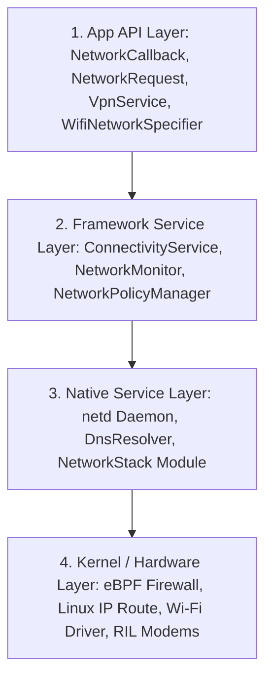

## Android connectivity runtime

Android의 연결성(Connectivity) 런타임 체계는 단순 소켓 오픈이나 `HttpURLConnection` 호출법을 넘어 **네트워크 평가 점수(Network Score), 백그라운드 정책(Metered / Data Saver / eBPF Firewall), 및 라우팅 멀티캐스팅(VpnService / netd)**을 통제하는 시스템 가용성 계약 위에 구축되어 있다.

정본 묶음: [Connectivity contracts](connectivity-contracts/connectivity-contracts.md)

### 계층 구분

Android Connectivity 시스템은 다음 4개 서브시스템 계층 중 어느 지점의 제어 계약을 설명하는지 구분한다.

- **App API Layer**: `ConnectivityManager`, `NetworkCallback`, `NetworkRequest`, `VpnService`, `NetworkSecurityConfig`처럼 앱 코드가 직접 부르는 인터페이스.
- **Framework Service Layer**: `ConnectivityService`, `NetworkMonitor`, `NetworkPolicyManagerService`, `TelephonyRegistry`처럼 `system_server` 내부에서 디폴트 네트워크를 선택하고 유효성(Validation)을 검사하는 계층.
- **Native Service Layer**: `netd` 데몬, `DnsResolver`, Mainline `NetworkStack` 모듈처럼 C++ 또는 전용 프로세스로 IP 라우팅, eBPF 방화벽 룰, DNS 캐싱을 처리하는 영역.
- **Kernel / Hardware Layer**: eBPF penalty_box, Linux 커널 multiple routing tables, iptables, Wi-Fi 칩셋 드라이버(`wlan0`), RIL 셀룰러 모뎀.

이 구분은 [Connectivity contracts](connectivity-contracts/connectivity-contracts.md) index 문서에서 문제 분류별로 세분화되어 관리된다.

### 관찰 신호 및 디버깅 접근법

시스템 네트워크 정합성 및 통신 장애 진단 시 다음 덤프 명령어로 신호를 확인한다:
- `adb shell dumpsys connectivity`: 활성 네트워크 score, Capabilities (`NET_CAPABILITY_VALIDATED`), Default network
- `adb shell dumpsys netpolicy`: Data Saver 및 eBPF UID background restrict 방화벽 룰
- `adb shell dumpsys netd`: ip rule, netId routing table 및 eBPF penalty box
- `adb shell dumpsys dnsresolver`: Private DNS (DNS-over-TLS) 유효성 검사 상태
- `adb shell dumpsys vpn`: Always-on 및 Lockdown VPN active status
