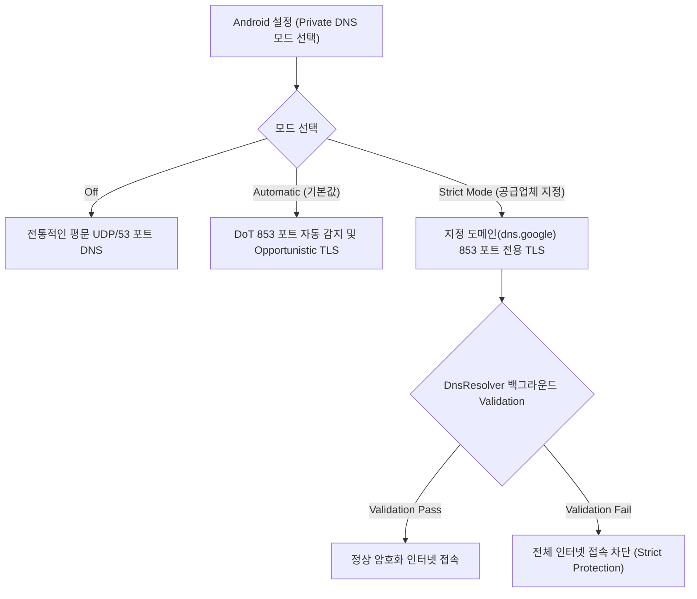

# Android Private DNS (Android Specific Extension)

## 1. 개요 (Overview)

이 노드는 컴퓨터 과학의 [DNS-over-TLS (DoT)](../../../../computer-science/networking/dns-over-tls-dot.md) 보안 프로토콜을 기반으로, **Android OS 가 프레임워크 및 네이티브 단에서 구현한 Private DNS 3대 작동 모드, `DnsResolver` 네이티브 모듈, Strict Mode 통제 방식을 서술하는 안드로이드 특화 확장 명세**이다.

Android 9(Pie) 이상부터 OS 차원에서 기본 탑재되어, 사용자가 설정한 보안 DNS 도메인을 통해 기기 전역의 모든 애플리케이션 DNS 쿼리를 TLS 로 암호화하여 통신사 및 Wi-Fi 해커의 감청을 차단한다.

---

### 초보자를 위한 쉽게 이해하는 비유

* **Android Private DNS (스마트폰 보안 출입 통합 스위치)**:
  - 컴퓨터 과학의 [DoT 보안 등기 우편](../../../../computer-science/networking/dns-over-tls-dot.md) 규격을 스마트폰 설정창에서 **[사용 안 함 / 자동 / 개인 지정 모드]** 스위치로 제어하고, 지정한 보안 주소록 서버가 확인되지 않으면 스마트폰의 모든 인터넷 통신을 차단하는 안드로이드 전용 보안 스위치.



---

## 2. Android 특화 Private DNS 내부 아키텍처

1. **Private DNS 3가지 작동 모드**:
   - **`Off`**: 전통적인 평문 UDP/53 포트 DNS 사용 (보안 미적용).
   - **`Automatic` (기본값)**: 네트워크가 DoT(853 포트)를 지원하면 자동으로 TLS 암호화 적용, 미지원 시 평문 DNS 로 폴백.
   - **`Strict Mode` (개인 지정 호스트네임)**: 사용자가 입력한 특정 보안 DNS 도메인(예: `dns.google`, `1.1.1.1`)만 사용하며, TLS Validation 실패 시 **모든 앱의 인터넷 접속을 차단**.
2. **`DnsResolver` Mainline 네이티브 모듈**:
   - `system_server` 내부의 `ConnectivityService` 가 아닌 C++ 기반 네이티브 데몬인 `DnsResolver` 가 백그라운드에서 주기적 Validation probes 를 쏘아 CA 인증서 및 호스트네임 정합성을 지속 검증한다.

---

## 3. 관측 가능 증거 및 CLI 명령어

`adb shell` 로 안드로이드 OS 의 Private DNS 설정값 및 DoT Validation 결과를 진단할 수 있다:

```bash
# dumpsys dnsresolver 를 통한 Android Private DNS Validation 현황 조회
adb shell dumpsys dnsresolver

# OS 글로벌 시스템 설정 내 Private DNS 설정값 조회
adb shell settings get global private_dns_mode
adb shell settings get global private_dns_specifier
```

---

## 4. 연결 문서 (Related Links)

- [CS DNS-over-TLS (DoT) 프로토콜](../../../../computer-science/networking/dns-over-tls-dot.md) - CS 기반 DoT 원자 노드 (SSOT)
- [Android Connectivity 런타임](android-connectivity.md) - 안드로이드 네트워크 계층 구조
- [NetId & Multi-Routing Table](netid-routing-table.md) - DNS 패킷이 전송되는 NetId 라우팅
- [dumpsys 시스템 진단 도구](../../06_testing_performance/debugging/dumpsys.md) - dumpsys dnsresolver 진단

---

### Kotlin DnsResolver API 직접 사용 및 Private DNS 상태 확인

```kotlin
import android.net.DnsResolver
import android.net.Network
import android.os.CancellationSignal
import java.net.InetAddress
import java.util.concurrent.Executor

fun resolveDomainWithPrivateDns(
    network: Network,
    domain: String,
    executor: Executor,
    onResolved: (List<InetAddress>) -> Unit
) {
    val resolver = DnsResolver.getInstance()
    val cancellationSignal = CancellationSignal()

    // system_server 및 netd Private DNS 설정이 적용된 DnsResolver 사용
    resolver.query(
        network,
        domain,
        DnsResolver.FLAG_EMPTY,
        executor,
        cancellationSignal,
        object : DnsResolver.Callback<List<InetAddress>> {
            override fun onAnswer(answer: List<InetAddress>, rcode: Int) {
                if (rcode == 0) {
                    onResolved(answer)
                }
            }

            override fun onError(error: DnsResolver.DnsException) {
                // Private DNS 서버 연결 불가 또는 strict mode 검증 실패 시 발생
            }
        }
    )
}
```

### 관찰 신호: dumpsys dnsresolver Private DNS 상태 확인

```bash
# netd dnsresolver의 Private DNS (Strict Mode vs Opportunistic Mode) 덤프
adb shell dumpsys dnsresolver

# 주요 관찰 사항:
# - Private DNS mode: STRICT (specific provider) vs AUTOMATIC
# - Server validation status: SUCCESS (TLS port 853 handshake OK)
# - DnsQueryLog: 암호화된 DNS 쿼리 처리 통계
```

### 관련 문서

- [Network Security Config는 앱 신뢰, cleartext, pinning 정책을 선언한다](network-security-config.md)
- [netd는 라우팅, DNS, 방화벽, tethering 명령을 실행한다](netd-daemon.md)

공식 문서: [Android Private DNS Features](https://developer.android.com/about/versions/pie/android-9.0-changes-28#private-dns)
