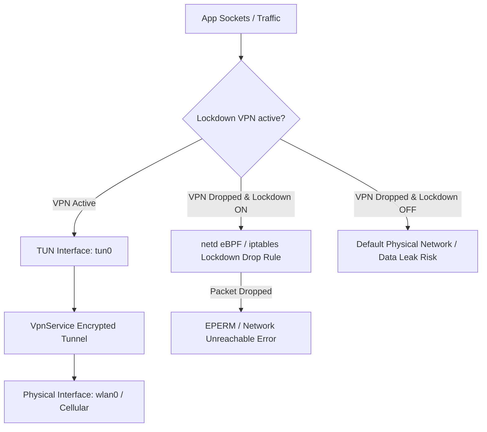

## Always-on 과 lockdown VPN 은 연결 실패를 보안 정책으로 바꾼다

상위 문서: [Connectivity contracts](connectivity-contracts.md)

Android의 **Always-on VPN** 및 **Lockdown VPN** 모드는 단순한 네트워크편의 기능이 아니다. VPN 서비스 장애나 네트워크 인터페이스 전환(Handover) 시 데이터가 암호화되지 않은 디폴트 네트워크(Wi-Fi/Cellular)로 유출되는 것을 차단하기 위해 **연결 실패 상황을 전면 네트워크 차단 보안 정책(Drop-All Rule)으로 승화시키는 커널 레벨 통제 계약**이다.

### 메커니즘: Lockdown VPN과 netd eBPF/iptables 차단 파이프라인

1. **Always-on VPN**:
   - 시스템 부팅 완료(`BOOT_COMPLETED`) 및 네트워크 연결 시 `Vpn.java` (system_server)가 등록된 VPN 패키지를 자동으로 시작하고 TUN 인터페이스를 복원한다.

2. **Lockdown VPN (Block Connections Without VPN)**:
   - 사용자가 "VPN 연결 없이 네트워크 차단"을 활성화하거나 DPC(Device Policy Controller)가 설정한 경우 동작한다.
   - `ConnectivityService`는 VPN TUN 인터페이스 이외의 물리 인터페이스(wlan0, rmnet0)에 대해 허용된 앱 UID를 제외한 모든 UID 트랙픽을 차단하는 eBPF / iptables `lockdown_drop` 룰을 `netd`에 전송한다.
   - VPN이 연결 끊김(Reconnecting) 상태일 때 패킷은 에러를 리턴하며 차단되어 cleartext 유출이 물리적으로 불가능해진다.



### Kotlin DevicePolicyManager Always-on VPN 설정 예시

```kotlin
import android.app.admin.DevicePolicyManager
import android.content.ComponentName
import android.content.Context

fun configureAlwaysOnVpn(
    context: Context,
    adminComponent: ComponentName,
    vpnPackageName: String
) {
    val dpm = context.getSystemService(Context.DEVICE_POLICY_MANAGER_SERVICE) as DevicePolicyManager
    
    try {
        // Always-on VPN 및 Lockdown(VPN 미연결 시 트랙픽 전면 차단) 활성화
        dpm.setAlwaysOnVpnPackage(
            adminComponent,
            vpnPackageName,
            true // lockdownEnabled = true
        )
    } catch (e: Exception) {
        // 예외 처리
    }
}
```

### Manifest 등록 필수 태그

```xml
<service
    android:name=".MyVpnService"
    android:permission="android.permission.BIND_VPN_SERVICE">
    <intent-filter>
        <action android:name="android.net.VpnService" />
    </intent-filter>
    <!-- Always-on VPN 지원 선언 -->
    <meta-data
        android:name="android.net.VpnService.SUPPORTS_ALWAYS_ON"
        android:value="true" />
</service>
```

### 관찰 신호: dumpsys vpn 및 netd 방화벽 룰 관찰

```bash
# 1. system_server VPN 서비스의 Always-on 및 Lockdown 상태 확인
adb shell dumpsys vpn

# 주요 출력 확인 필드:
# - Always-on package: com.example.vpn
# - Lockdown enabled: true
# - NetId & Interface: tun0

# 2. netd 의 lockdown UID drop 방화벽 룰 관찰
adb shell dumpsys netd | grep -A 10 "lockdown"
```

### 관련 문서

- [VpnService는 앱이 만든 TUN interface를 시스템 라우팅에 등록한다](vpnservice-registers-app-tun-interface-with-system-routing.md)
- [netd는 라우팅, DNS, 방화벽, tethering 명령을 실행한다](netd-enforces-routing-dns-firewall-and-tethering-operations.md)

공식 문서: [Android Always-on VPN Guide](https://developer.android.com/develop/connectivity/vpn#always-on)
