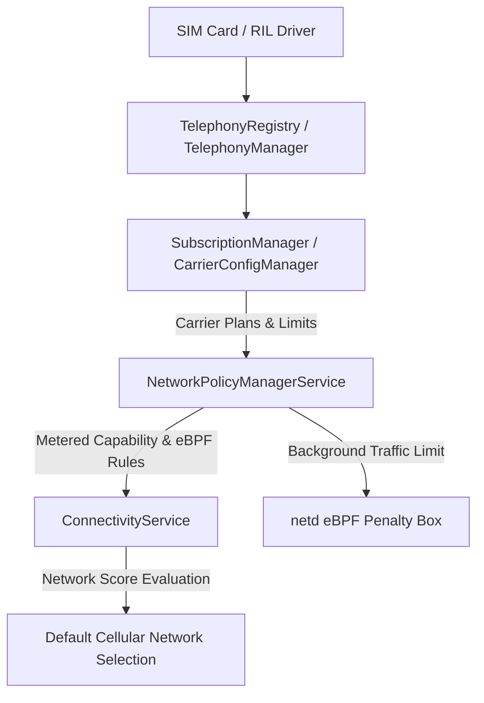

## 셀룰러 연결성은 요금제와 시스템 정책에 의해 통제된다

상위 문서: [Connectivity contracts](connectivity-contracts.md)

Android의 셀룰러(LTE/5G) 네트워크 연결성은 단순한 물리적 무선 신호 수신 여부로 결정되지 않는다. 통신사 정책(Carrier Configuration), 사용자의 데이터 요금제 플랜(`SubscriptionPlan`), **NetworkPolicyManagerService의 백그라운드 데이터 제한 정책**이 종합적으로 개입하여 셀룰러 네트워크의 기능적 가용성을 제어한다.

### 메커니즘: Telephony와 NetworkPolicy의 통합 제어 흐름

1. **CarrierConfigManager & SubscriptionManager**:
   - SIM 카드가 삽입되면 RIL(Radio Interface Layer)을 통해 통신사 식별자(MCC/MNC)를 읽고 `CarrierConfigManager`가 통신사 특화 APN, Roaming 정책, VoLTE/5G 슬라이싱 규격을 로드한다.

2. **SubscriptionPlan & Metered Status**:
   - `SubscriptionManager.setSubscriptionPlans()`를 통해 요금제의 데이터 한도(Limit) 및 소진 여부를 감지한다.
   - 데이터 소진 시 셀룰러 네트워크는 `NET_CAPABILITY_NOT_METERED`를 잃고 종량제(Metered) 네트워크로 전환된다.

3. **NetworkPolicyManagerService & Data Saver**:
   - 데이터 한도 초과 또는 데이터 절약 모드(Data Saver) 활성화 시 백그라운드 앱의 셀룰러 소켓 생성을 eBPF 차단하고, `ConnectivityService`의 네트워크 점수(Score)를 감점하여 가용한 Wi-Fi가 있을 때 즉시 우회 전환하도록 유도한다.



### Kotlin 셀룰러 종량제 및 네트워크 특성 관찰 코드

```kotlin
import android.net.ConnectivityManager
import android.net.NetworkCapabilities

fun checkCellularPolicy(connectivityManager: ConnectivityManager) {
    val activeNetwork = connectivityManager.activeNetwork
    val caps = connectivityManager.getNetworkCapabilities(activeNetwork) ?: return

    val isCellular = caps.hasTransport(NetworkCapabilities.TRANSPORT_CELLULAR)
    val isMetered = !caps.hasCapability(NetworkCapabilities.NET_CAPABILITY_NOT_METERED)
    val isUnmetered5G = caps.hasCapability(NetworkCapabilities.NET_CAPABILITY_TEMPORARILY_NOT_METERED)

    if (isCellular && isMetered) {
        // 셀룰러 종량제 네트워크: 대용량 동영상 다운로드 보류 및 압축 적용
        enableDataSavingStrategy()
    } else if (isUnmetered5G) {
        // 5G 무제한 요금제 상태: 최고 화질 스트리밍 허용
        enableHighQualityStrategy()
    }
}

private fun enableDataSavingStrategy() {}
private fun enableHighQualityStrategy() {}
```

### 관찰 신호: Telephony 및 NetworkPolicy 관찰

```bash
# 1. Telephony 서비스 및 Carrier Config 상태 확인
adb shell dumpsys telephony.registry

# 2. 셀룰러 네트워크 정책 및 Subscription Plan 덤프
adb shell dumpsys netpolicy

# 주요 출력 관찰 사항:
# - Subscription plans: LimitBytes, CycleRule, Metered status
# - UID Policy: RESTRICT_BACKGROUND (Data saver active)
```

### 관련 문서

- [Metered와 Data Saver는 백그라운드 네트워크 비용 정책이다](metered-and-data-saver-are-background-network-cost-policy.md)
- [ConnectivityService는 네트워크를 선택하고 정책을 적용한다](connectivityservice-selects-networks-and-applies-policy.md)

공식 문서: [Android Carrier Configuration](https://source.android.com/docs/core/connect/carrier-config)
