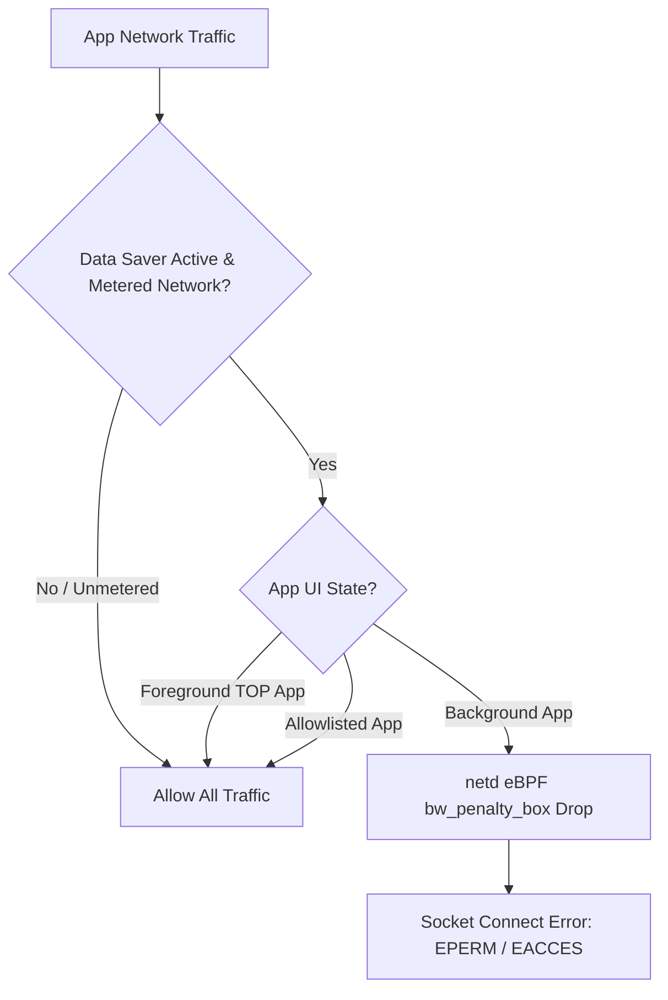

## Metered와 Data Saver는 백그라운드 네트워크 비용 정책이다

상위 문서: [Connectivity contracts](connectivity-contracts.md)

Android에서 **종량제 네트워크(Metered Network)**와 **데이터 절약 모드(Data Saver)**는 소켓 생성 자체를 원천 막는 하드웨어 에러가 아니다. 사용자의 통신 요금과 백그라운드 데이터 소비를 방지하기 위해 **앱의 포그라운드/백그라운드 가시성 상태(UID State)에 따라 네트워크 통신을 차단하는 비용 관리 정책(Cost Control Policy)**이다.

### 메커니즘: NetworkPolicyManagerService와 eBPF UID Penalty Box

1. **Metered Network Identification**:
   - `NET_CAPABILITY_NOT_METERED` 플래그가 없는 셀룰러 테더링 hot-spot 또는 종량제 Wi-Fi 연결을 나타낸다.

2. **Data Saver Status (`RESTRICT_BACKGROUND`)**:
   - 사용자가 시스템 설정에서 데이터 절약 모드를 활성화하면 `NetworkPolicyManagerService`가 작동한다.
   - 앱이 백그라운드(`PROCESS_STATE_BACKGROUND`)로 전환되는 즉시, `netd`는 **eBPF/iptables**(커널 안에서 UID별로 패킷을 필터링하는 Linux 방화벽 메커니즘 — 자세한 정의는 [netd 문서](netd-enforces-routing-dns-firewall-and-tethering-operations.md) 참고) `bw_penalty_box` 룰에 해당 앱의 UID를 추가하여 소켓 연결 수신/발신 시 `EPERM` 또는 `EACCES` 에러를 반환한다.
   - 포그라운드 앱(`PROCESS_STATE_TOP`)이거나 백그라운드 화이트리스트(Allowlist) 앱은 통신이 허용된다.



### Kotlin Data Saver 정책 감지 및 수신 코드

```kotlin
import android.net.ConnectivityManager
import android.content.Context

fun registerDataSaverListener(context: Context) {
    val cm = context.getSystemService(Context.CONNECTIVITY_SERVICE) as ConnectivityManager

    when (cm.restrictBackgroundStatus) {
        ConnectivityManager.RESTRICT_BACKGROUND_STATUS_ENABLED -> {
            // 백그라운드 데이터 제한 중: 포그라운드가 아닌 경우 네트워크 동기화 중단
        }
        ConnectivityManager.RESTRICT_BACKGROUND_STATUS_DISABLED -> {
            // 무제한 백그라운드 통신 허용
        }
        ConnectivityManager.RESTRICT_BACKGROUND_STATUS_WHITELISTED -> {
            // 사용자가 예외 허용한 백그라운드 허용 앱
        }
    }
}
```

### 관찰 신호: dumpsys netpolicy 백그라운드 차단 관찰

```bash
# Data Saver 상태 및 UID별 백그라운드 차단 맵 덤프
adb shell dumpsys netpolicy

# 주요 출력 필드:
# - Data saver mode: true / false
# - UID policies: UID=10234 -> RESTRICT_BACKGROUND (eBPF penalty_box blocked)
# - Default chain rules: bw_penalty_box active UIDs
```

### 관련 문서

- [셀룰러 연결성은 요금제와 시스템 정책에 의해 통제된다](cellular-connectivity-is-shaped-by-plan-and-system-policy.md)
- [ConnectivityService는 네트워크를 선택하고 정책을 적용한다](connectivityservice-selects-networks-and-applies-policy.md)

공식 문서: [Optimize Network Data Usage](https://developer.android.com/training/basics/network-ops/data-saver)
