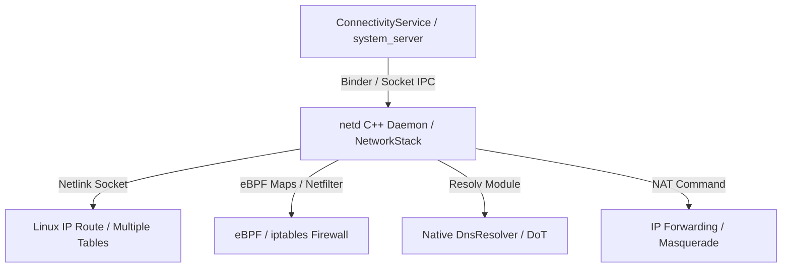

## netd는 라우팅, DNS, 방화벽, tethering 명령을 실행한다

상위 문서: [Connectivity contracts](connectivity-contracts.md)

Native C++ 데몬인 **netd (Network Daemon)** 및 Mainline **NetworkStack** 모듈은 Java 계층의 ConnectivityService 요청을 받아 Linux 커널 네트워크 서브시스템(`netfilter`, `ebpf`, `ip route`, `resolv`)에 구체적인 IP 라우팅, DNS 해석기(DnsResolver), eBPF 소켓 방화벽, 테더링 NAT 제어를 직접 커맨드 및 커널 소켓으로 저수준 반영하는 네이티브 실행 엔진이다.

### 메커니즘: netd의 4가지 핵심 서브시스템

1. **IP Routing (`ip rule` & `Fwmark`)**:
   - 앱 소켓에 Fwmark(So_MARK) 태그를 부여하고, 커널 라우팅 테이블(Multiple Routing Tables: `table 1002`, `table 1003` 등)을 조작하여 특정 네트워크 인터페이스(wlan0, rmnet0, tun0)로 트래픽을 분류 보낸다.

2. **DnsResolver (Native DNS Cache & Encrypted DNS)**:
   - `resolv` 모듈을 구동하여 DNS 조회 쿼리를 캐싱하고, Private DNS(DoT: DNS-over-TLS) 연결 및 서버 프록시 라우팅을 조율한다.

3. **eBPF / iptables Firewall**:
   - `bw_dozable`, `bw_penalty_box`, `lockdown_drop` 사양을 eBPF 맵과 iptables 체인으로 구성하여 특정 UID의 패킷을 커널 레벨에서 차단한다.

4. **Tethering NAT & Forwarding**:
   - SoftAP 테더링 시 다운스트림(wlan1)과 업스트림(rmnet0) 간의 IP 마스커레이딩(NAT) 및 포워딩 룰을 구성한다.



### Native C++ NDK Socket Fwmark 바인딩 코드

```cpp
#include <sys/socket.h>
#include <netinet/in.h>
#include <unistd.h>

// 특정 netId로 소켓 트래픽을 바인딩하기 위해 Fwmark 설정
bool bindSocketToNetId(int socketFd, unsigned netId) {
    // Android Fwmark 규격: netId와 mark 마스크 조합
    uint32_t mark = netId;
    if (setsockopt(socketFd, SOL_SOCKET, SO_MARK, &mark, sizeof(mark)) < 0) {
        return false;
    }
    return true;
}
```

### 관찰 신호: netd 및 커널 IP 라우팅 테이블 관찰

```bash
# 1. netd 서비스 상태 및 덤프
adb shell dumpsys netd

# 2. 커널 IP 라우팅 규칙(IP Rule) 테이블 확인
adb shell ip rule show

# 3. 특정 라우팅 테이블(예: netId 102) 내용 확인
adb shell ip route show table 102
```

### 관련 문서

- [ConnectivityService는 네트워크를 선택하고 정책을 적용한다](connectivityservice-selects-networks-and-applies-policy.md)
- [VpnService는 앱이 만든 TUN interface를 시스템 라우팅에 등록한다](vpnservice-registers-app-tun-interface-with-system-routing.md)

공식 문서: [Android Network Architecture Overview](https://source.android.com/docs/core/connect)
