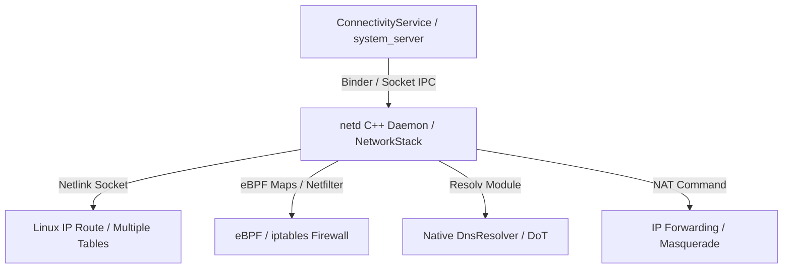

## netd는 라우팅, DNS, 방화벽, tethering 명령을 실행한다

상위 문서: [Connectivity contracts](connectivity-contracts.md)

Native C++ 데몬인 **netd (Network Daemon)** 및 Mainline **NetworkStack** 모듈은 Java 계층의 ConnectivityService 요청을 받아 Linux 커널 네트워크 서브시스템에 구체적인 IP 라우팅, DNS 해석기(DnsResolver), 소켓 방화벽, 테더링 NAT 제어를 직접 커맨드 및 커널 소켓으로 저수준 반영하는 네이티브 실행 엔진이다. 여기서 말하는 커널 네트워크 서브시스템은 세 가지다: **`netfilter`**(패킷이 커널 네트워크 스택을 지나갈 때 후킹해서 필터링/변형하는 Linux 커널 프레임워크로, `iptables` 규칙이 실제로 실행되는 곳), **`ebpf`**(커널을 재컴파일하지 않고도 커널 안에서 안전하게 샌드박스된 소규모 프로그램을 실행할 수 있게 해주는 메커니즘 — netd는 이걸로 UID별 패킷 필터링을 구현한다), **`resolv`**(DNS 질의를 처리하는 리졸버 모듈)다.

배경 지식: netfilter/iptables/eBPF 자체를 다루는 일반 노트는 아직 vault에 없다(위 정의가 이 노트 안에서의 유일한 설명). 라우팅 테이블의 일반 개념은 [routing-basics](../../../../../computer-science/networking/routing-basics.md), DNS 리졸버의 일반 동작은 [dns-fundamentals](../../../../../computer-science/networking/dns-fundamentals.md) 참고.

### 메커니즘: netd의 4가지 핵심 서브시스템

1. **IP Routing (`ip rule` & Fwmark)**:
   - 앱 소켓에 **Fwmark**(`SO_MARK` 소켓 옵션으로 커널이 각 패킷에 붙이는 정수 태그 — "이 트래픽이 어느 네트워크에 속하는지"를 라우팅 결정에 쓴다)를 부여하고, **Multiple Routing Tables**(리눅스가 기본 라우팅 테이블 하나만 쓰는 대신 `table 1002`, `table 1003`처럼 네트워크별로 여러 개를 두고 `ip rule`로 어느 테이블을 쓸지 선택하게 하는 정책 기반 라우팅 방식 — 배경 지식: [routing-basics](../../../../../computer-science/networking/routing-basics.md)의 라우팅 테이블 개념 참고)을 조작하여 특정 네트워크 인터페이스(wlan0, rmnet0, tun0)로 트래픽을 분류 보낸다.

2. **DnsResolver (Native DNS Cache & Encrypted DNS)**:
   - `resolv` 모듈을 구동하여 DNS 조회 쿼리를 캐싱하고, Private DNS(DoT: DNS-over-TLS) 연결 및 서버 프록시 라우팅을 조율한다.

3. **eBPF / iptables Firewall**:
   - `bw_dozable`(Doze 절전 모드에서 백그라운드 네트워크를 막는 규칙), `bw_penalty_box`(Data Saver 등으로 개별 앱의 네트워크를 제한하는 규칙), `lockdown_drop`(Always-on VPN lockdown 상태에서 VPN 밖으로 나가는 패킷을 차단하는 규칙) 같은 사양을 **eBPF 맵**(커널에서 실행되는 eBPF 프로그램이 UID→허용여부 같은 상태를 저장·조회하는 커널 내 키-값 자료구조)과 **iptables 체인**(netfilter 훅에 순서대로 적용되는 규칙 목록)으로 구성하여 특정 UID의 패킷을 커널 레벨에서 차단한다.

4. **Tethering NAT & Forwarding**:
   - SoftAP 테더링 시 다운스트림(wlan1)과 업스트림(rmnet0) 간의 **IP 마스커레이딩**(NAT의 한 형태로, 여러 사설 IP 기기의 트래픽을 하나의 공인 IP로 바꿔 내보내고 응답을 다시 원래 기기로 되돌려주는 주소 변환)과 포워딩 룰을 구성한다.



### Native C++ NDK Socket Fwmark 바인딩 코드

```cpp
#include <sys/socket.h>
#include <netinet/in.h>
#include <unistd.h>

// 특정 netId로 소켓 트래픽을 바인딩하기 위해 Fwmark 설정
bool bindSocketToNetId(int socketFd, unsigned netId) {
    // Android Fwmark 규격: netId와 mark 마스크 조합
    uint32_t mark = netId;
    if (setsockopt(socketFd, SOL_SOCKET, SO_MARK, &mark, sizeof(mark)) < 0) {
        return false;
    }
    return true;
}
```

### 관찰 신호: netd 및 커널 IP 라우팅 테이블 관찰

```bash
# 1. netd 서비스 상태 및 덤프
adb shell dumpsys netd

# 2. 커널 IP 라우팅 규칙(IP Rule) 테이블 확인
adb shell ip rule show

# 3. 특정 라우팅 테이블(예: netId 102) 내용 확인
adb shell ip route show table 102
```

### 관련 문서

- [ConnectivityService는 네트워크를 선택하고 정책을 적용한다](connectivityservice-selects-networks-and-applies-policy.md)
- [VpnService는 앱이 만든 TUN interface를 시스템 라우팅에 등록한다](vpnservice-registers-app-tun-interface-with-system-routing.md)

공식 문서: [Android Network Architecture Overview](https://source.android.com/docs/core/connect)
