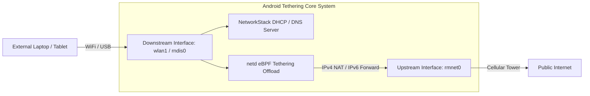

## Tethering은 브리지 업스트림과 다운스트림을 시스템 서비스를 통해 연결한다

상위 문서: [Connectivity contracts](connectivity-contracts.md)

Android **테더링(Tethering / SoftAP / USB Tethering / Bluetooth Tethering)**은 단일 앱 기능이 아니다. 외부 연결 업스트림(Upstream: 셀룰러 `rmnet0`)과 내부 클라이언트 다운스트림(Downstream: SoftAP `wlan1` 또는 USB `rndis0`) 사이에서 **Tethering System Service와 netd가 커널 IP 포워딩, `dhcpd`/`dnsmasq`(다운스트림 클라이언트에 IP를 나눠주고 이름을 풀어주는 DHCP/DNS 서버 데몬) 서버, BPF 하드웨어 오프로드(패킷 전달을 CPU 대신 eBPF/하드웨어 경로에서 처리해 배터리·발열을 줄이는 최적화)를 브리징 관리하는 시스템 계약**이다.

### 메커니즘: Downstream에서 Upstream으로의 NAT 포워딩 파이프라인

1. **Downstream Interface Control (SoftAP / USB)**:
   - `TetheringManager`는 다운스트림 인터페이스에 내부 IP 서브넷(예: `192.168.43.1/24`)을 부여하고, `NetworkStack` 내장 DnsServer/DHCPServer를 실행하여 접속 클라이언트 기기에 IP를 할당한다.

2. **Upstream Selection & BPF Hardware Offload**:
   - `ConnectivityService`가 인터넷 가용 업스트림(LTE/5G `rmnet0`)을 선택하면, `Tethering` 모듈은 `netd`에 명령하여 IPv4 **MASQUERADE**(NAT의 한 형태로, 여러 다운스트림 클라이언트의 사설 IP를 업스트림의 공인 IP 하나로 바꿔 내보내고 응답을 원래 클라이언트로 되돌리는 주소 변환) 및 IPv6 Routing 룰을 커널에 적용한다.
   - 최신 Android 11+에서는 CPU 소모를 줄이기 위해 **eBPF Tethering Offload** 드라이버를 통해 커널/하드웨어 수준에서 IP 패킷을 직접 전달한다.



### Kotlin TetheringManager 상태 감지 코드

```kotlin
import android.net.TetheringManager
import android.content.Context
import java.util.concurrent.Executor

fun monitorTetheringStatus(context: Context, executor: Executor) {
    val tm = context.getSystemService(Context.TETHERING_SERVICE) as TetheringManager

    val callback = object : TetheringManager.TetheringEventCallback {
        override fun onTetheredInterfacesChanged(interfaces: List<String>) {
            // 현재 테더링 브리지 동작 중인 다운스트림 인터페이스 목록 (e.g. wlan1)
        }

        override fun onUpstreamNetworkChanged(network: android.net.Network?) {
            // 테더링 브리지가 외부 인터넷을 송출하는 업스트림 네트워크 전환 감지
        }
    }

    tm.registerTetheringEventCallback(executor, callback)
}
```

### 관찰 신호: dumpsys tethering 및 IP 포워딩 덤프

```bash
# 1. 시스템 테더링 활성 인터페이스 및 업스트림 상태 관찰
adb shell dumpsys tethering

# 주요 덤프 확인 필드:
# - Tethered downstream interfaces: wlan1
# - Upstream network: netId 105 (Cellular)
# - BPF offload status: STARTED / HARDWARE ACCELERATED

# 2. 커널 IP 포워딩 및 NAT iptables 관찰
adb shell iptables -t nat -L -n -v
```

### 관련 문서

- [netd는 라우팅, DNS, 방화벽, tethering 명령을 실행한다](netd-enforces-routing-dns-firewall-and-tethering-operations.md)
- [ConnectivityService는 네트워크를 선택하고 정책을 적용한다](connectivityservice-selects-networks-and-applies-policy.md)

공식 문서: [Android Tethering Architecture](https://source.android.com/docs/core/connect/tethering)
