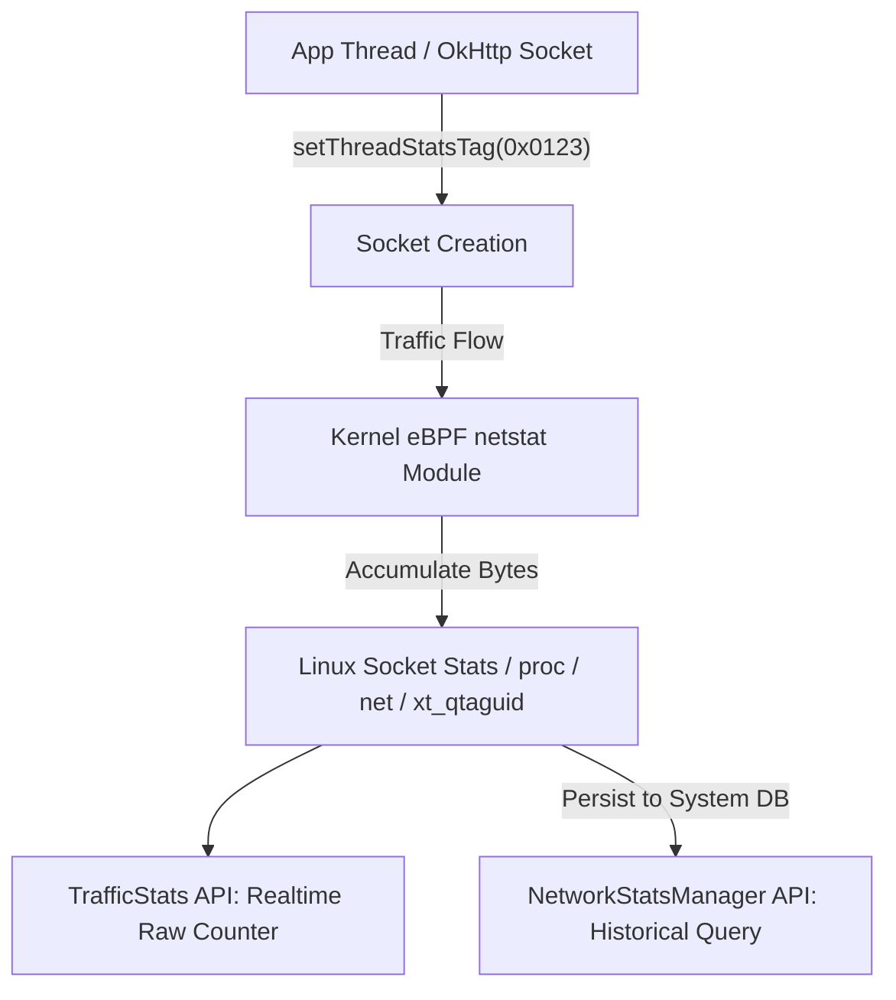

## TrafficStats는 UID 사용량을 관찰하며 비용 정책을 반영하지 않는다

상위 문서: [Connectivity contracts](connectivity-contracts.md)

Android의 **TrafficStats** 및 **NetworkStatsManager**는 개별 소켓 및 UID 레벨의 물리적 **송수신 바이트/패킷 통계(Raw Byte Counter)**를 수집하는 통계 관찰 도구다. 이 API는 **사용자의 종량제 요금 제한, 데이터 절약 모드 차단 상태, 통신사 과금 적용 여부(비용 정책)를 판단하거나 제어하는 기준이 아니다.**

### 메커니즘: Linux 커널 qtaguid / eBPF 통계 파이프라인

1. **Socket Tagging (`TrafficStats.setThreadStatsTag`)**:
   - 앱 스레드가 소켓을 열 때 소켓에 32비트 커스텀 태그(Tag ID)를 부여한다.
   - `netd` 및 커널 eBPF `netstat` 모듈은 소켓 통신 발생 시 해당 UID와 Tag ID 맵에 누적 전송 바이트/패킷 수를 누적 기록한다.

2. **TrafficStats vs NetworkStatsManager**:
   - `TrafficStats`: 단말 부팅 시점(`BOOT_COMPLETED`) 이후 누적된 실시간 원시 바이트 카운터를 빠르게 조회 (인메모리 전용).
   - `NetworkStatsManager`: `netd`가 로컬 DB에 영구 기록한 일자별/인터페이스별/UID별 통계 데이터베이스(과거 기록 관찰용).



### Kotlin Socket Tagging 및 TrafficStats 사용 예시

```kotlin
import android.net.TrafficStats
import java.net.HttpURLConnection
import java.net.URL

fun performTaggedNetworkOperation(urlString: String) {
    // 소켓 통계 구분을 위한 태그 지정 (예: 0xF001 = 이미지 다운로드)
    TrafficStats.setThreadStatsTag(0xF001)

    try {
        val url = URL(urlString)
        val connection = url.openConnection() as HttpURLConnection
        connection.inputStream.use { it.readBytes() }
    } finally {
        // 태그 해제
        TrafficStats.clearThreadStatsTag()
    }
}

fun printUidTraffic(uid: Int) {
    val rxBytes = TrafficStats.getUidRxBytes(uid)
    val txBytes = TrafficStats.getUidTxBytes(uid)
    // 수집된 물리 원시 수신/발신 바이트 출력
}
```

### 관찰 신호: dumpsys netstats UID 통계 관찰

```bash
# 1. system_server NetworkStats 서비스의 UID별 네트워크 누적 바이트 덤프
adb shell dumpsys netstats

# 주요 출력 관찰 필드:
# - UID=10234 set=DEFAULT tag=0xf001 rxBytes=1048576 txBytes=4096
# - NetworkIdentity: WIFI vs CELLULAR 통계 분리
```

### 관련 문서

- [Metered와 Data Saver는 백그라운드 네트워크 비용 정책이다](metered-and-data-saver-are-background-network-cost-policy.md)
- [네트워크 디버깅은 앱 API 상태와 시스템 네트워크 상태를 비교한다](network-debugging-compares-app-api-state-with-system-network-state.md)

공식 문서: [TrafficStats Class Reference](https://developer.android.com/reference/android/net/TrafficStats)
