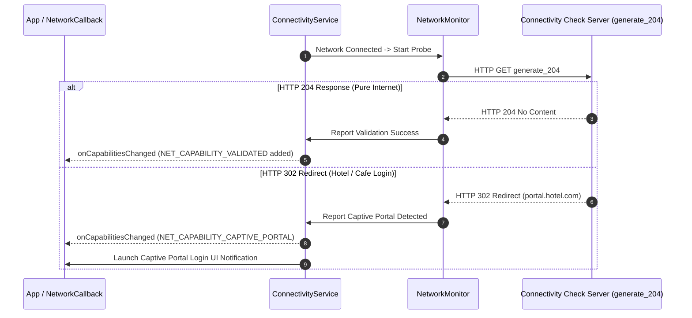

## Validated와 Captive Portal은 관찰된 인터넷 상태다

상위 문서: [Connectivity contracts](connectivity-contracts.md)

Wi-Fi나 셀룰러 인터페이스가 물리적으로 연결(`CONNECTED`) 상태에 진입했다고 해서 해당 네트워크가 즉시 인터넷 통신이 가능함을 의미하지 않는다. Android는 **NetworkMonitor** 모듈을 통해 프로브(HTTP Probe)를 전송하고, **실제 인터넷 접근 가능성(`NET_CAPABILITY_VALIDATED`) 및 웹 인증 리다이렉트 여부(Captive Portal)**를 실시간 관찰하여 네트워크 상태를 판정한다.

### 메커니즘: NetworkMonitor Probe 및 Captive Portal 판정 알고리즘

1. **HTTP Probe Execution (`g.co/generate_204`)**:
   - 네트워크 연결 즉시 `NetworkMonitor`는 구글 검증 URL(`http://connectivitycheck.gstatic.com/generate_204` 또는 `https://...`)로 HTTP/HTTPS 프로브 요청을 전송한다.

2. **State Evaluation & Transitions**:
   - **HTTP 204 No Content**: 실제 인터넷 통신이 가능함을 확인하고 `NET_CAPABILITY_VALIDATED` 속성을 활성화한다.
   - **HTTP 302 Redirect (Captive Portal)**: 호텔, 카페 등의 웹 로그인 페이지로 리다이렉트됨을 감지하고 `NET_CAPABILITY_CAPTIVE_PORTAL`을 발화하며 시스템 로그인 UI 알림을 발생시킨다.
   - **HTTP Timeout / Fail**: 인터넷 불가 네트워크로 판단하여 점수를 0점으로 깎고 다른 유효한 네트워크로 Default Network를 전환한다.



### Kotlin NetworkCallback Captive Portal 및 Validation 수신 예시

```kotlin
import android.net.ConnectivityManager
import android.net.Network
import android.net.NetworkCapabilities

fun observeInternetValidation(connectivityManager: ConnectivityManager) {
    val callback = object : ConnectivityManager.NetworkCallback() {
        override fun onCapabilitiesChanged(network: Network, caps: NetworkCapabilities) {
            val isValidated = caps.hasCapability(NetworkCapabilities.NET_CAPABILITY_VALIDATED)
            val isCaptivePortal = caps.hasCapability(NetworkCapabilities.NET_CAPABILITY_CAPTIVE_PORTAL)

            if (isCaptivePortal) {
                // 웹 인증이 필요한 와이파이: 사용자 로그인 완료까지 통신 대기
            } else if (isValidated) {
                // 인터넷 검증 완료: 정상 네트워크 통신 재개
            }
        }
    }

    connectivityManager.registerDefaultNetworkCallback(callback)
}
```

### 관찰 신호: dumpsys connectivity NetworkMonitor 프로빙 관찰

```bash
# NetworkMonitor의 프로브 결과 및 Captive Portal 상태 덤프
adb shell dumpsys connectivity | grep -A 10 "NetworkMonitor"

# 주요 확인 필드:
# - Validation result: PORTAL / VALID / INVALID
# - Last probe time & HTTP Response Code (e.g. 204 vs 302)
# - Captive portal redirect URL
```

### 관련 문서

- [ConnectivityService는 네트워크를 선택하고 정책을 적용한다](connectivityservice-selects-networks-and-applies-policy.md)
- [NetworkCallback 수명과 콜백 데이터 일관성은 관리되어야 한다](networkcallback-lifetime-and-callback-data-consistency-must-be-managed.md)

공식 문서: [Captive Portal Handling](https://source.android.com/docs/core/connect/captive-portal)
