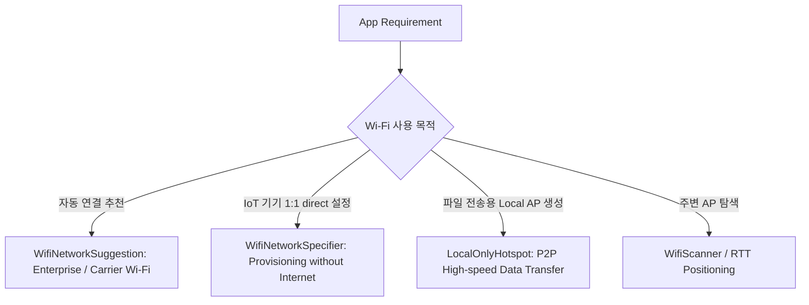

## WiFi APIs는 스캔, 추천, 연결 요청, 로컬 연결을 분리한다

상위 문서: [Connectivity contracts](connectivity-contracts.md)

Android 10(API 29)부터 기존의 비보안적인 글로벌 Wi-Fi 관리 API(`WifiManager.addNetwork()`, `enableNetwork()`)가 완전히 지원 중단(Deprecated)되고, **목적과 제어 범위에 따라 명확히 격리된 4가지 와이파이 API 세트**로 분리 개편되었다.

### 메커니즘: 목적별 Wi-Fi API 세트 세분화

1. **Network Suggestion API (`WifiNetworkSuggestion`)**:
   - 통신사/기업 앱이 시스템에 Wi-Fi 자격 증명을 "추천"하는 제안 모델.
   - 사용자 승인 하에 시스템 연결 엔진이 자동 자동 연결 여부를 결정한다.

2. **Network Specifier API (`WifiNetworkSpecifier`)**:
   - IoT 기기 초기 설정(Provisioning)용 1:1 전용 연결.
   - 대화상자 승인을 거쳐 해당 기기와만 피어-투-피어 연결되며 인터넷 연결(`NET_CAPABILITY_INTERNET`)은 제공되지 않는다.

3. **Local Only Hotspot (`startLocalOnlyHotspot`)**:
   - 인터넷 테더링이 아닌 카메라/드론과 스마트폰 간 대용량 파일 전송을 위한 1:N 로컬 Wi-Fi AP 생성.

4. **Wi-Fi Scanning (`WifiScanner`)**:
   - 백그라운드 위치 추적 무분별 방지를 위한 제한적 스캔 API.



### Kotlin WifiNetworkSpecifier IoT 연결 코드

```kotlin
import android.net.ConnectivityManager
import android.net.Network
import android.net.NetworkCapabilities
import android.net.NetworkRequest
import android.net.wifi.WifiNetworkSpecifier

fun connectToIotDevice(connectivityManager: ConnectivityManager) {
    // IoT 기기 Wi-Fi AP 자격 증명 지정
    val specifier = WifiNetworkSpecifier.Builder()
        .setSsid("IoT_Device_1234")
        .setWpa2Passphrase("SecretPassword")
        .build()

    val request = NetworkRequest.Builder()
        .addTransportType(NetworkCapabilities.TRANSPORT_WIFI)
        .removeCapability(NetworkCapabilities.NET_CAPABILITY_INTERNET) // 인터넷 미제공 명시
        .setNetworkSpecifier(specifier)
        .build()

    val callback = object : ConnectivityManager.NetworkCallback() {
        override fun onAvailable(network: Network) {
            // IoT 기기와 직접 소켓 통신 개시
        }
    }

    connectivityManager.requestNetwork(request, callback)
}
```

### 관찰 신호: dumpsys wifi 상태 확인

```bash
# system_server Wi-Fi 서비스의 활성 Suggestion 및 Specifier 덤프
adb shell dumpsys wifi

# 주요 덤프 관찰 필드:
# - Active WifiNetworkSpecifier requests
# - Registered WifiNetworkSuggestions by package
# - LocalOnlyHotspot status
```

### 관련 문서

- [ConnectivityService는 네트워크를 선택하고 정책을 적용한다](connectivityservice-selects-networks-and-applies-policy.md)
- [Default Network와 Requested Network는 수명이 다르다](default-network-and-requested-network-have-different-lifetimes.md)

공식 문서: [Android Wi-Fi Suggestion API](https://developer.android.com/guide/topics/connectivity/wifi-suggest)
