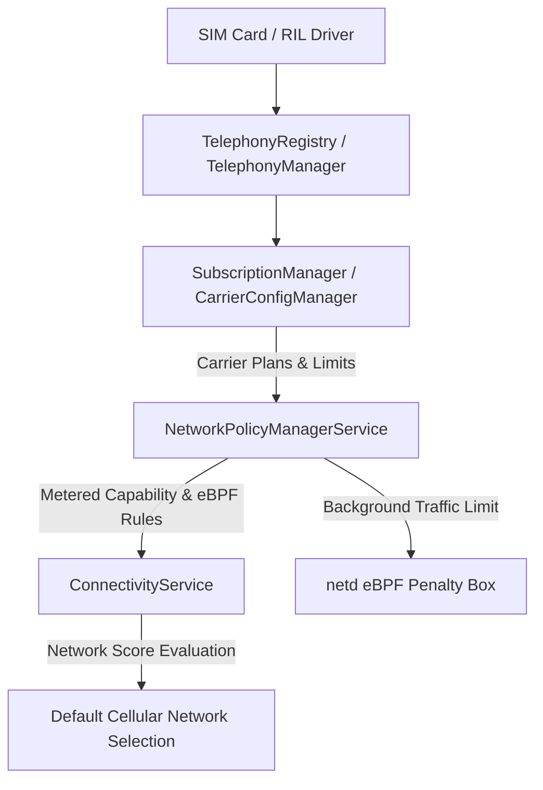

## 셀룰러 연결성은 요금제와 시스템 정책에 의해 통제된다

상위 문서: [Connectivity contracts](connectivity.md)

Android의 셀룰러(LTE/5G) 네트워크 연결성은 단순한 물리적 무선 신호 수신 여부로 결정되지 않는다. 통신사 정책(Carrier Configuration), 사용자의 데이터 요금제 플랜(`SubscriptionPlan`), **NetworkPolicyManagerService의 백그라운드 데이터 제한 정책**이 종합적으로 개입하여 셀룰러 네트워크의 기능적 가용성을 제어한다.

### 메커니즘: Telephony와 NetworkPolicy의 통합 제어 흐름

1. **CarrierConfigManager & SubscriptionManager**:
   - telephony stack과 carrier configuration은 subscription별 동작을 구성한다. 일반 앱은 APN, radio, carrier policy를 직접 제어하지 않고 공개된 capability와 자신의 권한 범위만 관찰한다.

2. **SubscriptionPlan & Metered Status**:
   - `SubscriptionManager.setSubscriptionPlans(int, List)`는 API 33에서 deprecated됐고, replacement overload도 carrier privilege 또는 명시적으로 위임된 carrier app만 호출할 수 있다. 일반 앱의 요금제 조회·설정 API로 사용하지 않는다.
   - meteredness는 carrier와 system이 `NetworkCapabilities`로 노출하는 비용 힌트다. 데이터 한도 소진이 항상 capability 전환이나 Wi-Fi 전환을 일으킨다고 보장할 수 없다.

3. **NetworkPolicyManagerService & Data Saver**:
   - Data Saver가 켜지고 active network가 metered이면 system은 allowlist가 아닌 앱의 background data를 제한한다. AOSP는 UID firewall과 traffic accounting에 eBPF를 사용할 수 있지만, 앱이 의존할 공개 계약은 ConnectivityManager의 `isActiveNetworkMetered`, `restrictBackgroundStatus`, 그리고 `NetworkCallback`이다. 이 정책이 Wi-Fi로 즉시 전환시킨다고 가정하지 않는다.



### Kotlin 셀룰러 종량제 및 네트워크 특성 관찰 코드

```kotlin
import android.net.ConnectivityManager
import android.net.NetworkCapabilities

fun observeNetworkCost(connectivityManager: ConnectivityManager) {
    val activeNetwork = connectivityManager.activeNetwork
    val caps = connectivityManager.getNetworkCapabilities(activeNetwork) ?: return

    val isCellular = caps.hasTransport(NetworkCapabilities.TRANSPORT_CELLULAR)
    val isPermanentlyUnmetered = caps.hasCapability(
        NetworkCapabilities.NET_CAPABILITY_NOT_METERED
    )
    val isTemporarilyUnmetered = caps.hasCapability(
        NetworkCapabilities.NET_CAPABILITY_TEMPORARILY_NOT_METERED
    )

    if (isPermanentlyUnmetered || isTemporarilyUnmetered) {
        // 현재 permanent 또는 temporary unmetered로 보고된다. 5G 여부를 보장하지 않는다.
        enableHighQualityStrategy()
    } else if (isCellular) {
        // 현재 셀룰러가 metered로 보고된다. 대용량 전송을 보류하거나 축소한다.
        enableDataSavingStrategy()
    }
}

private fun enableDataSavingStrategy() {}
private fun enableHighQualityStrategy() {}
```

### 관찰 신호: Telephony 및 NetworkPolicy 관찰

```bash
# 1. Telephony 서비스 및 Carrier Config 상태 확인
adb shell dumpsys telephony.registry

# 2. 셀룰러 네트워크 정책 및 Subscription Plan 덤프
adb shell dumpsys netpolicy

# 주요 출력 관찰 사항:
# - Subscription plans: LimitBytes, CycleRule, Metered status
# - UID Policy: RESTRICT_BACKGROUND (Data saver active)
```

### 관련 문서

- [Metered와 Data Saver는 백그라운드 네트워크 비용 정책이다](metered-and-data-saver-are-background-network-cost-policy.md)
- [ConnectivityService는 네트워크를 선택하고 정책을 적용한다](connectivityservice-selects-networks-and-applies-policy.md)

공식 문서: [Android Carrier Configuration](https://source.android.com/docs/core/connect/carrier-config)

추가 공식 문서: [SubscriptionManager](https://developer.android.com/reference/android/telephony/SubscriptionManager), [NetworkCapabilities](https://developer.android.com/reference/android/net/NetworkCapabilities), [Data Saver](https://developer.android.com/develop/connectivity/network-ops/data-saver), [eBPF traffic monitoring](https://source.android.com/docs/core/data/ebpf-traffic-monitor)
