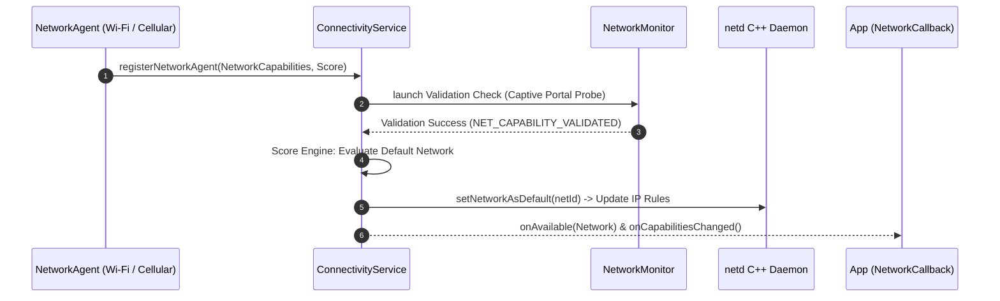

## ConnectivityService 는 네트워크를 선택하고 정책을 적용한다

상위 문서: [Connectivity contracts](connectivity.md)

`system_server` (또는 Mainline 모듈) 내부에서 동작하는 **ConnectivityService**는 Android 네트워크 시스템의 중앙 통제 허브다. 물리적/가상 인터페이스(`NetworkAgent`)들이 제공하는 네트워크 상태를 수집하고, **점수 산정 엔진(Network Offer / Score Engine)**을 통해 최선의 기본 네트워크(Default Network)를 결정한 뒤, 그 결과를 라우팅 테이블(`netd`)과 애플리케이션 콜백(`NetworkCallback`)으로 전파한다.

### 메커니즘: NetworkAgent 등록부터 Default Network 선택까지

1. **NetworkAgent Registration**:
   - Wi-Fi, Cellular, Ethernet, VPN 드라이버가 준비되면 각각 `NetworkAgent`를 생성하여 `ConnectivityService`에 네트워크 인스턴스를 등록한다.

2. **Network Evaluation & Validation**:
   - `NetworkMonitor` 모듈을 실행하여 해당 네트워크의 실제 인터넷 가용성(HTTP Captive Portal 검증)을 검사한다.
   - 검증 성공 시 `NET_CAPABILITY_VALIDATED` 플래그를 부여한다.

3. **Scoring Engine & Routing Update**:
   - 가중치 점수(Score)와 요구되는 `NetworkRequest` 조건을 비교하여 가장 높고 안정적인 네트워크를 **Default Network**로 승격한다.
   - 선출된 네트워크의 `netId` 및 라우팅 테이블(Routing Table ID)을 `netd`에 전송하여 커널 IP rule을 업데이트한다.



### Custom NetworkRequest 생성 및 ConnectivityService 등록 Kotlin 코드

```kotlin
import android.net.ConnectivityManager
import android.net.Network
import android.net.NetworkCapabilities
import android.net.NetworkRequest

fun listenToHighSpeedNetworks(connectivityManager: ConnectivityManager) {
    // 인터넷 가용 + 종량제가 아닌 셀룰러/Wi-Fi 요구조건 작성
    val request = NetworkRequest.Builder()
        .addCapability(NetworkCapabilities.NET_CAPABILITY_INTERNET)
        .addCapability(NetworkCapabilities.NET_CAPABILITY_VALIDATED)
        .addCapability(NetworkCapabilities.NET_CAPABILITY_NOT_METERED)
        .build()

    val callback = object : ConnectivityManager.NetworkCallback() {
        override fun onAvailable(network: Network) {
            // 조건을 충족하는 최선의 네트워크 획득 (netId)
        }

        override fun onCapabilitiesChanged(network: Network, caps: NetworkCapabilities) {
            // 대역폭(Link bandwidth) 변동 처리
        }
    }

    connectivityManager.registerNetworkCallback(request, callback)
}
```

### 관찰 신호: dumpsys connectivity 네트워크 상태 관찰

```bash
# ConnectivityService의 전체 활성 네트워크 및 스코어 덤프
adb shell dumpsys connectivity

# 주요 확인 필드:
# - Active Networks: netId, TransportType, Score, Capabilities
# - NetworkRequests list: 각 앱 UID가 요청 중인 NetworkRequest 사양
# - Default Network: 현재 시스템 글로벌 기본 네트워크 지정 현황
```

### 관련 문서

- [Default Network와 Requested Network는 수명이 다르다](default-network-and-requested-network-have-different-lifetimes.md)
- [netd는 라우팅, DNS, 방화벽, tethering 명령을 실행한다](netd-enforces-routing-dns-firewall-and-tethering-operations.md)

공식 문서: [Android Connectivity Architecture](https://source.android.com/docs/core/connect)
