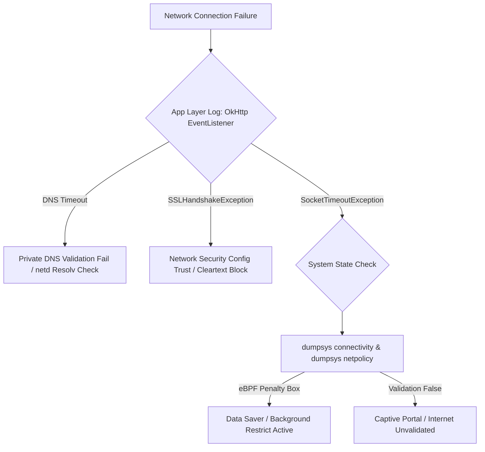

## 네트워크 디버깅은 앱 API 상태와 시스템 네트워크 상태를 비교한다

상위 문서: [Connectivity contracts](connectivity.md)

Android 네트워크 문제 진단 시, 애플리케이션의 HTTP 클라이언트(OkHttp, Cronet) 레벨 타임아웃/에러 로그만으로는 근본 원인을 파악할 수 없다. 반드시 **앱 관점의 API 통신 상태**와 **시스템 레벨의 네트워크/라우팅 상태(dumpsys, ip route, tcpdump)**를 교차 비교하여 원인 지점을 격리해야 한다.

### 메커니즘: 디버깅 교차 진단 체계

1. **App Layer (OkHttp EventListener / Interceptor)**:
   - DNS Lookup 소요 시간, TCP Handshake, TLS Negotiation, Response Code, HTTP/2 Stream Reset 여부를 추적한다.

2. **Framework / System Layer (`dumpsys connectivity`, `dumpsys netpolicy`)**:
   - 해당 시점에 default network가 무엇이었는지, `NET_CAPABILITY_VALIDATED` 연결 상태였는지, Data Saver 또는 eBPF penalty_box 방화벽에 UID가 차단되었는지 점검한다.

3. **Kernel / Network Interface Layer (`ip route`, `tcpdump`)**:
   - 소켓 패킷이 지정된 네트워크 인터페이스(wlan0/rmnet0)로 실제 발출되고 있는지, TLS Handshake TCP SYN에 대해 ACK 반응이 수신되는지 패킷 분석한다.



### OkHttp EventListener 타임라인 추적 Kotlin 코드

```kotlin
// OkHttp 타임라인 로그를 통해 DNS/TLS/Connect 구간 분리
class NetworkTraceListener : okhttp3.EventListener() {
    override fun dnsStart(call: okhttp3.Call, domainName: String) {
        // DNS 조회 시작 타임스탬프
    }
    override fun dnsEnd(call: okhttp3.Call, domainName: String, inetAddressList: List<java.net.InetAddress>) {
        // DNS 완료
    }
    override fun connectFailed(
        call: okhttp3.Call, inetSocketAddress: java.net.InetSocketAddress,
        connectionDevice: java.net.Proxy, protocol: okhttp3.Protocol?, ioe: java.io.IOException
    ) {
        // TCP 연결 실패: 시스템 라우팅 및 방화벽 확인 필요
    }
}
```

### 시스템 네트워크 진단 명령 종합

```bash
# 1. 글로벌 활성 기본 네트워크 및 유효성(Validated) 상태 진단
adb shell dumpsys connectivity

# 2. 방화벽 백그라운드 제한(Data Saver / Battery Saver) 확인
adb shell dumpsys netpolicy

# 3. Private DNS 및 Resolver 덤프
adb shell dumpsys dnsresolver

# 4. 실시간 네트워크 패킷 캡처 (rooting 기기 또는 pcap 덤프)
adb shell tcpdump -i any -s 0 -w /sdcard/capture.pcap
```

### 관련 문서

- [ConnectivityService는 네트워크를 선택하고 정책을 적용한다](connectivityservice-selects-networks-and-applies-policy.md)
- [netd는 라우팅, DNS, 방화벽, tethering 명령을 실행한다](netd-enforces-routing-dns-firewall-and-tethering-operations.md)

공식 문서: [Android Network Operations](https://developer.android.com/training/basics/network-ops)
