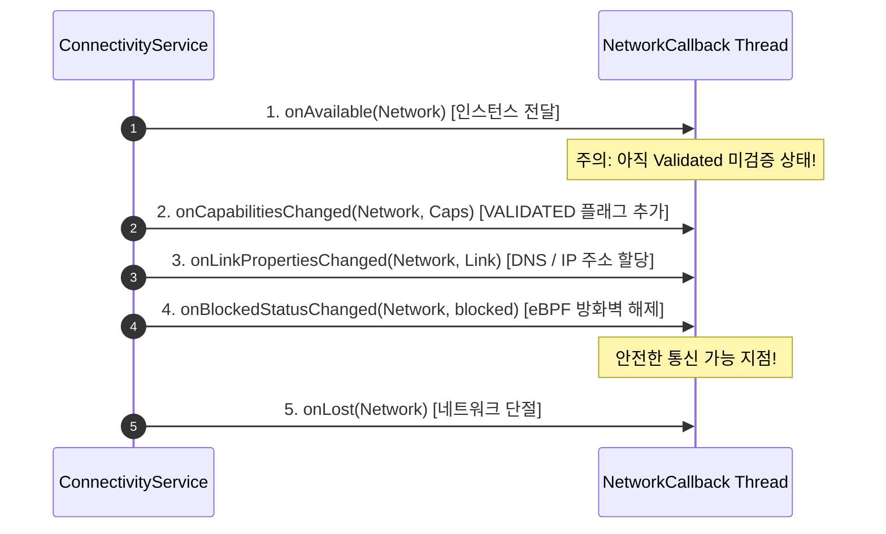

## NetworkCallback 수명과 콜백 데이터 일관성은 관리되어야 한다

상위 문서: [Connectivity contracts](connectivity.md)

`ConnectivityManager.NetworkCallback`은 단순 일회성 상태 조회가 아닌 **비동기 이벤트 스트림(Asynchronous Event Stream)**이다. 애플리케이션 수명주기(Lifecycle)에 맞춘 등록/해제 관리와, `onAvailable()` 호출 이후에도 `NetworkCapabilities`나 `LinkProperties`가 동적으로 변동될 때 발생하는 **콜백 데이터 경합 상태(Race Condition 및 Partial State)**를 일관되게 처리하는 방어적 계약이 필수적이다.

### 메커니즘: 비동기 콜백 순서와 데이터 일관성 파이프라인

1. **Callback Event Execution Sequence**:
   - ConnectivityService로부터 다음 순서로 이벤트가 비동기 전파된다:
     `onAvailable` -> `onCapabilitiesChanged` -> `onLinkPropertiesChanged` -> `onBlockedStatusChanged` -> `onLost`.
   - `onAvailable` 시점에는 아직 `NET_CAPABILITY_VALIDATED` 속성이나 IPv6 주소가 채워지지 않은 상태일 수 있으므로, `onAvailable` 하나만 믿고 즉시 HTTP 통신을 시작하면 에러가 발생할 수 있다.

2. **Lifecycle Unregistering & Leak Prevention**:
   - `Activity`/`Fragment`/`Service` 종료 시 `unregisterNetworkCallback()`을 호출하지 않으면 `system_server`에 Binder 인스턴스가 누수되며, 백그라운드 콜백 수신으로 인한 `IllegalArgumentException` 또는 널 포인터 널링 현상이 유발된다.



### Kotlin 안전한 NetworkCallback 수명주기 관리 및 스레드 바인딩 예시

```kotlin
import android.net.ConnectivityManager
import android.net.Network
import android.net.NetworkCapabilities
import android.os.Handler
import android.os.HandlerThread
import androidx.lifecycle.DefaultLifecycleObserver
import androidx.lifecycle.LifecycleOwner

class NetworkStateMonitor(
    private val cm: ConnectivityManager
) : DefaultLifecycleObserver {

    private var callback: ConnectivityManager.NetworkCallback? = null
    // 전용 Worker Handler 생성하여 UI 스레드 블로킹 방지
    private val workerThread = HandlerThread("NetworkCallbackWorker").apply { start() }
    private val workerHandler = Handler(workerThread.looper)

    override fun onStart(owner: LifecycleOwner) {
        callback = object : ConnectivityManager.NetworkCallback() {
            override fun onAvailable(network: Network) {
                // 단순 연결 알림
            }

            override fun onCapabilitiesChanged(network: Network, caps: NetworkCapabilities) {
                // 최신 검증 상태 확인
                val isValidated = caps.hasCapability(NetworkCapabilities.NET_CAPABILITY_VALIDATED)
                if (isValidated) {
                    // 실제 인터넷 통신 시작 안전 지점
                }
            }

            override fun onLost(network: Network) {
                // 연결 단절 처리
            }
        }

        // Android 8.0+: Handler 전송으로 콜백 스레드 지정
        cm.registerDefaultNetworkCallback(callback!!, workerHandler)
    }

    override fun onStop(owner: LifecycleOwner) {
        callback?.let {
            try {
                cm.unregisterNetworkCallback(it)
            } catch (e: IllegalArgumentException) {
                // 이미 해제된 경우 안전 예외 처리
            }
            callback = null
        }
        workerThread.quitSafely()
    }
}
```

### 관찰 신호: dumpsys connectivity 콜백 누수 관찰

```bash
# ConnectivityService에 바인딩된 앱의 NetworkCallback 세션 수 확인
adb shell dumpsys connectivity | grep -A 5 "NetworkCallbacks"

# 확인 항목:
# - 앱 패키지명의 active NetworkCallback 개수가 Activity 재생성 시 계속 증가하는지 점검
```

### 관련 문서

- [Default Network와 Requested Network는 수명이 다르다](default-network-and-requested-network-have-different-lifetimes.md)
- [ConnectivityService는 네트워크를 선택하고 정책을 적용한다](connectivityservice-selects-networks-and-applies-policy.md)

공식 문서: [ConnectivityManager.NetworkCallback Reference](https://developer.android.com/reference/android/net/ConnectivityManager.NetworkCallback)
