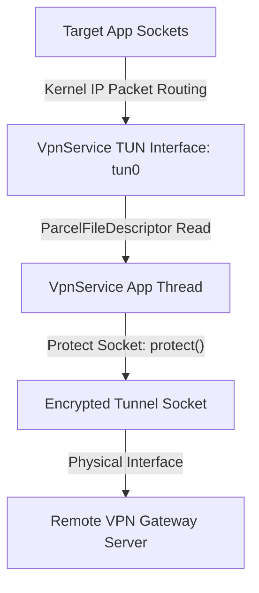

## VpnService는 앱이 만든 TUN interface를 시스템 라우팅에 등록한다

상위 문서: [Connectivity contracts](connectivity.md)

Android의 **VpnService**는 시스템 권한 없이 애플리케이션 레벨에서 가상 사설망(VPN)을 구축할 수 있도록 제공하는 프레임워크 계약이다. 앱이 가상 네트워크 인터페이스(**TUN Interface**: 커널이 제공하는 소프트웨어 네트워크 인터페이스로, 물리 하드웨어 없이도 IP 계층 패킷을 앱 프로세스와 주고받을 수 있게 해준다 — 일반 물리 인터페이스가 하드웨어로 패킷을 내보내는 자리에, TUN은 그 패킷을 파일처럼 읽고 쓸 수 있는 사용자공간 프로그램에 넘긴다)를 생성하고 이를 **`netd` 및 system_server 라우팅 테이블 최상단(Priority Route)에 가상 네트워크 인스턴스로 등록**하여 모든 단말 IP 패킷을 파일 디스크립터(`ParcelFileDescriptor`) 파일 읽기/쓰기 바이트로 획득하도록 중계한다.

### 메커니즘: Builder 생성부터 TUN 파일 디스크립터 I/O 파이프라인

1. **VpnService.Builder & Tunnel Configuration**:
   - 앱은 MTU, IPv4/IPv6 주소, 라우팅 서브넷(`addRoute("0.0.0.0", 0)`), 대상 앱 패키지 포함/제외 필터(`addAllowedApplication`)를 구성하고 `builder.establish()`를 호출한다.

2. **Kernel TUN Device Creation & netd Routing**:
   - system_server는 커널 `/dev/net/tun` 가상 장치를 열어 `tun0` 인터페이스를 생성하고, `netd`를 통해 라우팅 테이블(VPN Table)의 우선순위를 물리 네트워크(wlan0)보다 높게 등록한다.

3. **Packet I/O Read / Write Loop**:
   - 반환받은 `ParcelFileDescriptor`의 `FileInputStream`에서 커널발 원시 IP 패킷(Raw IP Packet)을 읽어 외부 VPN 서버로 암호화 전송하고, 수신된 복호화 IP 패킷을 `FileOutputStream`에 작성하면 커널을 통해 타겟 앱으로 전달된다.



### Kotlin VpnService TUN 인터페이스 생성 및 Socket Protect 코드

```kotlin
import android.net.VpnService
import android.os.ParcelFileDescriptor
import java.io.FileInputStream
import java.io.FileOutputStream
import java.net.DatagramSocket

class MyVpnService : VpnService() {
    private var vpnInterface: ParcelFileDescriptor? = null

    fun startVpnTunnel() {
        val builder = Builder()
            .setMtu(1500)
            .addAddress("10.0.0.2", 24)
            .addRoute("0.0.0.0", 0) // 모든 IPv4 트래픽을 TUN으로 라우팅
            .setSession("MySecureVpn")

        // TUN 가상 인터페이스 획득
        vpnInterface = builder.establish()

        // 중요: VPN 소켓 자체는 TUN 라우팅 무한 루프에 빠지지 않도록 protect() 필수!
        val tunnelSocket = DatagramSocket()
        protect(tunnelSocket)

        // 읽기/쓰기 루프 시작
        val inputStream = FileInputStream(vpnInterface!!.fileDescriptor)
        val outputStream = FileOutputStream(vpnInterface!!.fileDescriptor)
    }

    override fun onDestroy() {
        vpnInterface?.close()
        super.onDestroy()
    }
}
```

### 관찰 신호: dumpsys vpn 및 tun0 인터페이스 관찰

```bash
# 1. 활성 VPN 세션 및 TUN 인터페이스 구성 덤프
adb shell dumpsys vpn

# 주요 출력 필드:
# - Interface: tun0
# - Addresses: [10.0.0.2/24]
# - Routes: [0.0.0.0/0]
# - Underlying networks: wlan0

# 2. Linux 커널 tun0 인터페이스 확인
adb shell ip addr show tun0
```

### 관련 문서

- [Always-on과 lockdown VPN은 연결 실패를 보안 정책으로 바꾼다](always-on-and-lockdown-vpn-turn-failure-into-security-policy.md)
- [netd는 라우팅, DNS, 방화벽, tethering 명령을 실행한다](netd-enforces-routing-dns-firewall-and-tethering-operations.md)

공식 문서: [Android VpnService Developer Guide](https://developer.android.com/guide/topics/connectivity/vpn)
