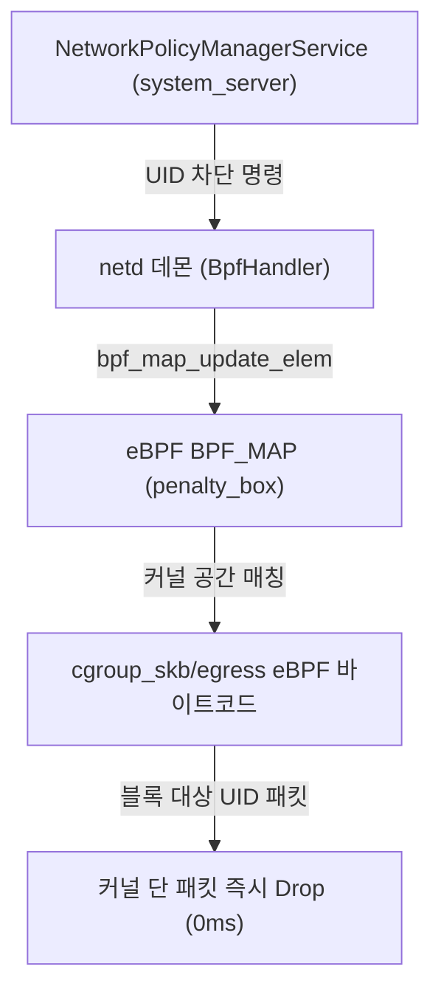

# Android eBPF 네트워크 패킷 통제 (Android Specific Extension)

## 1. 개요 (Overview)

이 노드는 컴퓨터 과학의 [eBPF 커널 엔진](../../../../computer-science/operating-systems/ebpf.md) 원리를 기반으로, **Android OS 가 네트워크 런타임에서 백그라운드 데이터 제한(Data Saver) 및 UID 별 패킷 방화벽(`penalty_box`)을 집행하는 안드로이드 특화 구현 명세**이다.

Android 9(Pie) 이상부터 기존 `iptables` 규칙 관리의 CPU 오버헤드와 메모리 낭비를 극복하기 위해, Native `netd` 데몬이 커널 BPF Map 을 가동하여 안드로이드 앱의 패킷을 0ms 에 제어한다.

---

### 초보자를 위한 쉽게 이해하는 비유

* **Android eBPF (시청 통제 모듈과 연동된 스마트 톨게이트)**:
  - 컴퓨터 과학의 [eBPF 커널 검문소](../../../../computer-science/operating-systems/ebpf.md) 기술 위에 안드로이드 시청(`system_server` / `netd`)의 지시를 등록하여, **데이터 절약 모드에 들어간 앱(UID)을 톨게이트 명단(`penalty_box`)에 즉시 등록하여 백그라운드 데이터 사용을 무조건 멈추게 하는 안드로이드 전용 블랙리스트 시스템**.



---

## 2. Android 특화 eBPF 핵심 구현체

1. **`BpfHandler` 및 `BpfNetworkStats` (`netd` 데몬 모듈)**:
   - `netd` 데몬 내부의 `BpfHandler` 가 Android 부팅 시 eBPF 바이트프로그램을 커널에 로딩하고, `BpfNetworkStats` 가 소켓별·UID 별 전송/수신 바이트 통계를 실시간으로 집계한다.
2. **`penalty_box` & `happy_box` BPF Maps**:
   - `penalty_box`: Data Saver 가 켜졌을 때 백그라운드 통신이 금지된 앱 UID 들의 블랙리스트 맵.
   - `happy_box`: Data Saver 와 무관하게 백그라운드 데이터 사용이 허용된 앱(화이트리스트 예외 앱)의 UID 맵.
3. **TrafficController & NetworkPolicyManagerService 연동**:
   - 사용자가 설정 앱에서 '백그라운드 데이터 제한'을 누르면 `NetworkPolicyManagerService` 가 Binder IPC 로 `netd` 에 전달하여 eBPF Map 을 0.1ms 내에 갱신한다.

---

## 3. 관측 가능 증거 및 CLI 명령어

`adb shell` 로 안드로이드 OS 내부의 eBPF BPF Map 덤프 및 UID 차단 상태를 진단할 수 있다:

```bash
# dumpsys netd 를 통한 BPF 프로그램 및 penalty_box 맵 상태 진단
adb shell dumpsys netd

# dumpsys netpolicy 로 안드로이드 UID 정책과 eBPF 연동 현황 확인
adb shell dumpsys netpolicy
```

---

## 4. 연결 문서 (Related Links)

- [CS eBPF 커널 런타임 엔진](../../../../computer-science/operating-systems/ebpf.md) - CS 기반 eBPF 원자 노드 (SSOT)
- [Android Connectivity 런타임](android-connectivity.md) - 안드로이드 네트워크 계층 구조
- [NetId & Multi-Routing Table](netid-routing-table.md) - netd 멀티 라우팅 파이프라인
- [dumpsys 시스템 진단 도구](../../06_testing_performance/debugging/dumpsys.md) - dumpsys netd 진단
