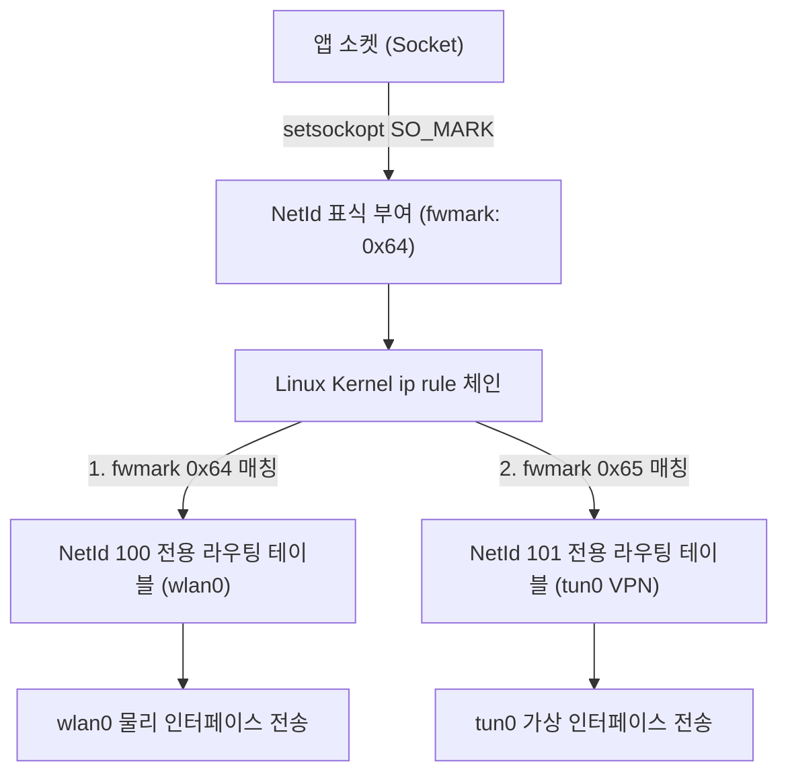

# NetId & Multi-Routing Table (안드로이드 멀티 네트워크 라우팅)

## 1. 개요 (Overview)

**NetId & Multi-Routing Table (NetId 멀티 라우팅)** 은 Android 기기가 Wi-Fi(`wlan0`), 셀룰러 데이터(`rmnet0`), VPN(`tun0`) 등 복수의 네트워크 인터페이스에 동시에 연결되어 있을 때, **각 소켓 패킷에 고유 식별자(`NetId`) 마크를 부여하여 해당 네트워크 전용 Linux 라우팅 테이블(Routing Table)로 정밀 분기시키는 고성능 라우팅 통제 메커니즘**이다.

단일 라우팅 테이블만 지원하는 일반 데스크톱 Linux 와 달리, Android 는 `netd` 데몬과 Linux 커널의 `ip rule / fwmark` 기능을 결합하여 앱별·인터페이스별 동시 멀티 배포 라우팅을 수행한다.

---

### 초보자를 위한 쉽게 이해하는 비유

* **NetId 라우팅 (공항 목적지별 전용 승강장 게이트)**:
  - 공항(스마트폰)에 버스(Wi-Fi), 지하철(셀룰러), 전용 셔틀(VPN) 승강장이 동시에 있을 때, 모든 승객(소켓 패킷)에게 **승차권 색상 표식(`NetId / fwmark`)**을 붙여주어, Wi-Fi 승차권을 가진 패킷은 Wi-Fi 라인으로만, VPN 승차권을 가진 패킷은 VPN 셔틀 라인으로만 헷갈리지 않고 정확히 탑승시키는 시스템.



---

## 2. 핵심 동작 메커니즘 (Internal Mechanism)

1. **NetId 및 fwmark (Socket Marking)**:
   - `ConnectivityService` 가 새로 연결된 네트워크(예: Wi-Fi)에 양의 정수인 `NetId`(예: 100, 101)를 할당한다. `netd` 데몬은 이 NetId 를 기반으로 커널 `ip rule` 에 `fwmark` 룰을 등록한다.
2. **`netd` 데몬의 Linux 라우팅 테이블 자동 생성**:
   - 새 네트워크가 감지되면 `netd` 는 전용 Linux 라우팅 테이블(Table 100, Table 101 등)을 개별 생성하고, 게이트웨이 및 IP 룰을 구성한다.
3. **Multi-Networking & NetworkSpecifier 지원**:
   - 특정 앱이 `NetworkRequest.Builder().addTransportType(TRANSPORT_CELLULAR)` 로 셀룰러 전용 통신을 요청하면, 시스템은 메인 인터넷이 Wi-Fi 이더라도 해당 앱 소켓에 셀룰러 전용 `NetId` 를 부여하여 동시 통신을 가능케 한다.

---

## 3. 관측 가능 증거 및 CLI 명령어 (Observable Evidence)

`adb shell` 로 현재 안드로이드 기기에 형성된 NetId 별 라우팅 테이블과 커널 룰을 확인할 수 있다:

```bash
# dumpsys netd 로 활성 NetId 및 라우팅 테이블 할당 현황 진단
adb shell dumpsys netd

# Linux 커널 ip rule 및 특정 NetId 라우팅 테이블 조회
adb shell ip rule show
adb shell ip route show table 100
```

---

## 4. 연결 문서 (Related Links)

- [Android Connectivity 런타임](android-connectivity.md) - Connectivity 전체 아키텍처
- [eBPF 커널 패킷 필터](../../../../computer-science/operating-systems/ebpf.md) - UID 패킷 필터링 및 penalty_box
- [VPN Always-on vs Lockdown](../../05_security_privacy/vpn-always-on-vs-lockdown.md) - VPN tun0 라우팅 및 봉쇄
- [dumpsys 시스템 진단 도구](../../06_testing_performance/debugging/dumpsys.md) - dumpsys netd 진단
