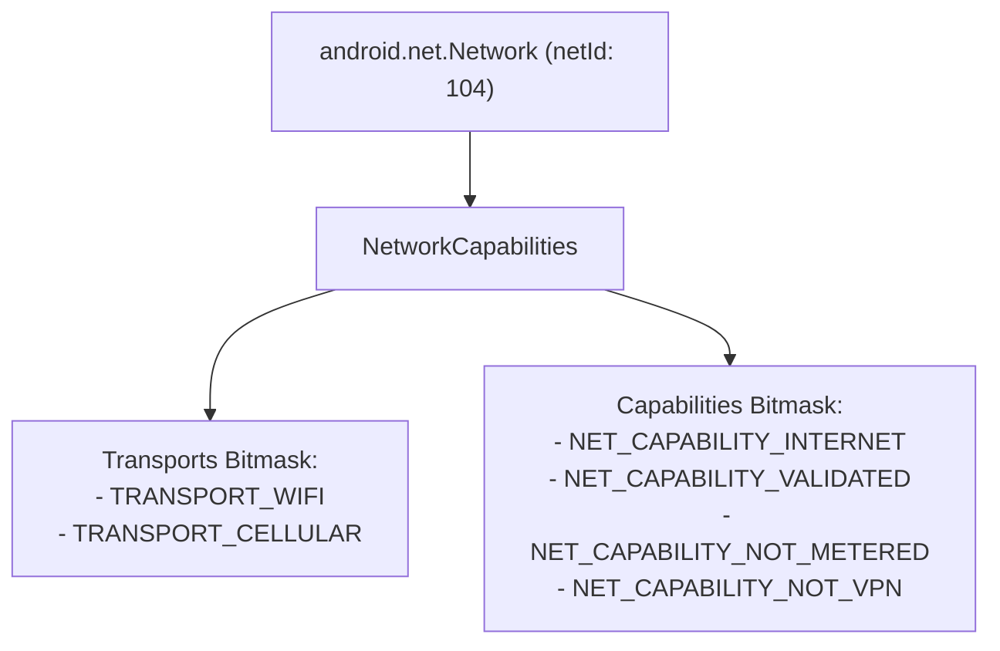

## Network는 연결 인스턴스이고 transport는 하나의 capability일 뿐이다

상위 문서: [Connectivity contracts](connectivity.md)

Android 네트워크 API 디자인에서 `android.net.Network` 객체는 단순히 "Wi-Fi"나 "Cellular"라는 무선 전송 기술 종류를 의미하지 않는다. **특정 물리/가상 인터페이스 인스턴스(netId)**를 식별하는 고유 핸들이며, 전송 방식(TransportType)은 그 네트워크가 갖는 수많은 **능력 속성(NetworkCapabilities)** 중 하나에 불과하다.

### 메커니즘: Network 핸들과 NetworkCapabilities 비트마스크

1. **Network (Instance Handle)**:
   - 시스템 내에서 활성화된 물리적/가상 연결 인터페이스(예: `wlan0` netId 102, `rmnet0` netId 105)를 가리키는 파셀러블 핸들.
   - `network.getSocketFactory()`를 사용하여 특정 소켓의 트래픽을 디폴트 네트워크가 아닌 지정된 `Network`로 직접 강제 바인딩할 수 있다.

2. **NetworkCapabilities (Capabilities Bitmask)**:
   - 해당 네트워크 인스턴스가 가진 기능적 성격들의 집합:
     - **Transports**: `TRANSPORT_WIFI`, `TRANSPORT_CELLULAR`, `TRANSPORT_VPN`, `TRANSPORT_ETHERNET`
     - **Capabilities**: `NET_CAPABILITY_INTERNET`, `NET_CAPABILITY_VALIDATED`, `NET_CAPABILITY_NOT_METERED`, `NET_CAPABILITY_NOT_VPN`, `NET_CAPABILITY_TRUSTED`

3. **Multi-Networking & Interface Pinning**:
   - Android 기기는 동시에 Wi-Fi와 Cellular 5G 연결을 가질 수 있으며, 앱은 `Network` 인스턴스 핸들을 통해 Wi-Fi가 켜진 상태에서도 셀룰러 인터페이스로 직접 소켓 통신을 보낼 수 있다.



### 특정 Network로 HTTP 통신 바인딩 Kotlin 코드

```kotlin
import android.net.ConnectivityManager
import android.net.Network
import java.net.URL

fun fetchUrlOverSpecificNetwork(network: Network, urlString: String): String {
    val url = URL(urlString)
    // 디폴트 네트워크가 아닌 지정된 network(netId)의 SocketFactory 사용
    val connection = network.openConnection(url) as java.net.HttpURLConnection
    
    return try {
        connection.inputStream.bufferedReader().readText()
    } finally {
        connection.disconnect()
    }
}
```

### 관찰 신호: dumpsys connectivity Capabilities 관찰

```bash
# dumpsys connectivity의 각 active network별 Capabilities 검사
adb shell dumpsys connectivity | grep -A 5 "NetworkAgentInfo"

# 출력 예시:
# NetworkAgentInfo{ ni{[type: WIFI[], state: CONNECTED/CONNECTED]} }
# Capabilities: [ Transports: WIFI Capabilities: INTERNET&NOT_RESTRICTED&TRUSTED&NOT_VPN&VALIDATED&NOT_METERED LinkUpBandwidth: 1048576Kbps ]
```

### 관련 문서

- [ConnectivityService는 네트워크를 선택하고 정책을 적용한다](connectivity-service.md)
- [Default Network와 Requested Network는 수명이 다르다](default-vs-requested-network.md)

공식 문서: [NetworkCapabilities Reference](https://developer.android.com/reference/android/net/NetworkCapabilities)
