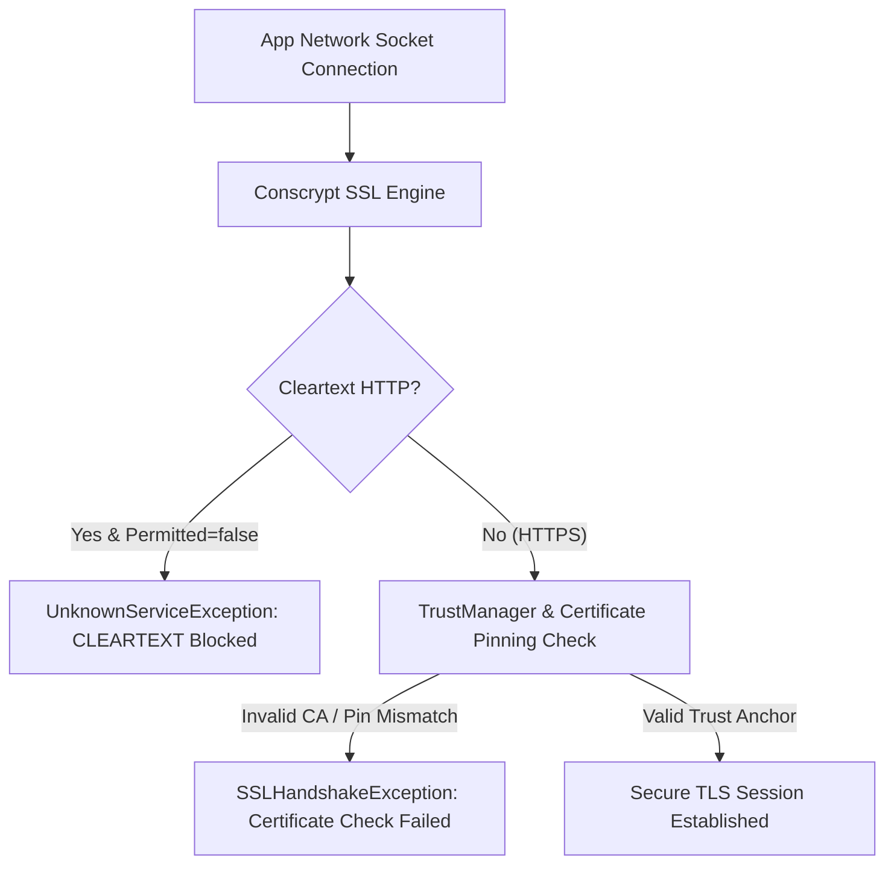

## Network Security Config는 앱 신뢰, cleartext, pinning 정책을 선언한다

상위 문서: [Connectivity contracts](android-connectivity.md)

배경 지식: [Certificate Pinning(인증서 고정)](../../../../security/fundamentals/certificate-pinning.md)

Android 7.0(API 24)부터 도입된 **Network Security Configuration**은 소스 코드에 인증서 처리 로직을 자바 코드로 하드코딩하지 않고, **선언적 XML 파일(`res/xml/network_security_config.xml`)을 통해 앱의 TLS/SSL 암호화 연결 정책, 암호화되지 않은 HTTP (Cleartext) 차단, 디버그 CA 신뢰 범위, 인증서 핀 세트(Certificate Pinning)**를 강제 적용하는 보안 계약이다.

### 메커니즘: Conscrypt 및 TrustManager 선언 검증

1. **Cleartext Traffic Enforcement (`cleartextTrafficPermitted`)**:
   - Android 9(API 28)부터 기본값은 `false`로 설정된다.
   - 앱이 `http://` 통신을 시도하면 OkHttp / **Conscrypt**(Google이 만든 Android 기본 TLS/SSL 엔진 구현체 — 앱의 모든 HTTPS 소켓이 이 위에서 인증서 검증을 수행한다) 레벨에서 `java.net.UnknownServiceException: CLEARTEXT communication to domain.com not permitted by network security policy` 에러를 발화하여 통신을 원천 차단한다.

2. **Certificate Pinning (`pin-set`)**:
   - 서버의 서명 공통 키(SHA-256 Hash)를 명시하여, 중간자 공격(MITM)이나 유효한 다른 인증서의 위조 서명을 차단한다.
   - 만료 시 서비스를 구동할 수 있도록 `expiration` 날짜와 백업 핀(`backup pin`) 작성을 강제한다.

3. **Debug Override (`debug-overrides`)**:
   - 디버그 빌드(`android:debuggable="true"`)에서만 개발자 로컬 CA(Charles Proxy / Fiddler CA)를 신뢰하도록 한정한다.



### XML 선언예: `network_security_config.xml`

```xml
<?xml version="1.0" encoding="utf-8"?>
<network-security-config>
    <!-- 전역 기본 정책: Cleartext HTTP 차단 -->
    <base-config cleartextTrafficPermitted="false">
        <trust-anchors>
            <certificates src="system" />
        </trust-anchors>
    </base-config>

    <!-- 특정 도메인 Certificate Pinning 및 HTTP 허용 -->
    <domain-config cleartextTrafficPermitted="false">
        <domain includeSubdomains="true">api.example.com</domain>
        <pin-set expiration="2027-12-31">
            <!-- SHA-256 Public Key Pin -->
            <pin digest="SHA-256">7HIpactkIAq2Y49orFOOQKurWxALw122=</pin>
            <!-- Backup Pin 필수 -->
            <pin digest="SHA-256">fwZa0BB3AeYgZC2qB8ffmUU8gHh2122=</pin>
        </pin-set>
    </domain-config>

    <!-- 디버그 빌드 전용 로컬 프록시 CA 신뢰 -->
    <debug-overrides>
        <trust-anchors>
            <certificates src="user" />
        </trust-anchors>
    </debug-overrides>
</network-security-config>
```

### AndroidManifest.xml 연결

```xml
<application
    android:networkSecurityConfig="@xml/network_security_config"
    ... >
</application>
```

### 관찰 신호: Conscrypt SSL 검증 로그

```bash
# Network Security Config 적용 검증 및 SSLHandshake 에러 logcat
adb logcat -s Conscrypt NetworkSecurityConfig
```

### 관련 문서

- [Private DNS는 DNS를 암호화하지만 앱 TLS 검증을 대체하지 않는다](android-private-dns.md)
- [네트워크 디버깅은 앱 API 상태와 시스템 네트워크 상태를 비교한다](network-debugging.md)

공식 문서: [Android Network Security Configuration](https://developer.android.com/training/articles/security-config)
