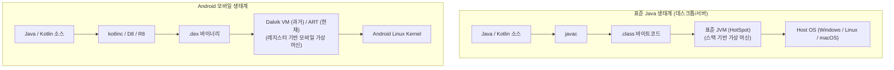

## Dalvik VM (Dalvik 가상 머신)

### 1. 개요 및 계층적 위치 (Overview & Architecture)

**Dalvik VM (Dalvik 가상 머신)** 은 Android 4.4(KitKat) 이하 버전까지 안드로이드 플랫폼의 기본 애플리케이션 실행 런타임으로 사용되었던 모바일 전용 독립 가상 머신이다.

> [!IMPORTANT]
> **"Dalvik 은 JVM 위에서 돌아가는 것이 아니다."**
> Android 기기(스마트폰)의 Linux OS 에는 표준 JVM 이 설치되어 있지 않다. Dalvik 은 데스크톱/서버용 JVM 과 완전히 대등한 위치에서, **Linux 커널 위에서 직접 프로세스로 실행되는 독자적인 모바일 가상 머신이자 런타임**이다.

Android 5.0(Lollipop)부터는 JIT 의 한계를 극복하고 AOT 컴파일과 향상된 GC 를 제공하는 **[ART (Android Runtime)](art.md)** 로 완전히 대체되었다.

---

### 2. 왜 JVM 대신 Dalvik 을 만들었는가? (JVM vs Dalvik)

초기 스마트폰 하드웨어(RAM 128MB~512MB, 저클럭 ARM CPU)는 데스크톱용으로 설계된 표준 JVM 을 구동하기에 지나치게 무거웠다. Google 은 다음과 같은 이유로 Dalvik 을 독자 개발했다:

| 비교 항목 | 표준 JVM (Java Virtual Machine) | Dalvik VM (과거 Android VM) |
|---|---|---|
| **가상 머신 아키텍처** | **스택 기반 (Stack-based)** | **레지스터 기반 (Register-based)** |
| **명령어 처리 방식** | 피연산자 스택(Operand Stack)에 값을 PUSH/POP 하여 연산 | 가상 레지스터(Virtual Registers)에 값을 직접 로드하여 연산 |
| **명령어 개수 및 효율** | 단순 연산에도 다수의 PUSH/POP 명령 필요 (명령어 수 많음) | **명령어 수가 30% 이상 적고 명령어 디스패치 루프가 빠름** |
| **실행 파일 포맷** | 클래스마다 쪼개진 **`.class` / `.jar`** (상수 풀 중복 극심) | 모든 클래스를 하나로 합친 **[`.dex`](../../../computer-science/jvm-bytecode-and-jar-archive.md)** (상수 풀 단일 통합) |
| **라이선스 문제** | 당시 Sun Microsystems(현 Oracle)의 Java JVM 특허/라이선스 | 모바일 최적화를 위해 Apache 2.0 라이선스로 클린룸 개발 |

---

### 3. '런타임(Runtime)'이란 무엇이며 왜 가상머신에 런타임이라는 말이 붙는가?

> **"런타임(Runtime)이란 프로그램이 실행(Run)되는 동안, 그 생명주기와 동작을 뒷받침하는 모든 소프트웨어 환경(가상 머신 + 표준 라이브러리 + 메모리 관리자 + 스레드 스케줄러)을 의미한다."**

- Java 생태계에서 **JRE (Java Runtime Environment)** = `JVM(엔진) + Java 표준 라이브러리`이듯이,
- Android 에서 **ART (Android Runtime)** = `가상 머신 엔진 + Android Core 라이브러리(android.*) + 가비지 컬렉터(GC) + 컴파일러(AOT/JIT)`를 의미한다.

---

### 4. Dalvik VM 의 내부 동작 특성과 한계

1. **JIT (Just-In-Time) 컴파일 위주 동작**:
   - 앱 기동 시 DEX 바이트코드를 인터프리터로 한 줄씩 실행하다가, 자주 실행되는 핫코드(Hot Code)만 런타임에 [JIT 컴파일](../../../computer-science/jit-compilation.md) 로 기계어로 변환했다.
   - 앱을 켤 때마다 매번 인터프리팅과 JIT 컴파일이 반복되어 CPU 전력 소모가 심하고 배터리 소모가 컸다.
2. **Stop-the-world GC**:
   - 가비지 컬렉션이 발생할 때마다 앱의 모든 실행 스레드가 멈추어 16ms 프레임 데드라인을 놓치는 화면 버벅임(Jank)이 빈번했다.
3. **ART 로의 전환**:
   - 이러한 Dalvik 의 근본적인 한계를 해결하기 위해 Android 5.0부터 앱 설치 시점에 미리 기계어로 번역하는 **AOT 컴파일**과 비차단 GC 를 탑재한 **[ART (Android Runtime)](art.md)** 로 완전히 교체되었다.

---

### 5. 연결 문서 (Related Links)

- [JDK vs JRE vs JVM 의 차이와 런타임의 본질](../../../computer-science/jdk-vs-jre-vs-jvm.md)
- [JVM 아키텍처와 런타임 실행 엔진](../../../computer-science/jvm-architecture.md)
- [Dalvik vs ART 비교](dalvik-vs-art.md)
- [ART (Android Runtime)](art.md)
- [D8과 R8 컴파일러 및 덱싱(Dexing) 메커니즘](../03_packaging_deployment/optimization/build-optimization/d8-and-r8.md)
- [바이트코드 파일(.class)과 아카이브 파일(.jar)의 본질](../../../computer-science/jvm-bytecode-and-jar-archive.md)
