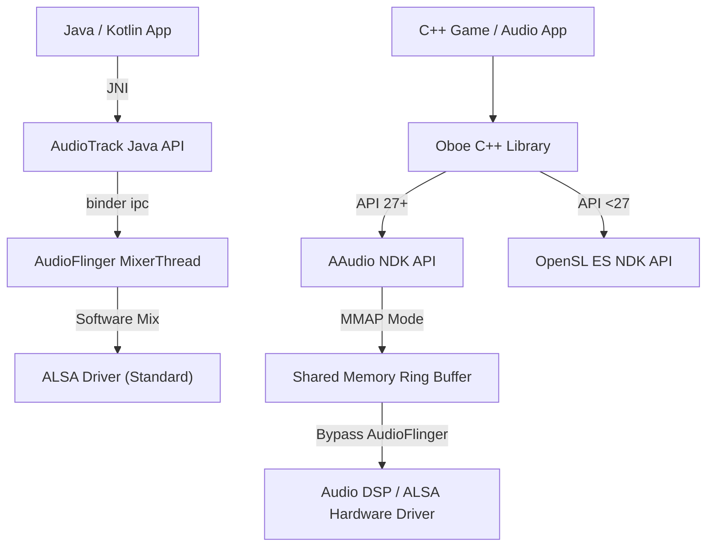

## AudioTrack, AAudio, Oboe는 지연 시간과 포터빌리티 트레이드오프를 선택한다

상위 문서: [Graphics and media contracts](android-graphics-media-runtime.md)

Android 오디오 출력 파이프라인은 높은 이식성과 편의성을 제공하는 Java/Kotlin 계층의 **AudioTrack**부터, NDK C 기반으로 커널 버퍼에 직접 접근하여 초저지연을 달성하는 **AAudio**, 그리고 두 API의 장점을 래핑한 Google의 C++ 라이브러리 **Oboe**로 구분된다.

### 메커니즘: 계층별 Latency 및 파이프라인 비교

1. **AudioTrack (Java Framework)**:
   - JNI 경계를 통해 `audioserver` 프로세스의 `AudioFlinger` MixerThread로 PCM 데이터를 전달한다.
   - 소프트웨어 믹싱, resampling, 효과 처리 버퍼를 거치므로 일반적인 지연 시간이 40ms~100ms 수준에 달한다.

2. **AAudio (Native NDK API, Android 8.0+ / API 26+)**:
   - 독점 모드(`AAUDIO_SHARING_MODE_EXCLUSIVE`)와 `AAUDIO_PERFORMANCE_MODE_LOW_LATENCY` 설정 시 **MMAP(Memory-Mapped I/O)** 경로를 사용한다.
   - `AudioFlinger` 믹서를 우회하여 하드웨어 ALSA/vDSP 커널 링버퍼와 공유 메모리로 직결되므로 지연 시간을 5ms~15ms 수준으로 단축한다.

3. **Oboe (C++ Cross-Platform Wrapper)**:
   - 기기의 API Level을 감지하여 API 27+에서는 AAudio를 사용하고, 구형 API 16+에서는 OpenSL ES로 폴백한다.
   - 단일 C++ API 코드베이스로 최대의 디바이스 이식성과 최저 지연 성능을 동시에 보장한다.



### Oboe C++ 초저지연 오디오 스트림 생성 코드

```cpp
#include <oboe/Oboe.h>

class RealtimeAudioEngine : public oboe::AudioStreamDataCallback {
public:
    void startStream() {
        oboe::AudioStreamBuilder builder;
        builder.setDirection(oboe::Direction::Output)
               ->setPerformanceMode(oboe::PerformanceMode::LowLatency)
               .setSharingMode(oboe::SharingMode::Exclusive)
               .setFormat(oboe::AudioFormat::Float)
               .setChannelCount(oboe::ChannelCount::Stereo)
               .setDataCallback(this);

        oboe::Result result = builder.openStream(mStream);
        if (result == oboe::Result::OK) {
            mStream->requestStart();
        }
    }

    // MMAP 초저지연 오디오 콜백 (Audio Thread에서 호출되므로 무차단 처리 필수)
    oboe::DataCallbackResult onAudioReady(
            oboe::AudioStream *oboeStream,
            void *audioData,
            int32_t numFrames) override {
        float *floatData = static_cast<float *>(audioData);
        for (int i = 0; i < numFrames * 2; ++i) {
            floatData[i] = 0.0f; // 오디오 신호 합성 로직
        }
        return oboe::DataCallbackResult::Continue;
    }

private:
    std::shared_ptr<oboe::AudioStream> mStream;
};
```

### 관찰 신호: AudioFlinger MMAP 및 Latency 관찰

```bash
# 1. AudioFlinger 믹서 트랙 및 MMAP 스트림 상태 관찰
adb shell dumpsys media.audio_flinger

# 출력 해석 포인트:
# - Output thread MMAP flags: FAST / MMAP 노드 생성 여부 확인
# - Frame count & Sample rate: 48000Hz 기준 burst size (e.g. 96 frames = 2ms)
# - Latency (ms): 각 active track의 실제 측정된 지연 시간

# 2. AAudio 전용 프로퍼티 및 덤프
adb shell dumpsys media.aaudio
```

### 관련 문서

- [AudioFocus는 공유 출력 정책이지 오디오 재생 권한이 아니다](audio-focus-policy.md)
- [Media3 ExoPlayer는 playback stack이지 저수준 codec API가 아니다](media3-exoplayer-stack.md)

공식 문서: [Oboe C++ Library](https://github.com/google/oboe)
