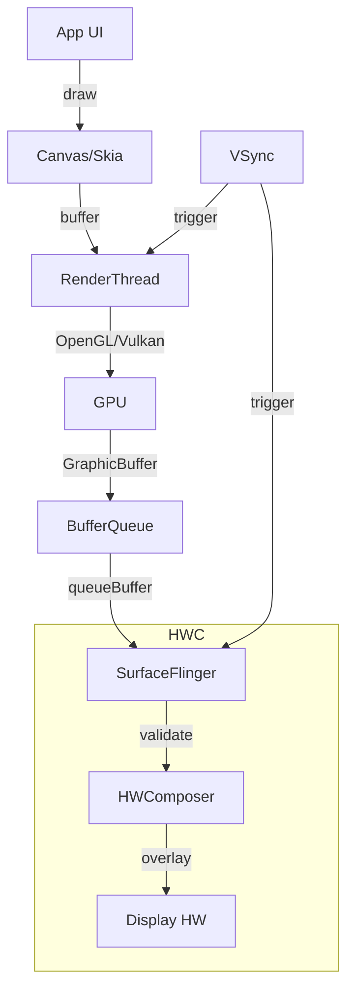

# 그래픽 아키텍처 개요

상위 노트: [android-graphics-and-media](01_inbox/mobile/android/01_system_internals/graphics-and-media/android-graphics-and-media.md)

```mermaid
graph TB
    App[App UI] -->|draw| Canvas[Canvas/Skia]
    Canvas -->|buffer| RenderThread[RenderThread]
    RenderThread -->|OpenGL/Vulkan| GPU
    GPU -->|GraphicBuffer| BufferQueue
    
    BufferQueue -->|queueBuffer| SF[SurfaceFlinger]
    
    subgraph HWC
        SF -->|validate| HWComposer
        HWComposer -->|overlay| Display[Display HW]
    end
    
    VSync[VSync] -->|trigger| SF
    VSync -->|trigger| RenderThread
```

### 핵심 컴포넌트
