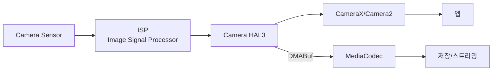

# Camera Pipeline

상위 노트: [android-graphics-and-media](01_inbox/mobile/android/01_system_internals/graphics-and-media/android-graphics-and-media.md)



### Camera2 API

```kotlin
val cameraManager = getSystemService(CameraManager::class.java)
val cameraId = cameraManager.cameraIdList[0]

cameraManager.openCamera(cameraId, object : CameraDevice.StateCallback() {
    override fun onOpened(camera: CameraDevice) {
        val captureRequest = camera.createCaptureRequest(TEMPLATE_PREVIEW)
        captureRequest.addTarget(surface)
        
        camera.createCaptureSession(listOf(surface), callback, handler)
    }
}, handler)
```

### CameraX (권장)

```kotlin
val preview = Preview.Builder().build()
val imageCapture = ImageCapture.Builder().build()

cameraProvider.bindToLifecycle(
    this,
    cameraSelector,
    preview,
    imageCapture
)

preview.setSurfaceProvider(previewView.surfaceProvider)
```

---
