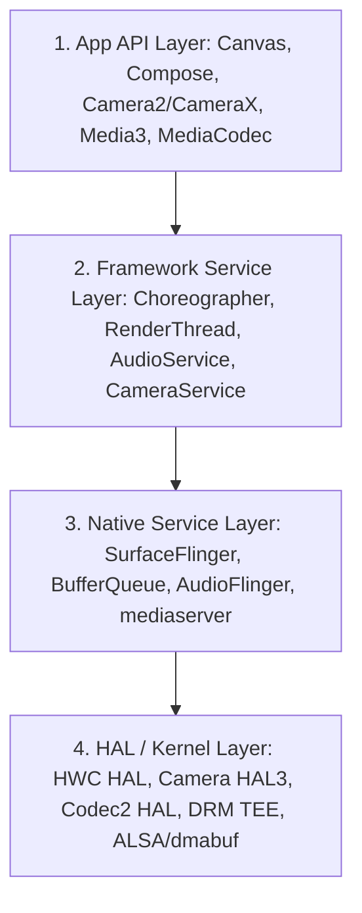

## Android graphics/media runtime

Android의 그래픽과 미디어 런타임 체계는 단순 UI 툴킷 뷰 작성법을 넘어 **버퍼 소유권(Buffer Ownership)과 시간축 VSync 프레임 마감 시간(Frame Deadline)**을 통제하는 하드웨어 가속 실행 계약 위에 구축되어 있다. 앱은 Surface에 프레임을 생산하고, BufferQueue는 producer/consumer를 격리하며, SurfaceFlinger와 Hardware Composer(HWC)는 최적의 오버레이 방식으로 최종 디스플레이를 합성한다.

### 계층 구분

Android 그래픽/미디어 노트는 다음 4개 하위 시스템 계층 중 어느 지점의 동작 계약을 설명하는지 명확히 구분한다.

- **App API**: `Canvas`/`Compose` 그리기, `Camera2`/`CameraX` 요청, `MediaCodec`/`Media3` 호출처럼 앱 프로세스가 직접 부르는 인터페이스.
- **Framework Service**: RenderThread 스케줄, `Choreographer`, `CameraService`, `AudioService`처럼 system_server 또는 앱 프로세스 내에서 파이프라인을 조율하는 계층.
- **Native Service**: `SurfaceFlinger`, `HWC` 서비스, `AudioFlinger`, `mediaserver`처럼 별도 Native C++ daemon 프로세스로 동작하며 Binder IPC로 통신하는 영역.
- **HAL/Kernel**: `HWC2 HAL`, `Camera HAL3`, `Codec2`, `Widevine DRM TEE`, `ALSA/dmabuf` 커널 드라이버 등 칩셋 벤더 하드웨어 자원에 직접 닿는 영역.

이 구분은 [Graphics and media contracts](android-graphics-media-runtime.md) index 문서에서 계약 단위로 세분화되어 기술된다.

### 관찰 신호 및 디버깅 접근법

시스템 정합성 이슈 및 성능 버벅임 발생 시 다음 덤프 명령어로 관찰 신호를 확보한다:
- `adb shell dumpsys SurfaceFlinger`: 레이어 Z-order 및 HWC hardware overlay 오프로드 상태
- `adb shell dumpsys gfxinfo <package>`: 프레임 렌더링 latency 및 Jank 비율
- `adb shell dumpsys media.camera`: 카메라 capture request 및 Output Surface 스트림 바인딩
- `adb shell dumpsys media.codec`: 인코더/디코더 하드웨어 세션 및 BufferQueue 대기 상태
- `adb shell dumpsys audio`: AudioFocus 스택 및 AudioTrack / MMAP 노드 현황

---

### 읽는 순서

1. **렌더링 파이프라인 정본**: [Surface](surface-graphic-buffers.md), [BufferQueue](bufferqueue-ownership.md), [SurfaceFlinger & HWC](surfaceflinger-composition.md), [파이프라인 전체 구조](android-rendering-pipeline.md)를 통해 버퍼 픽셀 전달 흐름을 이해한다.
2. **그리기와 프레임 스케줄링**: [Canvas/Compose는 합성기가 아니다](canvas-skia-compose-rendering.md), [RenderThread 역할](renderthread-pipeline.md), [VSync와 Choreographer](vsync-and-choreographer.md), [Jank 원인 분석](jank-frame-deadlines.md)으로 프레임 마감 시간을 파악한다.
3. **카메라 및 이미지 스트림**: [Camera HAL3 파이프라인](camera-hal-pipeline.md), [카메라 Output Surface](camera-output-surfaces.md), [CameraX와 Camera2 경계](camerax-vs-camera2.md), [ImageReader 버퍼](imagereader-buffers.md)를 확인한다.
4. **미디어 비디오 코덱 & DRM**: [MediaCodec Surface 모드](mediacodec-surface-mode.md), [MediaCodec ByteBuffer 모드](mediacodec-bytebuffer-mode.md), [Zero-Copy 파이프라인](surface-media-pipeline.md), [DRM & Secure Codec](drm-protected-media.md), [Media3 ExoPlayer](media3-exoplayer-stack.md)를 본다.
5. **오디오 파이프라인**: [AudioFocus 공유 정책](audio-focus-policy.md), [AudioTrack, AAudio & Oboe](android-audio-apis.md)로 오디오 출력 정책과 초저지연 경로를 이해한다.
6. **통합 디버깅**: [그래픽 미디어 디버깅](graphics-media-debugging.md)을 바탕으로 Perfetto 및 dumpsys 관찰 신호를 결합한다.

### 문제 분류 기준

- **화면 버벅임 및 프레임 드롭(Jank)**: [Jank 원인 분석](jank-frame-deadlines.md), [VSync와 Choreographer](vsync-and-choreographer.md), [RenderThread 역할](renderthread-pipeline.md)
- **화면 합성 및 전력 효율 오버레이**: [Hardware Composer](hardware-composer.md), [SurfaceFlinger & HWC](surfaceflinger-composition.md), [Canvas/Compose는 합성기가 아니다](canvas-skia-compose-rendering.md)
- **카메라 촬영 및 ML 이미지 처리**: [카메라 Output Surface](camera-output-surfaces.md), [ImageReader 버퍼](imagereader-buffers.md), [Camera HAL3 파이프라인](camera-hal-pipeline.md)
- **비디오 인코딩/디코딩 성능 및 DRM**: [MediaCodec Surface 모드](mediacodec-surface-mode.md), [DRM & Secure Codec](drm-protected-media.md), [Zero-Copy 파이프라인](surface-media-pipeline.md)
- **오디오 중첩 및 저지연 음동기화**: [AudioFocus 공유 정책](audio-focus-policy.md), [AudioTrack, AAudio & Oboe](android-audio-apis.md)
