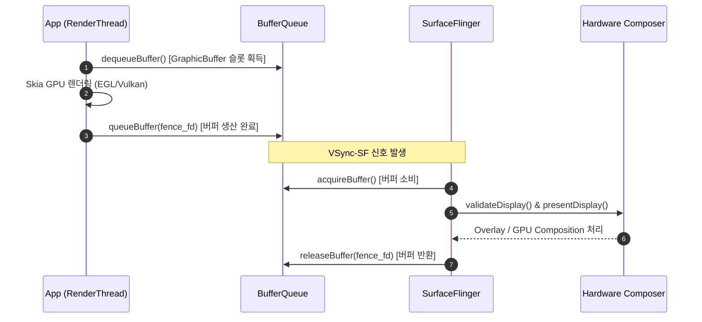

## Android 렌더링 파이프라인은 Surface → BufferQueue → Compositor 흐름이다

상위 문서: [Graphics and media contracts](android-graphics-media-runtime.md)

Android 화면 렌더링의 핵심 구조는 애플리케이션이 픽셀을 직접 디스플레이에 전송하지 않고, **Surface**를 통해 생산한 그래픽 버퍼를 **BufferQueue**에 enqueue하면, **SurfaceFlinger**와 **Hardware Composer(HWC)**가 VSync 신호에 맞춰 최적의 방식으로 최종 화면을 합성하는 흐름이다.

### 메커니즘: Producer-Consumer 버퍼 전달 파이프라인

1. **Producer (App / RenderThread)**:
   - 앱 프로세스의 RenderThread는 Skia(OpenGL ES 또는 Vulkan backend)를 통해 그리기 명령(`DisplayList`)을 전송한다.
   - `ANativeWindow` 인터페이스를 통해 BufferQueue로부터 비어 있는 버퍼를 요청(`dequeueBuffer`)하고, 렌더링 후 완료된 버퍼를 제출(`queueBuffer`)한다.

2. **BufferQueue (Shared Memory Buffer Pool)**:
   - `GraphicBuffer` 메모리 슬롯을 관리하며 `IGraphicBufferProducer`와 `IGraphicBufferConsumer` [binder ipc](../ipc-and-process/binder-ipc.md) 인터페이스로 생산자와 소비자를 격리한다.
   - 렌더링 동기화를 위해 **Fence**(GPU 작업이 끝났음을 알리는 동기화 신호 — 이 신호가 signal 되기 전까지는 그 버퍼를 아직 안전하게 읽거나 쓸 수 없다는 뜻)인 EGLFence/Sync FD를 버퍼와 함께 전달하여 CPU-GPU 비동기 대기 시간을 최소화한다.

3. **Consumer (SurfaceFlinger / HWC)**:
   - VSync-SF 신호가 발생하면 SurfaceFlinger는 BufferQueue에서 읽기 준비가 된 버퍼를 획득(`acquireBuffer`)한다.
   - HWC HAL을 통해 각 레이어의 합성 방식을 결정(Hardware Overlay vs GPU Composition)하고, 최종 프레임버퍼 또는 디스플레이 오버레이 플레인에 전달 후 버퍼를 해제(`releaseBuffer`)한다.



### C++ Native Surface / ANativeWindow 렌더링 파이프라인

```cpp
// Native C++에서 Surface(ANativeWindow)를 통한 버퍼 생산 예시
#include <android/native_window.h>
#include <EGL/egl.h>

void renderFrameToSurface(ANativeWindow* window) {
    // 1. 버퍼 기하 구조 설정 (ANativeWindow)
    ANativeWindow_setBuffersGeometry(window, 1080, 1920, WINDOW_FORMAT_RGBA_8888);

    // 2. EGL Surface 생성 및 Context 바인딩
    EGLDisplay display = eglGetDisplay(EGL_DEFAULT_DISPLAY);
    eglInitialize(display, nullptr, nullptr);
    
    EGLConfig config;
    EGLint numConfigs;
    EGLint attribs[] = { EGL_SURFACE_TYPE, EGL_WINDOW_BIT, EGL_NONE };
    eglChooseConfig(display, attribs, &config, 1, &numConfigs);

    EGLSurface surface = eglCreateWindowSurface(display, config, window, nullptr);
    EGLContext context = eglCreateContext(display, config, EGL_NO_CONTEXT, nullptr);
    eglMakeCurrent(display, surface, surface, context);

    // 3. GPU 그리기 명령 수행 (Skia / GLES)
    glClearColor(1.0f, 0.0f, 0.0f, 1.0f);
    glClear(GL_COLOR_BUFFER_BIT);

    // 4. BufferQueue에 queueBuffer 동작 수행 (EGL Swap Buffers)
    eglSwapBuffers(display, surface);
}
```

### 관찰 신호: SurfaceFlinger 버퍼 상태 관찰

```bash
# 1. SurfaceFlinger 활성 버퍼큐 및 레이어 관찰
adb shell dumpsys SurfaceFlinger

# 2. 특정 레이어의 BufferQueue 슬롯 및 Fence 대기 상태 확인
adb shell dumpsys SurfaceFlinger --latency "com.example.app/com.example.app.MainActivity#0"

# 주요 분석 포인트:
# - AllocBuffer count: 할당된 GraphicBuffer 개수 (보통 Triple Buffering 3개)
# - active buffer status: DEQUEUED, QUEUED, ACQUIRED, FREE 전환 여부
# - fence target state: GPU 렌더링 펜스가 제시간에 signal되는지 확인
```

### 관련 문서

- [BufferQueue는 producer와 consumer를 버퍼 소유권으로 분리한다](bufferqueue-ownership.md)
- [Surface는 그래픽 버퍼 producer 측 계약이다](surface-graphic-buffers.md)
- [SurfaceFlinger는 보이는 레이어를 HWC와 함께 합성한다](surfaceflinger-composition.md)

공식 문서: [Android Graphics Architecture](https://source.android.com/docs/core/graphics)
