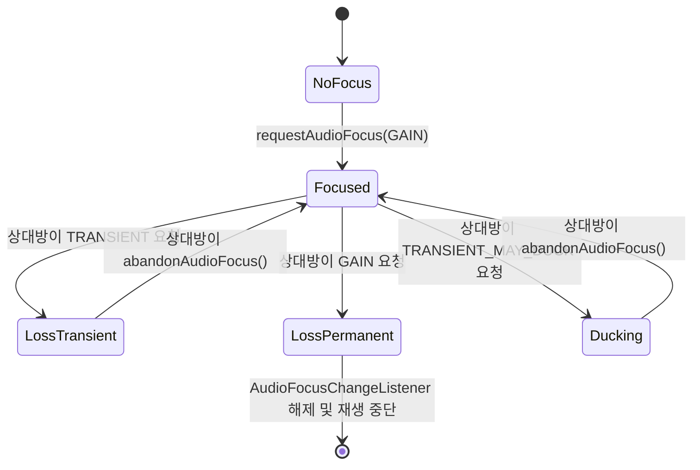

## AudioFocus 는 공유 출력 정책이지 오디오 재생 권한이 아니다

상위 문서: [Graphics and media contracts](android-graphics-media-runtime.md)

Android에서 **AudioFocus**는 하드웨어 수준의 오디오 출력을 강제로 차단하는 하드웨어 접근 권한이 아니다. 여러 앱이 동시에 소리를 낼 때 사용자 경험을 보호하기 위해 **시스템과 앱이 협력하여 지키는 상호 약속(Cooperative Policy)**이다. Focus를 잃은 앱이 이를 무시하고 소리를 낼 경우 물리적으로 소리가 섞여 출력될 수 있으므로, 앱은 반드시 Focus 변화 이벤트에 따라 재생을 일시 중단, 볼륨 감소(Ducking), 또는 세션 종료를 수행해야 한다.

### 메커니즘: AudioService Focus 스택 관리

1. **Focus Request & Focus Stack**:
   - 앱이 `AudioManager.requestAudioFocus()`를 호출하면 Binder IPC를 통해 `AudioService` (system_server)의 Focus 스택 top에 등록된다.
   - `AUDIOFOCUS_GAIN`: 음악/팟캐스트처럼 장시간 독점 재생.
   - `AUDIOFOCUS_GAIN_TRANSIENT`: 내비게이션 안내, 알림 음성처럼 단시간 재생 후 이전 앱 복귀.
   - `AUDIOFOCUS_GAIN_TRANSIENT_MAY_DUCK`: 기존 배경 음량 축소(Ducking) 후 중첩 재생.

2. **Ducking & Loss 콜백 분기**:
   - 새로운 focus 요청이 오면 기존 top focus 소유자에게 `OnAudioFocusChangeListener` 콜백으로 `AUDIOFOCUS_LOSS`, `AUDIOFOCUS_LOSS_TRANSIENT`, `AUDIOFOCUS_LOSS_TRANSIENT_CAN_DUCK` 전송.
   - Android 8.0(API 26)부터 `AudioAttributes` 설정 시, 시스템 프레임워크가 일부 Ducking 및 Focus 획득 대기(Delayed Focus)를 자동 처리할 수 있다.



### Kotlin AudioFocusRequest 구현예

```kotlin
import android.media.AudioAttributes
import android.media.AudioFocusRequest
import android.media.AudioManager

class AudioFocusController(private val audioManager: AudioManager) {
    private var focusRequest: AudioFocusRequest? = null

    private val focusChangeListener = AudioManager.OnAudioFocusChangeListener { focusChange ->
        when (focusChange) {
            AudioManager.AUDIOFOCUS_GAIN -> {
                // Focus 회복: 음량 원복 및 재생 재개
                setVolume(1.0f)
                resumePlayback()
            }
            AudioManager.AUDIOFOCUS_LOSS -> {
                // 영구 Focus 손실: 재생 정지 및 Focus 해제
                stopPlayback()
            }
            AudioManager.AUDIOFOCUS_LOSS_TRANSIENT -> {
                // 일시적 Focus 손실: 일시 정지
                pausePlayback()
            }
            AudioManager.AUDIOFOCUS_LOSS_TRANSIENT_CAN_DUCK -> {
                // Ducking: 음량을 20%로 축소하여 유지
                setVolume(0.2f)
            }
        }
    }

    fun requestFocus(): Boolean {
        val playbackAttributes = AudioAttributes.Builder()
            .setUsage(AudioAttributes.USAGE_MEDIA)
            .setContentType(AudioAttributes.CONTENT_TYPE_MUSIC)
            .build()

        focusRequest = AudioFocusRequest.Builder(AudioManager.AUDIOFOCUS_GAIN)
            .setAudioAttributes(playbackAttributes)
            .setAcceptsDelayedFocusGain(true)
            .setOnAudioFocusChangeListener(focusChangeListener)
            .build()

        val result = audioManager.requestAudioFocus(focusRequest!!)
        return result == AudioManager.AUDIOFOCUS_REQUEST_GRANTED
    }

    fun abandonFocus() {
        focusRequest?.let { audioManager.abandonAudioFocusRequest(it) }
    }

    private fun setVolume(v: Float) {}
    private fun resumePlayback() {}
    private fun stopPlayback() {}
    private fun pausePlayback() {}
}
```

### 관찰 신호: AudioService Focus 스택 관찰

```bash
# AudioService의 실시간 AudioFocus 스택 및 클라이언트 상태 확인
adb shell dumpsys audio | grep -A 20 "Audio Focus stack"

# 출력 주요 관찰 항목:
# - source: requesting client package name & UID
# - ducking map: 프레임워크에 의해 자동 ducking 적용 중인 파이프라인
# - focus loss ducking behavior: Delayed Focus 승인 여부
```

### 관련 문서

- [AudioTrack, AAudio, Oboe는 지연 시간과 포터빌리티 트레이드오프를 선택한다](android-audio-apis.md)
- [Media3 ExoPlayer는 playback stack이지 저수준 codec API가 아니다](media3-exoplayer-stack.md)

공식 문서: [Managing Audio Focus](https://developer.android.com/media/optimize/audio-focus)
