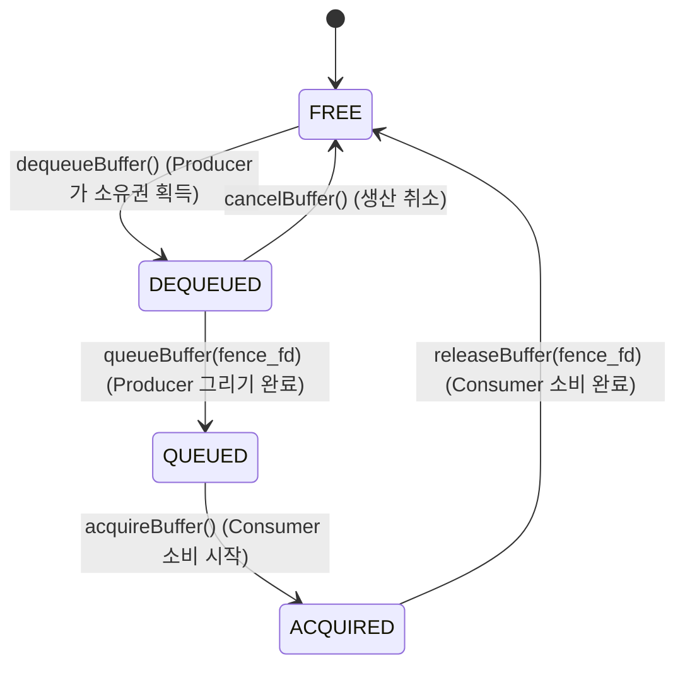

## BufferQueue는 producer와 consumer를 버퍼 소유권으로 분리한다

상위 문서: [Graphics and media contracts](graphics-media.md)

Android 그래픽 시스템의 핵심 추상화 구조인 **BufferQueue**는 그래픽 버퍼를 생성하는 생산자(Producer)와 이를 소비하는 소비자(Consumer) 사이에서 **GraphicBuffer의 소유권(Ownership)**을 명시적인 상태 머신으로 관리한다. 프로세스 간 [binder ipc](../ipc-and-process/binder-ipc.md) 통신을 최소화하면서 shared memory(`ion` / `dmabuf`) 기반으로 픽셀 데이터를 전달한다.

### 메커니즘: GraphicBuffer의 4가지 상태 머신

BufferQueue 내의 각 `GraphicBuffer` 슬롯은 다음 4가지 상태를 순환한다.

1. **FREE**:
   - 소비자가 사용을 마치고 반환한 상태. 생산자가 새 그리기 작업을 위해 `dequeueBuffer()`로 소유권을 가져갈 수 있다.
2. **DEQUEUED**:
   - 생산자(App RenderThread / Camera HAL / Codec)가 소유권을 획득하여 그리기/인코딩 작업을 수행 중인 상태.
3. **QUEUED**:
   - 생산자가 작업 완결 후 EGLSync/Fence와 함께 `queueBuffer()`를 호출하여 소비자가 읽을 수 있도록 제출한 상태.
4. **ACQUIRED**:
   - 소비자(SurfaceFlinger / ImageReader / VideoEncoder)가 `acquireBuffer()`로 소유권을 획득하여 디스플레이 합성 또는 분석 작업을 수행 중인 상태.



### C++ Native GraphicBuffer / ANativeWindow_Buffer 제어

```cpp
#include <android/native_window.h>
#include <android/native_window_jni.h>

void drawDirectPixelsToSurface(JNIEnv* env, jobject surfaceObj) {
    // 1. Java Surface 객체로부터 ANativeWindow 획득
    ANativeWindow* window = ANativeWindow_fromSurface(env, surfaceObj);
    
    // 2. BufferQueue 버퍼 규격 설정
    ANativeWindow_setBuffersGeometry(window, 1920, 1080, WINDOW_FORMAT_RGBA_8888);

    // 3. dequeueBuffer 및 lock (DEQUEUED 상태 진입)
    ANativeWindow_Buffer buffer;
    if (ANativeWindow_lock(window, &buffer, nullptr) == 0) {
        // buffer.bits 에 직접 RGB 픽셀 작성
        uint32_t* line = (uint32_t*)buffer.bits;
        for (int y = 0; y < buffer.height; ++y) {
            for (int x = 0; x < buffer.width; ++x) {
                line[x] = 0xFF00FF00; // Green color
            }
            line += buffer.stride; // stride 간격 준수
        }

        // 4. queueBuffer 및 unlockAndPost (QUEUED 상태 전환)
        ANativeWindow_unlockAndPost(window);
    }
    
    ANativeWindow_release(window);
}
```

### 관찰 신호: dumpsys SurfaceFlinger 버퍼큐 상태 덤프

```bash
# SurfaceFlinger의 전체 BufferQueue 슬롯 현황 덤프
adb shell dumpsys SurfaceFlinger --buffer-queue

# 출력 결과 분석 예시:
# SurfaceView - com.example.app/MainActivity#0
#   Slot 0: FREE     [0x7f01234000] width=1080, height=1920, format=1
#   Slot 1: ACQUIRED [0x7f01234800] fence=Fence(fd=34)
#   Slot 2: QUEUED   [0x7f01235000] fence=Fence(fd=36)
#
# * 대기 중인 펜스(Fence FD)가 해제되지 않고 누수되는 경우 BufferQueue Starvation jank 발생
```

### 관련 문서

- [Surface는 그래픽 버퍼 producer 측 계약이다](surface-graphic-buffers.md)
- [Android 렌더링 파이프라인은 Surface → BufferQueue → Compositor 흐름이다](android-rendering-pipeline.md)

공식 문서: [Android BufferQueue and Surface Control](https://source.android.com/docs/core/graphics/arch-bq-gralloc)
