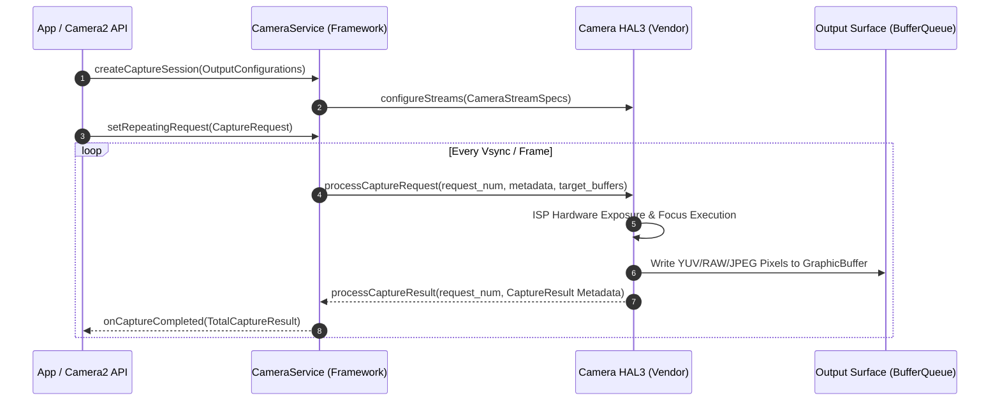

## Camera HAL 은 capture request 를 result 와 output buffer 로 변환한다

상위 문서: [Graphics and media contracts](graphics-media.md)

Android Camera2 및 CameraX 아키텍처의 핵심 백엔드인 **Camera HAL3**는 프레임워크(`CameraService`)가 전달한 캡처 요청(`CaptureRequest`)을 수신하여 렌즈/센서/**ISP**(Image Signal Processor — 센서가 받은 원시 광 신호를 노출/초점/화이트밸런스가 보정된 이미지로 변환하는 전용 하드웨어) 파이프라인을 제어한 뒤, 비동기적으로 이미지 데이터 버퍼(`GraphicBuffer`)와 캡처 메타데이터(`CaptureResult`)로 변환하여 반환하는 상태 머신 파이프라인이다.

### 메커니즘: HAL3 파이프라인 흐름 및 Binder/HIDL 계약

1. **Stream Configuration (`configureStreams`)**:
   - 앱이 카메라 파이프라인을 개설하면 `CameraService`는 HAL에 `configureStreams()`를 호출하여 Preview(YUV/PRIVATE), Still Capture(JPEG), Video Recording(MediaCodec Surface) 스트림의 해상도와 포맷을 전달하고 버퍼를 사전 바인딩한다.

2. **Process Capture Request (`processCaptureRequest`)**:
   - 프레임워크는 각 프레임마다 ISO, 셔터 스피드, AF 모드 메타데이터가 담긴 `CaptureRequest`를 `ICameraDeviceSession::processCaptureRequest()`로 비동기 전송한다.
   - 요청마다 결과 버퍼가 채워질 Target Surface의 GraphicBuffer 핸들이 포함된다.

3. **Process Capture Result (`processCaptureResult`)**:
   - 센서 프레임 취득 완료 시 HAL은 `processCaptureResult()` 콜백을 호출하여 3A(Auto Focus, Exposure, White Balance) 메타데이터와 그래픽 버퍼 완료 **Sync Fence**(GPU/하드웨어 작업이 끝났음을 알리는 동기화 신호 — signal 되기 전까지는 그 버퍼를 아직 읽을 수 없다는 뜻)를 비동기로 전달한다.



### Camera2 NDK (C++) CaptureRequest 작성 예시

```cpp
#include <camera/NdkCameraDevice.h>
#include <camera/NdkCameraMetadata.h>

void sendCaptureRequest(ACameraDevice* device, ACameraCaptureSession* session, ANativeWindow* outputWindow) {
    // 1. CaptureRequest Template (PREVIEW 모드) 생성
    ACaptureRequest* request = nullptr;
    ACameraDevice_createCaptureRequest(device, TEMPLATE_PREVIEW, &request);

    // 2. Target NativeWindow(Surface) 추가
    ACameraOutputTarget* outputTarget = nullptr;
    ACameraOutputTarget_create(outputWindow, &outputTarget);
    ACaptureRequest_addTarget(request, outputTarget);

    // 3. 메타데이터 조작 (Auto Exposure 모드 설정)
    uint8_t aeMode = ACAMERA_CONTROL_AE_MODE_ON;
    ACaptureRequest_setEntry_u8(request, ACAMERA_CONTROL_AE_MODE, 1, &aeMode);

    // 4. HAL 파이프라인으로 요청 제출 (repeating)
    ACameraCaptureSession_setRepeatingRequest(session, nullptr, 1, &request, nullptr);
    
    ACaptureRequest_free(request);
}
```

### 관찰 신호: CameraService 및 HAL 통계 관찰

```bash
# 1. CameraService 및 활성 카메라 HAL 세션 덤프
adb shell dumpsys media.camera

# 주요 출력 확인 사항:
# - Active Camera ID & Client Package
# - Stream configuration: format (HAL_PIXEL_FORMAT_YUV_420_888), width, height
# - In-flight capture request count & HAL pipeline depth
# - Frame drop count & Metadata timestamp gap

# 2. Camera HAL 센서 및 프레임 딜레이 logcat 관찰
adb logcat -s CameraService CameraHal3
```

### 관련 문서

- [카메라 출력 Surface는 프리뷰, 분석, 녹화 파이프라인을 정의한다](camera-output-surfaces.md)
- [CameraX와 Camera2는 제어 경계가 다르다](camerax-vs-camera2.md)

공식 문서: [Android Camera HAL3 Interface](https://source.android.com/docs/core/camera/camera3)
