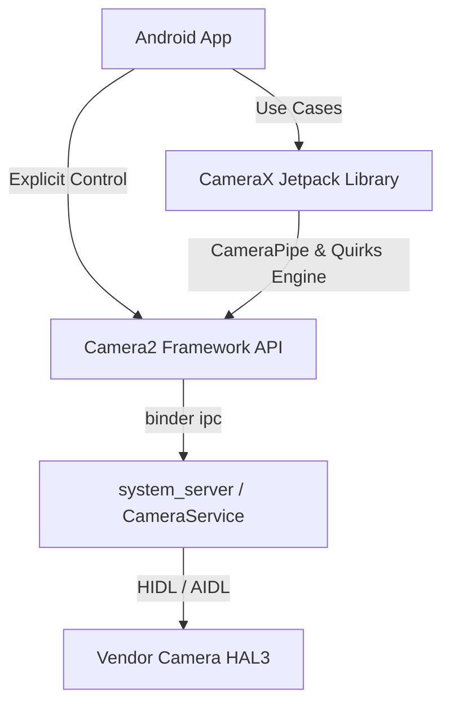

## CameraX 와 Camera2 는 제어 경계가 다르다

상위 문서: [Graphics and media contracts](android-graphics-media-runtime.md)

Android 카메라 API 시스템에서 **Camera2**는 명시적인 상태 머신과 파이프라인 수동 제어를 보장하는 프레임워크 저수준 API이고, **CameraX**는 유즈케이스 라이프싸이클 중심의 고수준 Jetpack 라이브러리다. 두 API는 디바이스 파편화 대응과 제어 세밀도 영역에서 극명한 경계 차이를 갖는다.

### 메커니즘: API 레이어 제어 범위 비교

1. **Camera2 (Framework Explicit Machine)**:
   - 개발자가 `CameraDevice`, `CameraCaptureSession`, `CaptureRequest` 상태 머신 및 Surface 파이프라인 생명주기를 직접 제어한다.
   - 센서 수동 제어(수동 ISO, 셔터 스피드, 포커스 거리, RAW DNG 취득) 및 초고속 캡처 세션 변경에 적합하다.
   - 단점: OEM 기기별 하드웨어 버그(특정 해상도 미지원, aspect ratio 왜곡)를 앱이 직접 파편화 대응 조치해야 함.

2. **CameraX (Jetpack UseCase Abstraction)**:
   - `Preview`, `ImageCapture`, `ImageAnalysis`, `VideoCapture` 유즈케이스 단편으로 동작을 추상화한다.
   - **CameraPipe** 모듈 및 Jetpack 퀼리티 쿼크(Quirks) 데이터베이스가 탑재되어 수천 종의 OEM 디바이스 예외 처리를 자동으로 은닉한다.
   - 필요 시 `Camera2Interop`을 통해 특정 CaptureRequest 옵션을 하부 Camera2 객체로 주입할 수 있다.



### Kotlin CameraX 사용 및 Camera2Interop 고급 설정 코드

```kotlin
import androidx.camera.camera2.interop.Camera2Interop
import androidx.camera.core.CameraSelector
import androidx.camera.core.ImageCapture
import androidx.camera.core.Preview
import androidx.camera.lifecycle.ProcessCameraProvider
import android.hardware.camera2.CaptureRequest

fun bindCameraXWithCamera2Interop(
    cameraProvider: ProcessCameraProvider,
    lifecycleOwner: androidx.lifecycle.LifecycleOwner,
    surfaceProvider: Preview.SurfaceProvider
) {
    val preview = Preview.Builder().build().also {
        it.setSurfaceProvider(surfaceProvider)
    }

    // Camera2Interop을 통해 수동 Exposure Compensation 등 저수준 옵션 주입
    val imageCaptureBuilder = ImageCapture.Builder()
    val camera2Extender = Camera2Interop.Extender(imageCaptureBuilder)
    camera2Extender.setCaptureRequestOption(
        CaptureRequest.CONTROL_AE_EXPOSURE_COMPENSATION, 2
    )

    val imageCapture = imageCaptureBuilder.build()
    val cameraSelector = CameraSelector.DEFAULT_BACK_CAMERA

    cameraProvider.unbindAll()
    cameraProvider.bindToLifecycle(
        lifecycleOwner, cameraSelector, preview, imageCapture
    )
}
```

### 관찰 신호: CameraX 및 Camera2 로그 관찰

```bash
# 1. CameraX 내부 쿼크(Quirks) 및 디바이스 보정 동작 확인 logcat
adb logcat -s CameraX Camera2CameraImpl

# 2. 시스템 레벨 카메라 세션 바인딩 확인
adb shell dumpsys media.camera
```

### 관련 문서

- [카메라 출력 Surface는 프리뷰, 분석, 녹화 파이프라인을 정의한다](camera-output-surfaces.md)
- [Camera HAL은 capture request를 result와 output buffer로 변환한다](camera-hal-pipeline.md)

공식 문서: [CameraX Architecture Guide](https://developer.android.com/training/camerax/architecture)
