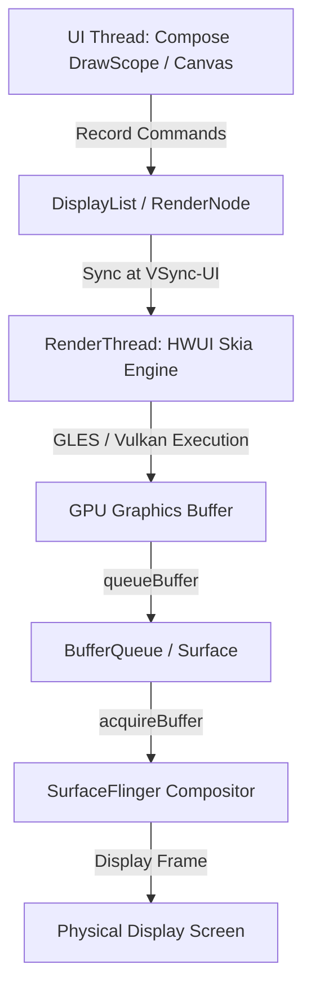

## Canvas, Skia, Compose 는 합성기가 아니라 그리기 명령의 생산자다

상위 문서: [Graphics and media contracts](graphics-media.md)

Android 뷰 시스템과 Jetpack Compose의 `Canvas` 또는 `DrawScope`는 화면 픽셀을 물리 디스플레이 프레임버퍼에 직접 렌더링하거나 레이어를 합성하는 주체가 아니다. 이들은 2D 렌더링 셰이프/텍스트 **그리기 명령(DisplayList / Skia Drawing Commands)**을 기록하는 생산자(Producer)일 뿐이며, 실제 픽셀 변환과 화면 합성은 RenderThread의 **Skia engine**과 시스템 **SurfaceFlinger** 프로세스가 나누어 담당한다.

### 메커니즘: UI Thread 기록에서 SurfaceFlinger 합성까지의 경로

1. **UI Thread (Measure / Layout / Draw Record)**:
   - `View.onDraw(Canvas)` 또는 Compose `Modifier.drawWithContent` 실행 시 UI 스레드는 GPU 명령을 직접 실행하지 않는다.
   - `DisplayListCanvas`를 통해 `RenderNode` 내부의 **DisplayList** 바이너리 스트림에 그리기 렌더 명령어(drawRect, drawText 등)를 기록한다.

2. **RenderThread (HWUI / Skia GPU Execution)**:
   - UI 스레드로부터 Sync된 `RenderNode` 트리를 넘겨받아 `Skia` 2D 엔진(OpenGL ES 또는 Vulkan backend)을 이용해 GPU 명령어로 변환한다.
   - GPU는 이 명령을 실행하여 애플리케이션 Surface의 `GraphicBuffer`에 최종 픽셀을 전송한다.

3. **SurfaceFlinger (System Display Compositor)**:
   - 애플리케이션이 완성한 `GraphicBuffer`를 넘겨받아 하드웨어 오버레이 및 타 앱 레이어(Status Bar, Navigation Bar)와 합성한다.



### RenderNode 및 Canvas 그리기 기록 Kotlin 코드

```kotlin
import android.graphics.Canvas
import android.graphics.Color
import android.graphics.Paint
import android.graphics.RenderNode

fun recordCustomDisplayList(): RenderNode {
    // 1. 하드웨어 가속 RenderNode 생성 (UI 스레드 부하 없음)
    val renderNode = RenderNode("CustomCardNode")
    renderNode.setPosition(0, 0, 800, 600)

    // 2. DisplayList 기록 시작
    val canvas: Canvas = renderNode.beginRecording()
    val paint = Paint().apply {
        color = Color.BLUE
        isAntiAlias = true
    }
    
    // Canvas에는 그려야 할 명령어가 데이터 구조로 기록됨
    canvas.drawRoundRect(0f, 0f, 800f, 600f, 30f, 30f, paint)
    renderNode.endRecording()

    return renderNode
}
```

### 관찰 신호: HWUI 파이프라인 및 RenderNode 통계 덤프

```bash
# 1. 앱 프로세스의 HWUI DisplayList 및 RenderThread 프로파일링
adb shell dumpsys gfxinfo com.example.app framestats

# 2. HWUI Skia backend 렌더링 방식 및 메모리 사용량 관찰
adb shell dumpsys meminfo com.example.app | grep -E "Graphics|GL|Skia"
```

### 관련 문서

- [RenderThread는 렌더 작업을 나누지만 UI 스레드 비용을 없애지 않는다](renderthread-pipeline.md)
- [Android 렌더링 파이프라인은 Surface → BufferQueue → Compositor 흐름이다](android-rendering-pipeline.md)

공식 문서: [Hardware Acceleration in Android](https://developer.android.com/guide/topics/graphics/hardware-accel)
