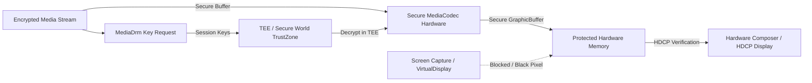

## DRM 보호 미디어는 secure codec 과 보호된 출력 경로를 요구할 수 있다

상위 문서: [Graphics and media contracts](android-graphics-media-runtime.md)

Widevine L1과 같은 저작권 보호(DRM) 미디어 재생 시, Android 시스템은 미디어 데이터 픽셀이 애플리케이션 JVM 메모리나 일반 CPU RAM 영역에 평문(Cleartext)으로 노출되는 것을 차단하기 위해 **Secure MediaCodec** 및 **Protected Output Surface** 경로를 필수 계약으로 요구한다.

### 메커니즘: Widevine L1 TEE 기반 Secure 하드웨어 경로

1. **Widevine L1 vs L3 보안 모델**:
   - **L3 (Software DRM)**: 복호화 키 및 복호화된 YUV 픽셀이 일반 CPU RAM(ARM TrustZone 외부)에서 처리되어 720p 이하 저화질로 제한됨.
   - **L1 (Hardware Security)**: 복호화, 인코딩, 디코딩 전 과정이 **TEE(Trusted Execution Environment / ARM TrustZone)** 및 전용 하드웨어 보큐어 영역(`ion_secure` / `dmabuf_secure`) 내에서만 이루어진다.

2. **Secure MediaCodec (`.secure` suffix)**:
   - 디코더 생성 시 `MediaCodec.createByCodecName("OMX.qcom.video.decoder.avc.secure")`처럼 secure 하드웨어 이름으로 구성된다.

3. **Protected Output Surface**:
   - SurfaceFlinger 및 Hardware Composer는 디스플레이 오버레이 전송 시 **HDCP (High-bandwidth Digital Content Protection)** 보안 연결을 검증하고, 스크린샷/화면 녹화(VirtualDisplay) 시 픽셀을 검은색으로 차단한다.



### ExoPlayer Widevine DRM 세션 빌드 Kotlin 예시

```kotlin
import androidx.media3.common.C
import androidx.media3.common.MediaItem
import androidx.media3.exoplayer.drm.DefaultDrmSessionManager
import androidx.media3.exoplayer.drm.HttpMediaDrmCallback
import androidx.media3.datasource.DefaultHttpDataSource

fun createSecureDrmMediaItem(videoUrl: String, licenseUrl: String): MediaItem {
    // Widevine L1 UUID 설정
    val WIDEVINE_UUID = C.WIDEVINE_UUID

    val drmConfiguration = MediaItem.DrmConfiguration.Builder(WIDEVINE_UUID)
        .setLicenseUri(licenseUrl)
        .setMultiSession(true)
        .setRequiresSecureDecoder(true) // Secure Codec 필수 요구
        .build()

    return MediaItem.Builder()
        .setUri(videoUrl)
        .setDrmConfiguration(drmConfiguration)
        .build()
}
```

### 관찰 신호: dumpsys mediadrm 및 보안 레벨 관찰

```bash
# 1. 기기의 Widevine DRM 지원 레벨(L1 vs L3) 및 Crypto Session 덤프
adb shell dumpsys mediadrm

# 주요 확인 필드:
# - vendor: Google Widevine Modular DRM
# - securityLevel: L1 (Hardware Secure) vs L3 (Software)
# - hdcpOutputLevel: HDCP 2.2 / 2.3 연결 상태

# 2. Secure Codec 컴포넌트 할당 상태 확인
adb shell dumpsys media.codec | grep -i "secure"
```

### 관련 문서

- [MediaCodec Surface 모드는 영상 producer와 consumer를 연결한다](mediacodec-surface-mode.md)
- [Surface 기반 미디어 파이프라인은 앱 수준 픽셀 복사를 줄인다](surface-media-pipeline.md)

공식 문서: [Android Media DRM Architecture](https://source.android.com/docs/core/media/drm)
