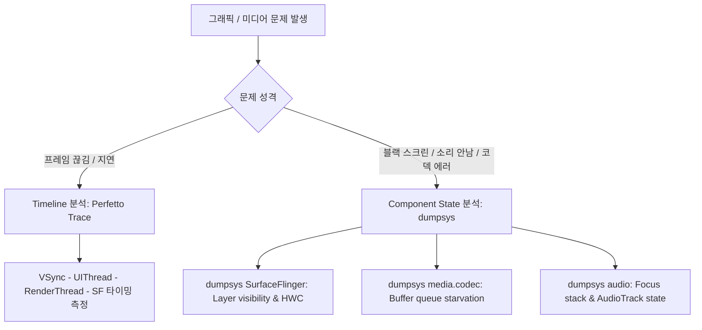

## 그래픽과 미디어 디버깅은 timeline 과 component state 에서 시작한다

상위 문서: [Graphics and media contracts](graphics-media-contracts.md)

Android 그래픽 및 미디어 파이프라인 디버깅은 특정 단일 함수 호출이나 스택 트레이스에 의존해서는 해결되지 않는다. 프레임 드롭, 블랙 스크린, 오디오/비디오 싱크 불일치 등의 문제는 반드시 시간축을 추적하는 **Timeline 분석(Perfetto Trace)**과 구성 요소의 정적 상태를 파악하는 **Component State 분석(dumpsys)**을 교차 검증하여 진단한다.

### 메커니즘: 진단 시작 흐름

1. **Timeline 분석 (시간축 디버깅)**:
   - `VSync` 신호를 기준으로 UI Thread, RenderThread, SurfaceFlinger, HWC의 처리 타이밍 관계를 분석한다.
   - 프레임 버벅임(Jank)이 발생한 정확한 파이프라인 지점(예: UI Thread Measure/Layout 과부하 vs RenderThread GPU Fence 대기 지연)을 좁힌다.

2. **Component State 분석 (정적 상태 디버깅)**:
   - 시스템 서비스 덤프를 통해 버퍼 소유권, 코덱 상태, 레이어 구성, 오디오 믹서 현황을 파악한다.
   - `dumpsys SurfaceFlinger`: 레이어 가시성 및 HWC composition 지원 여부.
   - `dumpsys media.codec`: 인코더/디코더 입력/출력 버퍼 큐 대기 현황.
   - `dumpsys audio`: AudioFocus 스택 및 HAL 출력 노드 현황.



### Perfetto Custom Trace 섹션 기록 Kotlin/C++ 코드

```kotlin
import androidx.tracing.Trace

fun renderMediaFrameWithTracing() {
    // Perfetto / Systrace 타임라인 트레이스 구획 지정
    Trace.beginSection("MyMediaPipeline#ProcessFrame")
    try {
        // 프레임 렌더링 / 복호화 작업 처리
        doFrameProcessing()
    } finally {
        Trace.endSection()
    }
}

private fun doFrameProcessing() {}
```

### 주요 진단 명령 예시

```bash
# 1. 프레임 타임라인 렌더링 통계 진단 (gfxinfo)
adb shell dumpsys gfxinfo com.example.app framestats

# 2. SurfaceFlinger 활성 레이어 및 그래픽 버퍼 메모리 현황 진단
adb shell dumpsys SurfaceFlinger --list-layers

# 3. 미디어 코덱 컴포넌트 활성 세션 상태 진단
adb shell dumpsys media.codec

# 4. Perfetto 트레이스 5초간 백그라운드 캡처
adb shell perfetto -c - --txt -o /data/misc/perfetto-traces/trace.pb <<EOF
buffers { size_kb: 65536 }
data_sources { config { name: "android.surfaceflinger_frame" } }
EOF
```

### 관련 문서

- [Jank는 UI, RenderThread, SurfaceFlinger 전 구간의 frame deadline 실패다](jank-is-frame-deadline-failure-across-ui-renderthread-and-surfaceflinger.md)
- [SurfaceFlinger는 보이는 레이어를 HWC와 함께 합성한다](surfaceflinger-composes-visible-layers-with-hwc.md)

공식 문서: [Android System Tracing Overview](https://developer.android.com/topic/performance/tracing)
