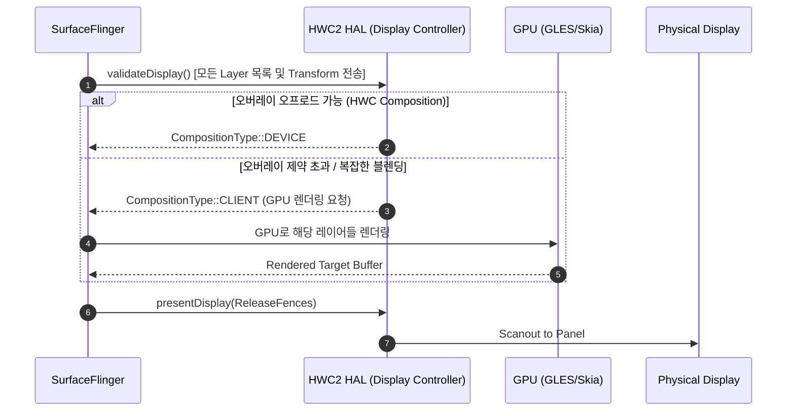

## Hardware Composer는 기기 제약 안에서 합성을 offload한다

상위 문서: [Graphics and media contracts](graphics-media-contracts.md)

**Hardware Composer (HWC / HWC2 HAL)**는 디스플레이 합성 작업을 칩셋 벤더의 전용 디스플레이 오버레이 파이프라인(MDP/DPU)으로 전달하여 GPU 전력 소모와 렌더링 지연을 획기적으로 줄이는 하드웨어 추상화 계층이다. SurfaceFlinger는 모든 레이어를 GPU로 그리지 않고, 가능한 최대한의 레이어를 HWC 오버레이로 오프로드한다.

### 메커니즘: HWC Prepare & Present 합성 2단계 계약

SurfaceFlinger와 HWC HAL 간의 매 프레임 인터랙션은 **Prepare(Validate)**와 **Present(Commit)** 2단계로 진행된다.

1. **Validate Display (`validateDisplay`)**:
   - SurfaceFlinger가 모든 앱/보조 레이어의 Z-order, 위치, 변환 행렬, 알파값을 HWC에 전달한다.
   - HWC는 디스플레이 오버레이 제약 조건(최대 지원 오버레이 개수, 회전/스케일링 제약, 색상 공간 포맷)을 검증하여 각 레이어의 합성 방식을 결정한다:
     - **HWC / Device Composition**: HWC 오버레이 핀이 하드웨어 합성 전담 (GPU 사용 0%).
     - **Client Composition (GPU)**: HWC 오버레이 제약 초과 시 GPU(Skia/GLES)가 중간 프레임버퍼에 렌더링 후 HWC 전달.

2. **Present Display (`presentDisplay`)**:
   - SurfaceFlinger와 HWC가 완성된 버퍼 펜스(Fence FD)를 주고받으며 디스플레이 스캔아웃 엔진에 넘겨 화면으로 출력한다.



### 관찰 신호: dumpsys SurfaceFlinger HWC 오버레이 관찰

```bash
# SurfaceFlinger 레이어별 Composition Type (Device vs Client) 관찰
adb shell dumpsys SurfaceFlinger | grep -A 20 "Header: GLES | Device | HWC"

# 주요 확인 필드:
# - Device: HWC 오버레이에 의해 GPU 사용 없이 직접 합성되는 레이어
# - GLES: HWC 제약 초과로 GPU(GLES)가 렌더링 중인 레이어 (전력 소모 증가 원인)
# - SolidColor / Cursor: HWC 특수 하드웨어 레이어
```

### 관련 문서

- [SurfaceFlinger는 보이는 레이어를 HWC와 함께 합성한다](surfaceflinger-composes-visible-layers-with-hwc.md)
- [Android 렌더링 파이프라인은 Surface → BufferQueue → Compositor 흐름이다](android-rendering-pipeline-is-surface-to-bufferqueue-to-compositor.md)

공식 문서: [Android Hardware Composer HAL](https://source.android.com/docs/core/graphics/hwc)
